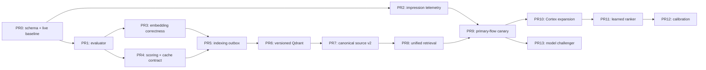

# AI matching, scoring i wyszukiwanie — rekomendacje i plan implementacji

> Data: 2026-07-15
>
> Stan zweryfikowany: 2026-07-15 15:58 CEST
>
> Status: rekomendowany kierunek do zatwierdzenia i realizacji; implementacja
> nie została rozpoczęta
>
> Tryb przygotowania: read-only audit kodu, dokumentacji i produkcyjnych
> diagnostyk; bez zmian danych produkcyjnych
>
> Baseline kodu w chwili audytu: `origin/main` =
> `62bb59dedb786af6dfe8847e29e5e14523a9797d`
>
> Baseline produkcji: `/api/health.version` =
> `62bb59dedb786af6dfe8847e29e5e14523a9797d`, overall `healthy`,
> `traffit = degraded`

## 1. Executive summary

NEXUS ma wiele potrzebnych elementów: Voyage embeddings, Qdrant, wyszukiwanie
pełnotekstowe, opcjonalne RRF i rerank, scoring biznesowy, profile wag,
historyczne dane pipeline oraz Cortex. Nie tworzą one jednak jednego spójnego
systemu.

Obecnie różne ekrany:

- budują inne teksty tego samego kandydata lub oferty,
- korzystają z różnych sposobów retrievalu,
- inaczej stosują rerank, profile wag i filtry biznesowe,
- pokazują liczby o różnym znaczeniu jako jeden „score”,
- mogą używać niepełnego lub nieaktualnego indeksu,
- nie zapisują wystarczającego kontekstu, aby uczciwie uczyć wagi z outcome'ów.

Najważniejsza rekomendacja:

> Nie zaczynać od zmiany modelu, masowego re-embedu ani uczenia wag z
> placementów. Najpierw należy naprawić pomiar, poprawność przestrzeni
> wektorowej, świeżość indeksu, wersjonowanie cache i kontrakt score 0–100.

Rekomendowana kolejność:

1. wykonać read-only audyt pozostałości schematu AI w produkcji i zamrozić
   aktualny baseline,
2. naprawić istniejący evaluator i uruchomić append-only telemetry,
3. poprawić błędy embeddingu, provider isolation, profile i cache,
4. zbudować trwały indexing outbox oraz wersjonowane kolekcje Qdrant,
5. wprowadzić kanoniczne źródła oraz wersjonowane projekcje retrieval,
6. zunifikować retrieval, eligibility, rerank i scoring,
7. uruchomić główny hybrid/rerank jako shadow i canary,
8. dopiero potem wykorzystać Cortex do kontrolowanego query expansion,
9. na końcu testować learned ranking, kalibrację i ewentualną zmianę modelu.

## 2. Zakres i relacja do innych dokumentów

Ten dokument opisuje fundament techniczny i pomiarowy AI matching:

- indeksację i reprezentację danych,
- candidate generation,
- lexical/dense retrieval i fusion,
- rerank,
- scoring biznesowy,
- cache i snapshoty,
- ewaluację, telemetry, rollout i rollback.

Uzupełnia, a nie zastępuje:

- [audyt manualnego wyszukiwania](./manual-candidate-search-audit-and-implementation-plan-2026-07-15.md),
  który opisuje Recruiter Search Workspace, poprawność filtrów i UX,
- [audyt Cortexa](./cortex/cortex-audit-2026-07-13.md), który opisuje jakość
  taksonomii i fact store,
- [podsumowanie AI modernization](./ai-modernization/01-final-summary.md),
  które zawiera historyczne eksperymenty matchingowe.

## 3. Zweryfikowany stan obecny

### 3.1. Produkcja i pokrycie danych

W chwili weryfikacji produkcja była zgodna z `origin/main` na SHA `62bb59d`.

Same-day authenticated diagnostics pokazały:

- Voyage API key ustawiony, ping OK, wymiar 1024,
- Qdrant `nexus_candidates = 46 945` punktów,
- Qdrant `nexus_jobs = 3 861` punktów,
- Cortex szacuje bazę kandydatów na około 54 tys. rekordów,
- plik CV ma 94,2% bazy, parsowany tekst 72,4%,
- co najmniej jeden fakt kompetencyjny ma 55,8% bazy,
- znana dostępność: 0%,
- wszystkie 261 096 faktów Cortexa mają nieznaną datę obserwacji,
- Traffit pozostaje `degraded`.

Porównanie 46 945 punktów kandydatów z populacją około 54 tys. sugeruje
potencjalną lukę około 7,1 tys. rekordów. Nie jest to jeszcze dokładny wskaźnik
`eligible coverage`, ponieważ oba źródła mogą używać innego mianownika.
Pierwszym obowiązkowym pomiarem jest zatem:

`eligible DB records ↔ indexed records ↔ matching content hash`.

### 3.2. Mapa obecnych flow

| Powierzchnia | Candidate generation | Rerank | Finalny ranking / score | Główny problem |
|---|---|---|---|---|
| Główne rekomendacje job → candidate | Dense Qdrant | Nie | Composite + historical boost | Nie jest to deklarowany pełny hybrid; cache może być stale |
| Proposal snapshots | Dense Qdrant | Nie | Composite z cache, bez historical boostu | Snapshot może przeżyć zmianę dokumentu, indeksu lub formuły |
| Legacy `/jobs/{id}/ai-matches` | Dense Qdrant | Opcjonalny Voyage | Cosine/rerank, bez tego samego composite | Inne znaczenie score niż w głównym widoku |
| Manual candidate search | Domyślnie PostgreSQL FTS/boolean | Nie | Kolejność FTS/filtrów | To nie jest domyślnie hybrid |
| Hybrid candidate search | PostgreSQL `ts_rank` + dense + RRF | Opcjonalny | Fused order; API gubi część score | `ts_rank` nie jest BM25; inny corpus sparse i dense |
| Candidate → job | Dense Qdrant jobs | Nie | Composite | Query jest embedowane jako `document` |
| CV preview → jobs | Dense Qdrant | Opcjonalny | Rerank + composite | Ryzyko mieszania skali rerank z cosine |
| Marketplace / seeking-contractors | Dense Qdrant | Nie | Composite | Kilka niezależnych builderów i profile nie wszędzie aktywne |
| Global semantic search | Dense Qdrant | Nie | Semantic order | Brak wspólnego eligibility i filtrów w retrievalu |

### 3.3. Najważniejsze findings

#### AI-P0-01 — evaluator istnieje, ale nie jest wiarygodnym gate'em

Canonical script to
[`backend/scripts/eval_matching.py`](../backend/scripts/eval_matching.py#L1).
Istnieje także starszy duplikat w `backend/scripts/scripts/`.

Aktualny evaluator:

- monkeypatchuje stałe modułu, mimo że engine używa utworzonego wcześniej
  `DEFAULT_PROFILE`,
- nie przekazuje jawnie profilu do `rank_candidates_for_job`,
- nie odtwarza wszystkich produkcyjnych flow,
- nie mierzy głównego hybrid/rerank, bo główny flow go nie używa,
- wybiera małą, niereprezentatywną próbkę historycznych jobów,
- ma leakage: najnowsze screening answers mogą pomagać przewidywać dojście do
  screeningu,
- traktuje wiele nieocenionych rekordów jak negatywy,
- nie ma temporal holdoutu ani confidence intervals.

Historyczny raport z maja miał `P@5 = 0.167`, `Recall@20 = 0.151`,
`nDCG@10 = 0.171`. Wynik jest stary i sam harness wymaga naprawy, więc nie jest
aktualnym baseline'em produkcji.

#### AI-P0-02 — reverse search używa złego typu embeddingu

`generate_embedding` dokumentuje, że wyszukiwanie powinno używać
`input_type="query"`:
[`embedding_service.py`](../backend/app/services/embedding_service.py#L191).

Candidate search robi to poprawnie, ale
`search_jobs_semantic` wywołuje domyślne `document`:
[`embedding_service.py`](../backend/app/services/embedding_service.py#L674).

Dotyczy to candidate/CV → jobs, w tym marketplace i rekomendowanych ofert.

#### AI-P0-03 — możliwe mieszanie przestrzeni Voyage i Ollama

Po niepowodzeniu Voyage engine dopuszcza fallback do Ollamy. Jeżeli fallback
zwróci 1024 elementy, wektor może trafić do cache/indeksu identyfikowanego jak
Voyage.

Ten sam wymiar nie oznacza tej samej przestrzeni semantycznej. Cosine między
query Ollamy i dokumentami Voyage nie ma wiarygodnego znaczenia.

#### AI-P0-04 — indeks nie ma trwałego kontraktu świeżości

Re-embed jest wywoływany tylko w części write flow. Zmiany po enrichment,
PATCH kandydata, imporcie Traffit lub zmianie Champion Profile nie mają jednego
gwarantowanego mechanizmu:

`source change → enqueue → reindex → invalidate dependent artifacts`.

Brakuje mierzalnego `desired_hash == indexed_hash` oraz kolejki z retry,
heartbeat i dead-letter semantics.

#### AI-P0-05 — profile wag mogą mieć budżet 110

Default engine ma sześć warstw:

`35 semantic + 30 skills + 12 salary + 8 location + 5 availability +
10 champion = 100`.

API profili przyjmuje pięć wag sumujących się do 100:
[`scoring_weights.py`](../backend/app/api/scoring_weights.py#L29).
`WeightProfile.from_record` dokłada brakujące `champion_fit = 10`:
[`scoring_service.py`](../backend/app/services/scoring_service.py#L129).

Custom profile może więc mieć faktyczny budżet 110. W live recommendations
historical boost może dodatkowo zmienić wyświetlaną liczbę; proposal snapshots
nie dodają tego boostu.

#### AI-P0-06 — cache nie jest związany z wersją wejść i formuły

`CandidateJobMatchScore` jest używany po kluczu
`candidate × job × profile`. Brakuje co najmniej:

- `scoring_algorithm_version`,
- `profile_revision`,
- `embedding_index_version`,
- `taxonomy_version`,
- `candidate_source_hash`,
- `job_source_hash`.

Jeżeli wiersz ma `stale = false`, może zostać zwrócony mimo nowego similarity
score lub re-embedu:
[`match_score_cache.py`](../backend/app/services/match_score_cache.py#L110).

#### AI-P1-01 — dokument embeddingowy jest płaskim, niewersjonowanym blobem

Builder kandydata zawiera imię, nazwisko, firmy, skills, doświadczenie, summary
i pierwsze 3000 znaków raw CV:
[`embedding_service.py`](../backend/app/services/embedding_service.py#L250).

Problemy:

- PII i szum niepotrzebny do dopasowania,
- brak sekcji i wersji schematu,
- brak quality flag dla OCR/CID junk,
- arbitralne pierwsze 3000 znaków,
- różne buildery w równoległych flow,
- dense, sparse i reranker nie czytają tego samego corpus.

Historyczny eksperyment potwierdził ryzyko naiwnego concatenation:
P@5 wzrosło o 4%, ale Recall@20 spadło o 17%, a nDCG@10 o 16%:
[`01-final-summary.md`](./ai-modernization/01-final-summary.md#L137).

#### AI-P1-02 — Cortex nie jest jeszcze gotową warstwą online matching

Cortex ma właściwy kierunek: `candidate × canonical skill × source` z evidence
i confidence. Obecnie:

- nie zasila bezpośrednio retrieval/scoringu,
- ma fakty tylko dla 55,8% bazy,
- nie zna daty obserwacji wszystkich obecnych faktów,
- taksonomia ma kolizje i dużą kolejkę unmatched terms,
- dostępność ma 0% pokrycia,
- Traffit, jedyne obecne źródło faktów, jest degraded.

Najpierw trzeba naprawić reconcile i deterministyczną taksonomię. Dopiero potem
Cortex może być canonical skill evidence source.

#### AI-P0-07 — produkcja ma pozostałości po revertowanym pakiecie AI

Commit `d507d95` przywrócił kod do stanu sprzed szerokich PR-ów AI `#696–#708`
po crash-loopie i rozjechanym grafie migracji. Migracje `0162–0170` pozostały
jednak zastosowane w produkcyjnej bazie.

W tej serii istniały m.in. pomysły:

- unified retrieval/indexing/scoring (`#701`),
- wersjonowany blue-green index (`#706`),
- canary rollout (`#708`).

Należy traktować je wyłącznie jako materiał referencyjny. Nie wolno przywracać
całego pakietu ani cherry-pickować go bez audytu. Pierwszy krok implementacji
musi zinwentaryzować realne tabele, triggery, kolejki i wersję Alembic w
produkcji.

## 4. Docelowa architektura

### 4.1. Jeden pipeline, jawne etapy

```text
request/job/candidate canonical source representation
    ↓
deterministic, versioned projections per modality
    ↓
eligibility i hard exclusions
    ↓
candidate generation: sparse + dense + structured filters
    ↓
fusion / adaptive overfetch
    ↓
optional rerank
    ↓
deterministic business fit score 0–100
    ↓
confidence / data completeness
    ↓
explanation + evidence
```

Każda powierzchnia może mieć inną politykę, ale nie osobną implementację.
Przykład: marketplace może mieć inny status jobów i threshold niż job
recommendations, lecz używa tego samego buildera, indeksu, scoring engine i
version contract.

### 4.2. Rozdzielenie znaczeń wyniku

API nie powinno nazywać każdej liczby `score`.

Docelowy kontrakt:

| Pole | Znaczenie | Widoczność |
|---|---|---|
| `eligible` | Czy para może wejść do rankingu | UI + API |
| `eligibility_reasons[]` | Conflict, blacklist, client exclusion, hard gate | UI + API |
| `retrieval_score` | Dense/sparse/RRF score, skala zależna od retrievera | Diagnostyka |
| `rerank_score` | Score konkretnego rerankera | Diagnostyka |
| `fit_score` | Deterministyczny, wersjonowany wynik biznesowy 0–100 | UI + API |
| `fit_breakdown` | Semantic, skills, salary, location, availability, champion | UI + API |
| `fit_confidence` | Kompletność i wiarygodność danych wejściowych | UI + API |
| `calibrated_probability` | Opcjonalne P(event w horyzoncie), dopiero później | UI + API |
| `ranker_version` | Formula/profile/index/taxonomy versions | API + telemetry |

`fit_score` nie jest prawdopodobieństwem. Brak danych nie powinien być ukryty
przez neutralne punkty; użytkownik powinien zobaczyć osobny
`fit_confidence`.

Polityka missing data w scoring v2:

- warstwa z wiarygodnym sygnałem zwraca `value`, `known=true` i confidence,
- warstwa bez sygnału ma `known=false` i nie dostaje automatycznie 0 ani
  neutralnych 65% budżetu,
- `fit_score` jest normalizowany po znanych warstwach,
- `fit_confidence` pokazuje udział wspieranego dowodami budżetu wag,
- unknown w eligibility pozostaje `unknown`; nie staje się automatycznie
  `pass`, `fail` ani `unavailable`,
- sposób użycia confidence w kolejności jest osobną, wersjonowaną polityką i
  musi przejść ablation na low-data slice.

### 4.3. Niezmienne kontrakty

1. Query zawsze używa `input_type="query"`.
2. Jedna kolekcja zawiera dokładnie jeden
   `provider × model × dimension × text_schema_version`.
3. Każdy punkt ma `entity_id`, `content_hash`, `indexed_at` i provenance.
4. Każda zmiana pola używanego przez builder tworzy idempotentny event
   indeksacyjny.
5. `indexed_hash` musi ostatecznie zrównać się z `desired_hash`.
6. Sparse, dense i rerank korzystają z jednego kanonicznego źródła oraz
   deterministycznych, wersjonowanych projekcji właściwych dla danej modalności.
7. Jeden aktywny profil na scope; profil ma sześć wag sumujących się do 100.
8. Cache i snapshoty zawierają wersje wszystkich zależności.
9. Degraded fallback jest jawny i nie zostaje zapisany jako zdrowy wynik.
10. Raw CV, nazwiska, telefony i e-maile nie trafiają do telemetry.
11. Każdy nowy ranking działa najpierw w shadow i za osobną feature flagą.
12. Każda migracja jest additive, używa `alembic upgrade heads` i — zgodnie z
    NEXUS migration trap — jest mirrowana idempotentnie w
    `backend/entrypoint.sh`.

## 5. Kontrakt ewaluacji

### 5.1. Dataset

Nie traktować wszystkich historycznych pipeline stages jako prostego ground
truth.

Dataset powinien:

- używać istniejącego `ProposalSnapshot` tylko jako częściowego historycznego
  sygnału: przechowuje IDs, breakdown, profile ID i timestamp, ale nie pełne
  dokumenty wejściowe, wersję formuły/indeksu ani dowód faktycznej ekspozycji,
- opierać nowe dane na immutable server-side impression/run snapshot,
- odtwarzać dokument kandydata, joba, profil i wersje z momentu ekspozycji,
- łączyć ekspozycję z późniejszym outcome,
- używać temporalnego train/validation/test split,
- grupować po jobie, aby kandydaci z jednego joba nie przeciekali między
  splitami,
- mieć osobny client holdout,
- raportować slice'y po roli, seniority, jakości CV, kompletności skills,
  lokalizacji, języku i źródle danych.

### 5.2. Hierarchia etykiet

1. Jawna ocena klienta lub decyzja interview.
2. Advance vs jawne rejection z reason code.
3. Recruiter `relevant / not relevant` z powodem.
4. Shortlist / add-to-pipeline jako słabszy sygnał.
5. Hire jako downstream business outcome.
6. Niewyświetlony lub nieoceniony kandydat = `unknown`, nie negative.

Screening answers powstałe po ekspozycji nie mogą być cechą przewidującą
dojście do screeningu.

### 5.3. Osobne metryki

| Warstwa | Metryki |
|---|---|
| Index | eligible coverage, stale ratio, lag p50/p95/p99, failed/dead events |
| Candidate generation | Recall@50/100/200, coverage, source overlap |
| Rerank | nDCG@10, MRR, Success@5 |
| Final fit | P@5, nDCG@10, Recall@20, pairwise accuracy |
| Kalibracja | Brier, ECE, reliability curve — dopiero po zdefiniowaniu targetu |
| Operacyjne | p50/p95 latency, error/fallback rate, cost/query |
| Biznesowe | view, shortlist, add-to-pipeline, reject reason, interview, hire |

### 5.4. Provisional promotion gates

Do zatwierdzenia po świeżym baseline:

- `Recall@100`: nie gorzej niż `-1 pp`,
- `P@5`: bez regresji większej niż `-1 pp`,
- `nDCG@10`: co najmniej `+5% relative` dla promowanego challengera,
- brak krytycznej regresji w slice'ach,
- p95 latency i cost/query w ustalonym budżecie,
- zero mixed-version/provider vectors,
- indeks obejmuje 100% eligible records albo ma jawną, zatwierdzoną listę
  wyjątków z reason codes,
- p95 indexing lag <5 minut.

Metryki muszą mieć bootstrap confidence intervals. Nie wolno promować wariantu
na podstawie samej średniej z 10 jobów. Przed canary trzeba zdefiniować minimalną
liczebność lub power dla głównej metryki i najważniejszych slice'ów; upływ czasu
sam w sobie nie jest wystarczającą podstawą promocji.

## 6. Plan implementacji PR po PR

### 6.1. Zależności



PR1 i PR2 mogą powstać równolegle po PR0. PR3 i PR4 mogą powstać równolegle po
zamrożeniu baseline'u. Kolejnych etapów nie należy łączyć w jeden szeroki PR.

### PR0 — read-only audyt schematu i aktualny baseline

**Cel:** ustalić realny stan produkcji przed jakąkolwiek migracją lub zmianą
rankingu.

**Zakres:**

- dodać host-native, read-only
  `backend/scripts/audit_ai_matching_state.py`,
- zinwentaryzować Alembic version/heads, tabele i triggery z pozostałości
  `0162–0170`,
- sprawdzić, czy istnieje kolejka indeksacyjna i czy rośnie,
- policzyć eligible DB vs Qdrant vs matching content hash,
- policzyć cache rows, stale ratio, profile budgets i snapshot freshness,
- zapisać JSON + Markdown baseline z exact deployed SHA.

**Migracje:** brak.

**Testy:** unit test parsera raportu; read-only SQL smoke na testowej bazie CI.

**Acceptance:** kompletna lista istniejących obiektów, właścicieli, triggerów,
liczników i bezpieczna decyzja `reuse / migrate / ignore` dla każdego.

**Rollback:** nie dotyczy; skrypt nie może wykonywać DDL/DML.

### PR1 — naprawiony evaluator i świeży baseline

**Cel:** evaluator musi odtwarzać rzeczywisty production flow i być
deterministycznym gate'em.

**Zakres:**

- usunąć lub zamienić duplikat `backend/scripts/scripts/eval_matching.py` na
  cienki wrapper z ostrzeżeniem,
- przekazywać jawny sześciowarstwowy `WeightProfile`,
- usunąć monkeypatch stałych,
- dodać adaptery evaluatorów dla candidate generation, rerank i final fit,
- dodać temporal holdout, grouped split i slice reports,
- oznaczać unknown osobno od negative,
- zapisywać JSON + Markdown oraz manifest danych/wersji,
- wygenerować świeży raport `baseline-2026-07-xx`.

**Migracje:** brak.

**Feature flag:** brak; narzędzie offline.

**Testy:** deterministyczny fixture, test ablation, test braku leakage,
metryki na syntetycznym rankingu, parity z production orchestrator.

**Acceptance:** dwa uruchomienia na tym samym snapshotcie dają ten sam wynik;
zmiana jednej wagi zmienia oczekiwaną ablację; raport oddziela retrieval,
rerank i final fit.

**Rollback:** revert PR; brak wpływu na runtime.

### PR2 — append-only impression i outcome telemetry

**Cel:** zapisywać, co użytkownik naprawdę zobaczył przed późniejszym outcome.

**Model danych:**

- osobny append-only `match_impressions` z unique co najmniej
  `(run_id, candidate_id)`,
- osobny append-only `match_outcomes` z unikalnym `event_id`, dzięki czemu jeden
  impression może mieć wiele późniejszych zdarzeń bez nadpisywania historii.

**Zakres danych:**

- `run_id`, `surface`, `request/job/user/client`,
- candidate ID, rank i eligibility,
- retrieval sources i score,
- rerank score,
- pełny fit breakdown,
- profile/formula/index/taxonomy/text-schema versions,
- fallback/degraded status,
- timestamp,
- późniejsze view, shortlist, add, reject, interview i hire.

Jeżeli dana warstwa nie ma jeszcze wersjonowania runtime, PR2 wprowadza dla
niej jawną, niemutowalną wartość legacy, np. `scoring-v1` lub `index-legacy-v1`,
zamiast zapisywać `NULL` albo zgadywać wersję retrospektywnie.

Nie zapisywać raw CV, query zawierającego PII, nazwiska, e-maila ani telefonu.
User/client identifiers w warstwie analitycznej mają być pseudonimizowane albo
dostępne wyłącznie przez ograniczony RBAC. Tabele muszą mieć jawny retention,
procedurę DSAR/delete i audyt dostępu.

**Migracje:** additive tabela/partycjonowanie; migration DDL mirrored w
`entrypoint.sh`.

**Feature flag:** `AI_MATCH_TELEMETRY_ENABLED=false`.

**Testy:** payload redaction, append-only semantics, impression uniqueness,
outcome `event_id` idempotency, server-side rank capture, RBAC, retention/DSAR
job oraz awaria telemetry.

**Acceptance:** 100% flag-enabled responses ma run ID; telemetry odtwarza
kolejność widzianą przez użytkownika; brak PII w próbie logów. Awaria telemetry
nie blokuje rekomendacji, ale ustawia mierzalny degraded status i alert.

**Rollout:** admin/internal 100%, następnie wszystkie surfaces.

**Rollback:** wyłączyć flagę; zachować tabelę i dane.

### PR3 — correctness hotfix embeddingu

**Cel:** usunąć błędy poprawności bez zmiany text schema.

**Zakres:**

- `search_jobs_semantic(... input_type="query")`,
- usunąć redundantne generowanie query embeddingu w CV preview, jeśli
  występuje,
- rozszerzyć cache key o provider/model/input type/dimension,
- nie zapisywać fallbacku Ollama jako Voyage,
- fail closed dla próby użycia obcego providera w kolekcji,
- dodać provider/model provenance do diagnostyki,
- oznaczyć obecną kolekcję bez pełnego provenance jako `legacy/unknown`;
  historycznych punktów nie uznawać za zweryfikowane tylko dlatego, że mają
  wymiar 1024.

**Migracje:** brak lub tylko additive metadata po audycie PR0.

**Feature flag:** `AI_EMBEDDING_STRICT_PROVIDER=true`; domyślnie true po
shadow verification.

**Testy:** query/document contract, Voyage failure, Ollama fallback, cache
isolation, wrong-dimension i same-dimension/different-provider rejection.

**Acceptance:** żaden nowy obcy wektor nie trafia do kolekcji/cache Voyage;
wszystkie reverse-search queries są typu query. Pełną izolację historycznych
punktów potwierdza dopiero reindex do wersjonowanej kolekcji z PR6.

**Rollback:** w awarii przejść do jawnego degraded/fail-closed mode. Nie
wyłączać strict mode w sposób, który ponownie dopuści mieszanie przestrzeni.
Revert kodu tylko z zachowaniem provider-aware cache isolation.

### PR4 — kontrakt scoring profile i wersjonowany cache

**Cel:** jeden deterministyczny fit 0–100 na wszystkich powierzchniach.

**Zakres:**

- sześć konfigurowalnych wag, suma dokładnie 100,
- jeden aktywny profil na scope z deterministycznym resolverem,
- `profile_revision` i `scoring_algorithm_version`,
- history boost jako osobna cecha/breakdown, nie nieograniczony dodatek ponad
  100,
- oddzielenie `fit_score` od `fit_confidence`,
- wdrożenie missing-data policy z sekcji 4.2 zamiast neutralnych 65%,
- cache key z profile/formula/index/taxonomy/source hashes,
- invalidacja po zmianie profilu i wszystkich danych wejściowych,
- nie cache'ować Qdrant failure jako zdrowego semantic=0.

Na tym etapie profile i formula dostają realne revision/version. Zależności,
które powstaną dopiero w PR5–PR10, używają jawnych legacy placeholders
wprowadzonych w PR2, a klucz cache jest rozszerzany wraz z pojawieniem się
kanonicznych revision/hash. Nie udajemy wersji, której system jeszcze nie ma.

**Migracje:** additive kolumny i indeksy; idempotentne statements w
`entrypoint.sh`.

**Feature flag:** `AI_SCORING_CONTRACT_V2=false`.

**Testy:** property test `0 <= fit_score <= 100`, suma wag, deterministic profile
selection, cache hit/miss po każdej zmianie wersji, conflict/blacklist cases.

**Acceptance:** ta sama para, profil i dostępne wersje dają ten sam fit na
wszystkich surfaces; zmiana każdej już wersjonowanej zależności nie zwraca
starego cache. Pełny source/index/taxonomy contract jest domykany odpowiednio w
PR5, PR6 i PR10.

**Rollback:** flag off; zachować nowe kolumny.

### PR5 — trwały indexing outbox i freshness SLO

**Cel:** każda istotna zmiana danych ostatecznie aktualizuje indeks i zależne
artefakty.

**Zakres:**

- jedna tabela/outbox po audycie pozostałości `0162–0170`,
- event `entity_type + entity_id + entity_revision + desired_hash + operation`,
- `operation = upsert/delete`; delete zapisuje tombstone, aby usunięty lub
  nieeligible rekord nie pozostawał w Qdrant,
- enqueue w tej samej transakcji co zmiana źródła,
- pokrycie create/PATCH, CV upload, background enrichment, Traffit sync,
  Champion Profile i taxonomy-impacting changes,
- idempotent worker z retry, heartbeat, advisory lock i dead-letter status,
- compare-and-set: worker pomija event starszy niż bieżąca/indexed revision i
  nie może nadpisać nowszego punktu starszym eventem,
- po sukcesie: `indexed_hash`, invalidacja score cache i proposal snapshots,
- diagnostics: queue depth, oldest age, failure count, coverage and lag.

Trigger DB może tylko enqueue'ować entity ID. Worker musi budować dokument i
hash w aplikacji. Nie duplikować logiki buildera w PL/pgSQL.

**Migracje:** additive; reuse istniejących tabel wyłącznie po PR0; mirror w
entrypoint.

**Feature flags:** `AI_INDEX_OUTBOX_ENABLED=false`,
`AI_INDEX_WORKER_ENABLED=false`.

Przed PR6 worker może być uruchomiony wyłącznie dla utrzymania świeżości
niezmienionego schematu v1. Nie może wykonywać masowego re-embedu ani zmiany
modelu w aktywnej kolekcji.

**Testy:** wszystkie write paths enqueue, duplicate event idempotency,
out-of-order revisions, tombstone/delete, retry, worker restart, poison event,
advisory lock i invalidate dependencies.

**Acceptance:** 100% pól buildera ma test enqueue; po drain
`desired_hash == indexed_hash` i `indexed_revision == current_revision`;
usunięte/nieeligible rekordy nie zostają w indeksie; p95 lag <5 min; zero
silent drops.

**Rollback:** wyłączyć worker/enqueue osobno; eventy zachować do replay.

### PR6 — versioned collections i blue-green alias

**Cel:** nigdy nie mieszać starych i nowych wektorów ani przebudowywać aktywnej
kolekcji in-place.

**Zakres:**

- collection manifest:
  `provider/model/dimension/text_schema/entity_schema/created_at`,
- fizyczne wersjonowane kolekcje,
- stabilny alias `nexus_candidates_active` / `nexus_jobs_active`,
- checkpointed backfill i resume,
- porównanie DB expected set z index set,
- shadow search na active i challenger,
- atomic alias swap,
- poprzednia kolekcja read-only przez minimum 14 dni.

Przed startem backfillu wymagany jest capacity/cost gate:

- wolne miejsce na active + challenger + rollback copy wraz z bezpiecznym
  marginesem Qdrant,
- zapisany maksymalny koszt Voyage dla pełnego przebiegu,
- rate limit i checkpointy,
- automatyczne zatrzymanie przy disk pressure, error spike lub przekroczeniu
  budżetu.

**Feature flag:** alias/manifest config, bez zmiany call sites przed gotowością.

**Testy:** interrupted backfill/resume, mixed manifest rejection, exact coverage,
alias switch i rollback.

**Acceptance:** zero mixed versions; 100% eligible records albo jawna,
zatwierdzona lista wyjątków; capacity/cost gate zaliczony; alias rollback
przetestowany przed produkcyjnym switchem.

**Rollback:** atomic swap aliasu na poprzednią kolekcję, bez deployu.

### PR7 — canonical candidate/job source v2 i projekcje modalne

**Cel:** jedno wersjonowane źródło znaczenia oraz deterministyczne projekcje
dostosowane do dense, sparse i rerank. Projekcje nie muszą mieć identycznej
serializacji, ale muszą pochodzić z tych samych faktów i wersji.

**Candidate document v2:**

- bez imienia, nazwiska, e-maila, telefonu i adresu,
- etykietowane sekcje,
- canonical skills z source/confidence/freshness,
- verified skills i aktualna rola,
- seniority/years z jawnie opisanym źródłem,
- recent experience i domeny,
- quality-gated AI summary,
- raw CV tylko jako fallback lub wybrane czyste sekcje,
- normalizacja wszystkich spotykanych wariantów JSON.

**Job document v2:**

- title bez referencyjnego szumu,
- role/seniority/industry,
- canonical must/nice skills,
- opis i wymagania po czyszczeniu,
- Champion criteria, deal breakers i business context,
- lokalizacja/remote/language jako strukturalne pola i payload filters.

Nie „ważyć” skills przez przypadkowe powtarzanie tokenów. Jeżeli potrzebna
będzie większa kontrola, późniejszy eksperyment może użyć oddzielnych wektorów
`profile / skills / recent experience` i jawnego late fusion.

**Feature flag:** `AI_TEXT_SCHEMA_V2=false`.

**Testy:** PII exclusion, golden source i projections, JSON variants, raw-CV
quality gate, stable content hash oraz factual parity między projekcjami.

**Acceptance:** shadow index v2 przechodzi gates z sekcji 5.4 i nie ma
krytycznej regresji na sparse-profile slice.

**Rollback:** alias wraca do v1; v2 pozostaje do diagnostyki.

### PR8 — unified retrieval orchestrator

**Cel:** jeden serwis generujący kandydatów i wspólny trace rankingu.

**Zakres:**

- canonical `MatchingRequest` i `MatchingRun`,
- wspólny eligibility service,
- strukturalne hard filters przed/na etapie retrieval,
- sparse + dense candidate generation,
- RRF lub inna jawna fusion,
- adaptive overfetch, gdy filters odrzucają top-K,
- opcjonalny rerank z zachowaniem jego score i wersji,
- finalny scoring v2,
- ten sam trace/breakdown dla recommendations, proposals, reverse matching,
  marketplace i search,
- surface policy jako konfiguracja, nie osobny builder.

Hard filter może działać tylko na polu o wystarczającej wiarygodności. Brak
danych — szczególnie przy obecnym 0% pokryciu deklarowanej dostępności — nie
może automatycznie oznaczać `unavailable` ani odrzucać kandydata.

**Feature flag:** `AI_UNIFIED_RETRIEVAL_ENABLED=false` per surface.

**Testy:** parity current flow, filters-before-top-K, stable ordering,
degraded-mode matrix, score provenance i API schema.

**Acceptance:** ta sama para, policy i version daje ten sam eligibility oraz
fit breakdown niezależnie od wywołującego ekranu; każdy wynik ma pełny version
trace. Końcowy rank może się różnić, jeżeli surface jawnie używa innego
candidate pool, top-K lub policy — różnica musi być widoczna w trace.

**Rollback:** wyłączyć flagę per surface.

### PR9 — główny hybrid/rerank: shadow i canary

**Cel:** sprawdzić, czy hybrid/rerank poprawia główne recommendations i
proposals, zamiast zakładać to z góry.

**Zakres rollout:**

1. challenger A: hybrid-only przy obecnym downstream rankingu,
2. challenger B: rerank-only na tym samym candidate pool,
3. challenger C: hybrid + rerank dopiero po osobnych ablacjach A/B,
4. dla każdego: offline eval na zamrożonym datasecie,
5. shadow 100% requestów bez wpływu na UI,
6. internal canary 5% sticky po jobie,
7. 25%, 50%, 100% po przejściu gate'ów i minimalnej liczebności.

Nie zmieniać jednocześnie modelu, text schema i wag. Challenger musi różnić się
jednym kontrolowanym elementem.

**Feature flags:** osobne dla hybrid i rerank.

**Acceptance:** promotion gates z sekcji 5.4, brak latency/cost breach oraz
brak regresji w add-to-pipeline i recruiter judgment.

**Rollback:** flag off; primary wraca do poprzedniego orchestratora bez
reindexu.

### PR10 — Cortex jako evidence source i kontrolowane query expansion

**Dependencies:** naprawiony Cortex reconcile i deterministyczna taksonomia
zgodnie z osobnym audytem.

**Zakres:**

- canonical `normalized_key` i jednoznaczne aliasy,
- union evidence zamiast „pierwszego niepustego fallbacku”,
- confidence/freshness w payloadzie i fit confidence,
- exact-token skill matching,
- deterministyczna alias expansion,
- osobna flaga i ablation dla related-skill expansion,
- kuracja unmatched terms według liczby unikalnych kandydatów, nie liczby
  uruchomień backfillu.

Pierwsza wersja nie używa swobodnego LLM query expansion.

**Feature flag:** `AI_SKILL_EXPANSION_ENABLED=false`.

**Acceptance:** wzrost skill recall bez mierzalnego spadku precision; zero
false-positive dla krótkich aliasów typu `go`, `r` i `c` w zwykłej prozie.

**Rollback:** wyłączyć expansion; zachować canonical evidence.

### PR11 — learned ranker

Ten etap zaczyna się dopiero po zebraniu wystarczających impression/outcome
data oraz ustaleniu minimalnej liczebności/power.

- prosta regularizowana, nieujemna regresja tylko jako benchmark,
- preferowany później model pairwise/listwise,
- temporal validation i client holdout,
- learned profile jako nowa, jawna wersja,
- shadow i canary; nigdy automatyczny overwrite aktywnych wag.

**Feature flag:** osobna wersja rankera, domyślnie off.

**Acceptance:** promotion gates offline i online, stabilność głównych slice'ów
oraz pełna explainability/provenance cech.

**Rollback:** poprzednia wersja rankera/profilu bez retrainingu ani reindexu.

### PR12 — kalibracja zamrożonego rankera

- najpierw zdefiniować zdarzenie i horyzont, np.
  `P(client_interview w 60 dni | exposed)`,
- Platt jako pierwszy benchmark,
- isotonic dopiero przy odpowiedniej liczbie obserwacji,
- osobny kalibrator per surface/formula/target,
- kalibracja nie zastępuje optymalizacji rankingu.

Ranker, feature set i candidate ordering są zamrożone podczas eksperymentu.

**Feature flag:** wersja kalibratora per target/surface.

**Acceptance:** lepszy Brier/ECE/reliability na temporal holdout bez zmiany
kolejności rankingu.

**Rollback:** ukryć probability lub wrócić do poprzedniego kalibratora;
`fit_score` pozostaje bez zmian.

### PR13 — opcjonalny model embeddingowy jako challenger

- Voyage 4 lub inny model wyłącznie jako blue-green challenger,
- ten sam dataset, text schema, retrieval i scoring,
- decyzja na podstawie quality, latency i cost/query,
- żadnego re-embedu aktywnej kolekcji in-place.

**Feature flag:** challenger collection/alias, niezależny od learned rankera i
kalibracji.

**Acceptance:** wszystkie quality gates, capacity/cost gate i zero mixed
vectors.

**Rollback:** atomic alias swap do poprzedniego modelu.

## 7. Rollout i rollback matrix

| Zmiana | Aktywacja | Główne obserwacje | Stop condition | Rollback |
|---|---|---|---|---|
| Strict provider | Config flag | embed failures, fallback rate | wzrost błędów bez poprawnego degraded response | jawny degraded/fail-closed; bez mixed fallback |
| Scoring v2 | Per-surface flag | score bounds, parity, cache hit | score poza 0–100 lub rozjazd surfaces | flag off |
| Index outbox | enqueue/worker flags | queue age, failures, hash parity | lag >15 min, silent drop, failure spike | worker off, replay later |
| Qdrant v2 | Alias | coverage, mixed versions, latency | coverage mismatch lub quality gate fail | atomic alias swap |
| Text schema v2 | Alias + flag | offline/shadow metrics, PII tests | retrieval regression | alias to v1 |
| Unified retrieval | Per-surface flag | latency, fallback, rank parity | error/latency/quality breach | flag off |
| Hybrid/rerank | Sticky canary | quality, cost, latency, business events | gate regression | flag off |
| Skill expansion | Independent flag | skill precision/recall | false positives / slice regression | flag off |
| Learned ranker | Ranker version flag | offline + online metrics | any promotion gate fail | previous version |
| Calibration | Calibrator version flag | Brier, ECE, reliability | gorsza kalibracja lub drift targetu | previous/off |
| Model challenger | Collection alias | quality, cost, latency, disk | gate lub capacity breach | atomic alias swap |

Standardowa progresja:

`offline → shadow 100% → internal 5% → 25% → 50% → 100%`.

Każdy etap obserwować minimum 24–48 godzin i do czasu osiągnięcia z góry
ustalonej minimalnej liczebności/power globalnie oraz w głównych slice'ach.
Sam upływ 48 godzin nie pozwala na promocję. Nie usuwać v1 ani starych kolekcji
przed zakończeniem pełnego okna rollbacku.

## 8. Ryzyka i mitigacje

| Ryzyko | Mitigacja |
|---|---|
| Pozostałości migracji `0162–0170` w prod | PR0 read-only schema audit; żadnego nowego DDL przed decyzją reuse/migrate |
| Selection/exposure bias placementów | Impression logs, unknown ≠ negative, temporal split, recruiter judgments |
| Leakage z późniejszych etapów | Point-in-time features i jawne cutoff timestamps |
| Reindex obciąży Voyage/Qdrant | Checkpointy, rate limit, osobna kolekcja, resume |
| Stary cache ukryje efekt zmiany | Versioned cache keys i source hashes |
| Sparse/dense czytają różne treści | Canonical document i wspólna normalizacja |
| Traffit degraded / Cortex stale | Data freshness jako confidence i osobny operational gate |
| Rerank zwiększy koszt/latency | Shadow cost accounting, top-N cap, osobna flaga |
| Mało ocen per slice | Dłuższe okno, confidence intervals, brak automatycznej promocji |
| PII w telemetry/embeddingu | Centralna redakcja, PII tests, brak raw CV w logs |

## 9. Świadomie poza zakresem pierwszych etapów

- zmiana dostawcy/modelu embeddingów,
- trenowanie wag bez impression data,
- traktowanie hire jako jedynego ground truth,
- swobodne LLM query expansion,
- usuwanie starych kolekcji lub tabel z produkcji,
- destrukcyjne migracje,
- pełny redesign Recruiter Search Workspace,
- naprawy wszystkich problemów jakości Traffit/Cortex w jednym PR,
- lokalny Docker.

## 10. Definition of Done dla każdego PR

Każdy PR kończy się identycznym blokiem:

1. **Dependencies** — wymagane migracje, flagi i poprzednie PR-y.
2. **Changed surfaces** — endpointy, workers, UI i jobs.
3. **Data contract** — wersje, hashes, retention i PII.
4. **Focused tests** — najmniejszy sensowny host-native zestaw.
5. **Metric gate** — oczekiwana metryka i dopuszczalna regresja.
6. **Feature flag** — domyślnie off dla nowych ścieżek.
7. **Rollout** — offline, shadow, canary i pełne włączenie.
8. **Rollback** — bez deployu tam, gdzie to możliwe.
9. **CI** — pełny wymagany workflow green.
10. **Production proof** — exact SHA w `/api/health`, diagnostyka indeksu oraz
    realna weryfikacja UI/API.

Zgodnie z kontraktem repo:

- bez lokalnego Dockera,
- małe, skupione PR-y,
- migracje przez `alembic upgrade heads` i entrypoint safety net,
- merge dopiero po zielonym CI,
- deploy przez istniejący workflow,
- produkcyjny smoke test z wymaganym User-Agent,
- UI verification w Chrome dla każdej zmiany widocznej dla rekrutera.

## 11. Ostateczna rekomendacja

Największy oczekiwany zysk jakości nie leży obecnie w zmianie Voyage ani
„mocniejszym” promptowaniu embeddingu.

Kolejność o najwyższej wartości i najniższym ryzyku to:

1. prawdziwy baseline i telemetry,
2. poprawność query/provider/score/cache,
3. kompletność i freshness indeksu,
4. versioned blue-green infrastructure,
5. canonical source v2 i projekcje modalne,
6. unified hybrid/rerank pipeline,
7. Cortex evidence i expansion,
8. learned ranking, calibration i model experiments.

Dopiero po wykonaniu etapów 1–6 NEXUS będzie miał wiarygodne dane, aby
odpowiedzieć nie „czy nowy model wygląda lepiej”, lecz:

> Czy ten wariant konsekwentnie znajduje więcej właściwych kandydatów, lepiej
> porządkuje top wyniki, nie pogarsza żadnej ważnej grupy, mieści się w budżecie
> i daje rekruterowi ten sam zrozumiały wynik na każdym ekranie?
