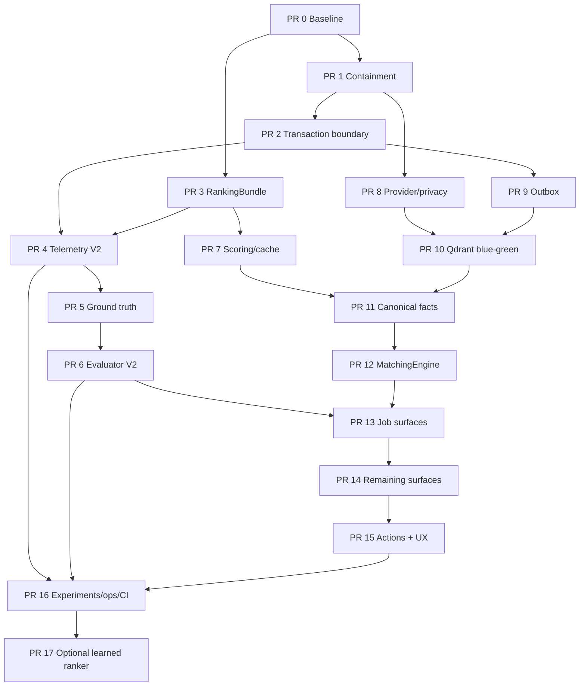

# Moduł 3 — Matching, scoring, rekomendacje i selekcja Candidate ↔ Job

## Audyt, rekomendacja docelowa i szczegółowy plan implementacyjny dla Claude Code

> Data audytu: 2026-07-16 (Europe/Warsaw)
>
> Stan kodu: `origin/main` = `254d574500ef79235accb37bef10dc9d183c4e7d`
>
> Stan produkcji: `/api/health.version` =
> `254d574500ef79235accb37bef10dc9d183c4e7d`, status `healthy`, baza `healthy`
>
> Tryb: read-only audyt kodu z izolowanego archiwum `origin/main` oraz
> read-only weryfikacja rzeczywistych ekranów produkcyjnych
>
> Status: rekomendacja i plan; implementacja nie została rozpoczęta w ramach
> tego zadania

## 1. Streszczenie zarządcze

NEXUS ma już większość elementów potrzebnych do zbudowania dobrego systemu
matchingu: Voyage embeddings, Qdrant, PostgreSQL FTS, RRF, opcjonalny reranker,
deterministyczny scoring biznesowy, profile wag, eligibility, shortlisty,
proposal snapshots, telemetry tables, indexing outbox i zalążek wspólnego
orchestratora.

Te elementy nie tworzą jednak jeszcze jednego produkcyjnego systemu.

Aktualnie co najmniej siedem flow oblicza lub prezentuje dopasowanie inaczej:

1. job → kandydaci przez `/recommendations`,
2. job → kandydaci przez legacy `/ai-matches`,
3. proposal snapshots,
4. kandydat → joby,
5. marketplace i `seeking-contractors`,
6. manual search i hybrid search,
7. CV preview oraz historyczne podobieństwo projektów.

W zależności od ekranu `match_score` może oznaczać cosine `0..1`, wynik
rerankera, ułamek zgodności tagów, kompletność profilu albo composite fit
`0..100`, czasem powiększony o ukryty historical boost. Eligibility jest
egzekwowane przede wszystkim przy części zapisów, a nie jako wspólna brama
przed wyświetleniem. Nowy `matching_orchestrator.py` nie ma produkcyjnych
call-site'ów.

Weryfikacja live pokazała skutki tego rozjazdu:

- na jednym ekranie joba występowały równolegle trzy rankingi: 20 rekordów
  historycznych, 90 nowych rekomendacji i 0 wyników legacy;
- ta sama osoba mogła mieć wynik około `0.15` w jednym panelu i `66/100` w
  drugim;
- rekord oznaczony w nazwie jako blacklistowy nadal miał aktywną akcję
  przypisania; nie jest to dowód na enum `blacklisted`, ale jest to dowód, że
  status kanoniczny, jakość danych i eligibility nie są bezpiecznie
  komunikowane;
- breakdown z totalem `66.2` prezentował widoczne składowe sumujące się do
  `61.2`; brakujące 5 punktów pochodziło z niewidocznego historical boostu;
- marketplace prawie nie znajdował jobów dla kandydatów, mimo że odwrotny flow
  dla joba znajdował dziesiątki osób;
- kandydat → job wyświetlił wynik `38/100` przed `40/100`, zasugerował draft z
  aktywnym „Przypisz” i ujawnił surowy błąd `query.current_user: Field required`;
- produkcja nadal pokazuje użytkownikom tekst zawierający `(TODO)` i odwołanie
  do nieistniejącej akcji „Pokaż wszystkie”.

Najważniejsza rekomendacja brzmi:

> Nie zaczynać od nowego modelu, uczenia wag ani masowego re-embedu. Najpierw
> należy zamknąć ryzyka RBAC/PII i kosztu, odseparować przestrzenie wektorowe,
> naprawić transakcje, wersjonowanie oraz eligibility, a następnie podłączyć
> wszystkie powierzchnie do jednego `MatchingEngine` w shadow/canary.

Plan jest celowo rozpisany na 18 małych, odwracalnych PR-ów. Nie ma sztucznego
limitu siedmiu PR-ów. PR 17, czyli learned ranker, jest opcjonalnym etapem
końcowym, a nie częścią pierwszego wdrożenia.

## 2. Zakres modułu

### 2.1. W zakresie

- job → candidate recommendations;
- candidate → job recommendations;
- legacy AI matching;
- proposal snapshots i ich generowanie;
- historyczne podobieństwo kandydatów/projektów;
- marketplace, `seeking-contractors` i alerty;
- CV → job preview;
- manual/hybrid candidate search w części retrieval i score;
- eligibility Candidate ↔ Job;
- scoring, profile wag, breakdown, confidence i cache;
- embeddingi, Qdrant, canonical text i indexing outbox;
- shortlist, compare i przypisanie kandydata do joba;
- score presentation, explanations i error states w UI;
- impressions, outcomes, ewaluacja, eksperymenty i monitoring.

### 2.2. Zależności od innych modułów

Ten moduł nie powinien ponownie implementować odpowiedzialności z modułu
„Kandydaci, sourcing i baza talentów”. Potrzebuje z niego kanonicznych:

- statusu kandydata;
- availability/marketability;
- polityk dostępu do PII;
- konfliktów klienta, NDA i blacklist;
- dokumentów CV oraz wersji danych;
- source lineage i praw do przetwarzania.

Analogicznie job powinien dostarczać wersjonowane kryteria, widoczność,
status, klienta, stawki i Champion Profile. Matching konsumuje te fakty; nie
powinien sam zgadywać ich authority.

### 2.3. Świadomie poza pierwszym rolloutem

- automatyczne podejmowanie decyzji o odrzuceniu kandydata;
- samodzielne wysyłanie profilu do klienta bez akceptacji człowieka;
- learned ranker przed zebraniem wiarygodnych ekspozycji i outcome'ów;
- inferowanie cech chronionych z imienia, CV lub zdjęcia;
- migracja do nowego dostawcy embeddingów bez porównania challenger;
- szeroki redesign całego ATS niezwiązany z matchingiem.

## 3. Źródła dowodowe i ograniczenia

### 3.1. Kod

Audyt oparto na izolowanej kopii dokładnego `origin/main` wskazanego wyżej.
Lokalny checkout był na branchu `wip/uncommitted-main-snapshot-2026-07-15`,
z innym `HEAD` i nieśledzonymi raportami. Nie został potraktowany jako prawda
produkcyjna i nie został zmodyfikowany poza dodaniem tego dokumentu.

Pierwsza pełna inspekcja była wykonana na `e25225b`. Przed finalizacją
`origin/main` przesunął się przez dokumentacyjny commit `26e8508` i analytics
security containment `254d574`. Ponownie sprawdzono pełny diff. Nie zmienił on
silników matchingu, scoringu, eligibility, indeksacji ani ich komponentów UI;
dodał m.in. `OperationalUser` i capability model dla analytics. Ustalenia
matchingowe pozostają aktualne, a metadata raportu i produkcji zostały
przełączone na `254d574`.

Najważniejsze sprawdzone obszary:

- `backend/app/api/matching.py`;
- `backend/app/api/recommendations.py`;
- `backend/app/api/search.py`;
- `backend/app/api/cv_match_preview.py`;
- `backend/app/api/candidate_scoring.py`;
- `backend/app/api/proposals.py`;
- `backend/app/services/scoring_service.py`;
- `backend/app/services/match_score_cache.py`;
- `backend/app/services/matching_orchestrator.py`;
- `backend/app/services/embedding_service.py`;
- `backend/app/services/hybrid_search.py`;
- `backend/app/services/candidate_job_eligibility.py`;
- `backend/app/services/index_outbox_service.py`;
- `backend/app/services/match_telemetry_service.py`;
- `backend/app/services/marketplace_service.py`;
- `backend/app/tasks/compute_proposals.py`;
- `backend/scripts/eval_matching.py`;
- główne komponenty matching/search/marketplace w `frontend/src`;
- `.github/workflows/ci.yml`.

### 3.2. Produkcja

Read-only sprawdzono:

- `/settings/scoring`;
- zakładkę AI Matching na wybranym jobie testowym;
- `/sourcing/marketplace`;
- zakładkę „Dopasowanie” na profilu kandydata;
- `/api/health`.

Finalny healthcheck po re-anchor zwrócił overall `healthy`, bazę `healthy`,
Anthropic `configured`, Cortex `healthy`, Traffit `degraded` i CloudTalk
`unhealthy`. Degradacja Traffit może wpływać na świeżość wejść matchingowych,
dlatego PR 0 ma mierzyć facts/index freshness zamiast utożsamiać HTTP 200 z
pełną gotowością danych.

Nie zapisano danych, nie uruchomiono recompute, nie przypisano kandydata, nie
uruchomiono re-embedu i nie generowano ręcznie płatnych operacji AI.

### 3.3. Ograniczenie snapshotu administracyjnego

`/api/admin/snapshot` nie został pobrany, ponieważ w środowisku audytu nie było
lokalnego pliku z tokenem administracyjnym. Nie omijano autoryzacji i nie
odczytywano tokenów z przeglądarki. Dlatego liczby live z paneli są dowodem UX,
ale nie zastępują pełnego runtime inventory z PR 0.

### 3.4. Domyślna konfiguracja a produkcyjne env

W `origin/main` domyślnie wyłączone są m.in.:

- `AI_MATCH_TELEMETRY_ENABLED`;
- `AI_SCORING_CONTRACT_V2`;
- `AI_INDEX_OUTBOX_ENABLED`;
- `AI_INDEX_WORKER_ENABLED`;
- `AI_TEXT_SCHEMA_V2`;
- `AI_UNIFIED_RETRIEVAL_ENABLED`.

To nie dowodzi samo w sobie, że każda flaga jest wyłączona w Coolify. PR 0 ma
zinwentaryzować realne wartości bez ujawniania sekretów.

## 4. Co już powstało od poprzednich raportów

Od starszego audytu AI matching na `62bb59d` wdrożono wartościowe fundamenty:

- `MatchingRequest`, `MatchingResult` i in-memory `MatchingRun`;
- `matching_orchestrator.py`;
- model impressions/outcomes;
- algorithm version w cache;
- `fit_confidence`;
- Search V3 schema i adapter legacy;
- eligibility dla single assign, bulk add i shortlist promotion;
- job shortlist backend i UI;
- scoring contract V2 za flagą;
- canonical text V2 za flagą;
- collection manifest i backfill planner;
- index outbox i worker za flagami;
- reverse query z `input_type="query"`;
- matching diagnostics endpoint;
- golden evaluator manual search;
- telemetry scaffold;
- poprawki request-aware compare i bulk-add reason codes.

To ważny postęp, ale obecność pliku lub tabeli nie oznacza jeszcze użycia w
produkcji. `run_matching`, `record_outcome`, Search V3 execution i manifest
kolekcji nie mają kompletnego produkcyjnego spięcia. Skrypt backfill po
`--execute` nadal świadomie odmawia zapisu. Dlatego plan poniżej rozwija
istniejące fundamenty zamiast tworzyć drugi zestaw abstrakcji.

## 5. Obecna mapa flow

| Powierzchnia | Retrieval | Finalny wynik | Eligibility przed pokazaniem | Główna wada |
|---|---|---|---|---|
| Job recommendations | dense Qdrant, fallback DB | composite + historical boost | niepełna | odpowiedź nazywa flow hybrid mimo braku sparse/RRF |
| Legacy AI matches | dense, opcjonalny rerank, tag fallback | cosine/rerank/skill fraction | tylko część statusu | różne skale pod jednym `match_score`, koszt bez twardych limitów |
| Proposal snapshot | dense, fallback DB | composite bez tego samego boostu | niepełna | nietrwały background task i ubogie wersjonowanie |
| Candidate → jobs | dense Qdrant, fallback DB | composite | brak wspólnej bramy | drafty, post-filter starvation, brak progu |
| Marketplace alerts | dense + composite | threshold 80 | częściowa | race w dedupe, alert pair blokowany na zawsze |
| Seeking contractors | dense top-N, potem filtr published | composite, próg 40 w UI | częściowa | top-N może nie zawierać żadnego published joba |
| Manual hybrid search | PostgreSQL `ts_rank` + dense + RRF | fused order, API często gubi score | filtry po top 200 | false pagination/total i `relevance_score=0` |
| CV preview | dense/rerank + composite | mieszane skale | niepełna | PII egress, warning gubiony w UI |
| Historical candidates | podobne joby + stage history | wynik 0..1 | brak docelowej eligibility | inna semantyka i błędy status/query contract |

## 6. Dowody z produkcyjnego UX

### 6.1. Job → kandydaci

Na jednym jobie testowym UI uruchamiało trzy listy jednocześnie:

- „Kandydaci z podobnych projektów”: 20;
- „Rekomendowani kandydaci”: 90;
- „Klasyczne AI Matching (legacy)”: 0.

Ten sam rekord mógł występować w kilku listach z nieporównywalnym wynikiem.
Standardowy użytkownik widzi również operacyjne akcje legacy: „Przelicz
scoring” oraz „Embed all jobs”. Lista 90 rekordów jest renderowana bez
paginacji lub wirtualizacji.

### 6.2. Score i breakdown

Przykładowy wynik miał total `66.2/100`, podczas gdy widoczne warstwy dawały:

`17.1 + 20 + 7.8 + 6.6 + 3.2 + 6.5 = 61.2`.

Różnica 5 punktów była historical boostem, którego tooltip i frontendowy typ
nie pokazywały. Jednocześnie brak danych o stawce, dostępności i Championie
dawał neutralne punkty. Niski poziom dowodów wyglądał więc jak precyzyjny i
dość wysoki wynik.

### 6.3. Ustawienia wag

UI `/settings/scoring` nadal komunikuje pięć warstw `40/30/15/10/5` i nie
pozwala świadomie edytować warstwy Champion. Built-in backend używa sześciu
warstw `35/30/12/8/5/10`. API przyjmuje już `champion_fit`, ale frontendowy
kontrakt i edytor są nadal pięciowarstwowe. Starsze rekordy bez
`champion_fit`, przy wyłączonym contract V2, mogą odziedziczyć dodatkowe 10
punktów ponad budżet 100.

### 6.4. Candidate → jobs

Zakładka „Dopasowanie” pokazała:

- surowy błąd backendowy `query.current_user: Field required`;
- job `38/100` przed jobem `40/100`;
- draft z aktywnym „Przypisz”;
- „Sugerowane pule” z wysokimi procentami, które nie mają wyjaśnionej relacji
  do score job-fit.

To nie tylko problem sortowania. Użytkownik nie ma pewności, czy widzi
retrieval relevance, fit, historyczne podobieństwo, kompletność profilu czy
procent innego modelu.

### 6.5. Marketplace

W live widoku było 18 konsultantów w horyzoncie, ale prawie każdy miał brak
ofert spełniających próg. Dwa rekordy miały po jednym słabym dopasowaniu.
Rozwinięcie pokazywało literalny tekst z `(TODO)` i sugerowało kliknięcie
nieistniejącego „Pokaż wszystkie”.

Główny mechanizm starvation jest w kodzie: najpierw pobierane jest top-N jobów
Qdrant ze wszystkich statusów, a dopiero później następuje przecięcie z
published. Jeśli top-N zawiera głównie draft/closed, flow może zwrócić zero,
mimo że niżej w indeksie istnieją dobre joby published.

## 7. Rejestr ustaleń

| ID | Priorytet | Ustalenie | Skutek |
|---|---|---|---|
| M3-SEC-01 | P0 | matching nie ma jednej macierzy RBAC i projekcji PII | viewer/client może zobaczyć zbyt dużo lub wykonać mutację |
| M3-COST-01 | P0 | legacy `limit/min_score` nie mają walidowanych granic | kosztowy DoS i masowy egress CV do rerankera |
| M3-PRIV-01 | P0 | PII/raw CV trafia do Voyage, Anthropic i Qdrant | ryzyko RODO, vendor egress i nadmiar danych |
| M3-VEC-01 | P0 | Voyage i Ollama mogą współdzielić kolekcję | losowe podobieństwa mimo zgodnego wymiaru |
| M3-CACHE-01 | P0 | awaria Qdrant może zatruć cache jako fresh | błędne wyniki przeżywają powrót providera |
| M3-TX-01 | P0 | cache/outbox/telemetry commitują sesję wywołującego | przypadkowy commit lub rollback logiki biznesowej |
| M3-ELIG-01 | P0 | eligibility nie filtruje wszystkich read surface | forbidden match jest widoczny i przypisywalny |
| M3-ACT-01 | P0 | kilka ścieżek assignment ma inne skutki uboczne | brak spójnej idempotencji, audit i CV snapshotu |
| M3-API-01 | P0 | recompute wywołuje route-to-route bez `Request` | endpoint jest funkcjonalnie uszkodzony |
| M3-ARCH-01 | P1 | co najmniej siedem silników/adapterów | ten sam pair ma różne wyniki |
| M3-SCORE-01 | P1 | score miesza skale i ukryty boost | liczba nie jest porównywalna ani wyjaśnialna |
| M3-SCORE-02 | P1 | unknown dostaje neutralne punkty | ubogie profile są sztucznie wysoko |
| M3-SCORE-03 | P1 | salary nie ma bezpiecznej jednostki/waluty | fałszywy match lub mismatch finansowy |
| M3-PROFILE-01 | P1 | profile są mutable i niedeterministycznie rozwiązywane | cache i wynik zmieniają znaczenie bez nowej wersji |
| M3-INDEX-01 | P1 | outbox jest nieatomowy, opcjonalny i niepełny | stale/orphan vectors |
| M3-INDEX-02 | P1 | manifest/backfill to scaffold, nie lifecycle | brak bezpiecznego blue-green rollout |
| M3-RETR-01 | P1 | awaria i prawidłowe zero są nierozróżnialne | degraded udaje pełny wynik |
| M3-RETR-02 | P1 | filtry po stałym top-N obniżają recall | false zero i fałszywa paginacja |
| M3-JOB-01 | P1 | draft/closed vectors zabierają top-K | reverse i marketplace nie widzą published jobów |
| M3-SNAP-01 | P1 | proposal BackgroundTasks nie są durable | snapshot może zostać wiecznie `pending` |
| M3-MKT-01 | P1 | alert dedupe/race/rescan są niespójne | duplikat lub trwałe pominięcie dobrego matcha |
| M3-TEL-01 | P1 | telemetryka nie mierzy produkcyjnych flow | brak wiarygodnego learning loop |
| M3-EVAL-01 | P1 | evaluator ma leakage i selection bias | nie może być gate'em jakości |
| M3-UI-01 | P1 | trzy rankingi i wiele progów w UI | użytkownik nie zna źródła prawdy |
| M3-UI-02 | P1 | error-as-empty i raw backend errors | awaria wygląda jak zero lub wycieka detal |
| M3-UI-03 | P1 | polling, brak paginacji i stale state | koszt, wyścigi i ciężkie renderowanie |
| M3-UI-04 | P1 | compare/selection/shortlist gubią kontekst | ciche obcięcie i błędne decyzje |
| M3-A11Y-01 | P2 | dialogi/tooltipy/mobile nie mają pełnej dostępności | bariery keyboard/screen reader |
| M3-CI-01 | P1 | kluczowe testy są poza wymaganym pytest slice | regresja może przejść zielone CI |

## 8. Szczegółowe ustalenia i rekomendacje

### 8.1. Bezpieczeństwo, prywatność i koszt

#### M3-SEC-01 — brak centralnego RBAC i least-privilege projection

Endpointy matching/search/proposals zwracają email, telefon, stawkę i AI
summary przy samym `CurrentUser`. Reverse recommendations mogą ujawniać
drafty. Single assign jest dostępne szerzej niż canonical bulk flow.

Dowody startowe:

- `backend/app/api/matching.py:132-148,208-215`;
- `backend/app/api/recommendations.py:81-118,568-705,921-1025`;
- `backend/app/api/proposals.py:56-147`;
- `backend/app/api/search.py:64-96,244-249`;
- `backend/app/api/marketplace.py:53-66,147-205`;
- `backend/app/api/candidate_scoring.py:77-140`.

Zmiana:

- zdefiniować capabilities `matching:read_internal`, `matching:write`,
  `matching:admin`, `matching:client_shared`;
- wszystkie endpointy używają tej samej policy dependency;
- response DTO jest projekcją zależną od capability;
- klient widzi wyłącznie jawnie udostępniony, zanonimizowany snapshot;
- draft widzą role rekrutacyjne mające relację do joba;
- mutation nigdy nie polega na ukryciu przycisku w frontendzie.

#### M3-COST-01 — legacy endpoint ma nieograniczony koszt

`backend/app/api/matching.py:208-241` przyjmuje surowe `limit`, `min_score` i
`location`. Duży limit może poszerzyć Qdrant fetch i liczbę dokumentów
rerankowanych przez Voyage. Dokumenty zawierają raw CV i PII.

Zmiana natychmiastowa:

- `Query(ge=1, le=100)` dla limitu;
- `Query(ge=0, le=1)` dla progu;
- maksymalna długość lokalizacji;
- RecruiterPlus;
- rate limit i per-user/provider budget;
- usunięcie „Embed all jobs” z głównego UI;
- operacje masowe wyłącznie przez trwały admin job z estymacją kosztu.

#### M3-PRIV-01 — canonical text nie jest jeszcze PII-free

Legacy builder zawiera imię, nazwisko, firmy, AI summary i raw CV.
`canonical_text.py` deklaruje kierunek PII-free, ale nadal ma raw-CV fallback i
nie wykonuje kompletnej redakcji. Qdrant payload przechowuje pełną nazwę.
Justification wysyła do Anthropic do 6000 znaków CV.

Zmiana:

- wspólny `AIDataEgressPolicy` przed każdym vendor call;
- deterministyczna redakcja emaili, telefonów, adresów, URL-i i nazw własnych,
  o ile nie są potrzebne do dopasowania;
- Qdrant payload: tylko ID techniczne, status/index signature i filtry;
- bez raw CV w document/rerank/prompts;
- data map: pole → purpose → provider → retention;
- golden i adversarial DLP tests;
- osobny, rotowalny telemetry pseudonymization key, nie `SECRET_KEY`.

### 8.2. Wektory, indeks i transakcje

#### M3-VEC-01 — fallback Ollama miesza przestrzenie

`generate_embedding()` fallbackuje Voyage → Ollama, ale downstream zapisuje
wektor do tych samych nazw kolekcji. Oba modele mogą mieć 1024 wymiary, lecz
nie współdzielą przestrzeni semantycznej.

Reguła docelowa:

`physical collection = provider + model + dimension + text schema + fact schema`.

Awaria Voyage może uruchomić lexical degraded mode albo oddzielną kolekcję
Ollama, nigdy zapis do aliasu Voyage. Każdy point i każda odpowiedź mają
`index_signature`.

#### M3-INDEX-01 — outbox nie jest transakcyjnym outboxem

`index_outbox_service.py` wykonuje własne `commit/rollback`. Enqueue może więc
być zatwierdzony oddzielnie od encji. Podobny problem istnieje w score cache i
telemetryce. Worker nie odzyskuje bezpiecznie osieroconego `processing`, nie ma
`next_attempt_at`, a job delete jest no-opem.

Zmiana:

- service dodaje event do przekazanej sesji i tylko `flush()`;
- granica application command wykonuje jeden commit;
- claim ma lease z `lease_expires_at` i reaper;
- exponential backoff + jitter + dead letter;
- compaction do ostatniego desired state per entity;
- delete usuwa point obu typów;
- `desired_hash` obejmuje pełny index signature;
- po wykonaniu worker ponownie sprawdza najnowszy desired revision;
- alert, gdy outbox on/worker off albo lag przekracza SLO.

#### M3-INDEX-02 — manifest i backfill nie są jeszcze operacyjne

`collection_manifest.py` nie steruje live runtime. `backfill_qdrant_collection`
po `--execute` zwraca odmowę i prosi o oddzielny job. Aplikacja nadal czyta
legacy physical names, dimension jest hardcoded, a Qdrant client nie egzekwuje
centralnie API key/TLS/timeoutów.

Zmiana:

- trwała tabela manifestów i stanów backfill;
- prawdziwy, resumable batch job z checkpointem w DB;
- exact expected eligible set i desired/current hash parity;
- walidacja model/dimension/distance/schema przy startupie;
- atomic alias swap;
- rollback przez alias do poprzedniej kolekcji;
- rehearsal na challenger przed produkcyjnym switchem.

### 8.3. Scoring, profile i cache

#### M3-SCORE-01 — score nie ma jednej semantyki

Legacy `match_score` może być cosine, rerank relevance, skill fraction albo
profile completeness. Composite endpoint dodaje historyczny boost. Manual
search czasem zwraca `relevance_score=0`. Progi w frontendzie to m.in. 30, 40,
50, 60, 70, 75, 80 i 90.

Docelowe pola muszą być rozdzielone:

```json
{
  "retrieval_score": 0.73,
  "rerank_score": 0.61,
  "fit_score": 68.4,
  "ranking_score": 63.1,
  "confidence": 0.58,
  "band": "medium",
  "eligibility": "eligible",
  "version": "ranking-bundle-sha256",
  "computed_at": "..."
}
```

`fit_score` nie jest prawdopodobieństwem zatrudnienia. Jeśli w przyszłości
pojawi się skalibrowane prawdopodobieństwo konkretnego outcome'u, musi mieć
osobną nazwę, target i horyzont.

#### M3-SCORE-02 — unknown nie może udawać dowodu

Obecny `SCORE_UNKNOWN_NEUTRAL_FRACTION` przyznaje część budżetu za brak danych.
W live przykładzie brak salary, availability i Champion dał kilkanaście
punktów. To spłaszcza ranking i premiuje ubogie profile.

Rekomendowany contract V3:

- każda warstwa zwraca `value`, `known`, `confidence`, `evidence` i `reason`;
- dopasowanie liczone jest tylko na znanych warstwach;
- osobny `confidence` mierzy pokrycie i jakość dowodu;
- `ranking_score` stosuje jawny uncertainty penalty lub lower-confidence bound;
- niski confidence wyświetla „za mało danych”, a nie precyzyjne `66/100`;
- MUST/hard constraints są eligibility, nie punktami;
- brak deadline nie oznacza pełnej zgodności dostępności;
- historical boost nie jest ukrytą premią; do czasu wiarygodnej ewaluacji jest
  tylko opisanym evidence signalem.

#### M3-SCORE-03 — stawka wymaga kanonicznego typu

Porównanie różnych pól bez pewnej waluty i okresu może zestawić PLN/miesiąc z
PLN/h lub B2B netto z inną podstawą. Ponadto tańszy kandydat nie powinien być
symetrycznie karany jak zbyt drogi.

Wprowadzić `RateAmount`:

- amount/min/max;
- currency;
- period: hour/day/month;
- employment/tax basis;
- source i observed_at;
- możliwość przeliczenia tylko przy znanym, wersjonowanym kursie/policy.

#### M3-PROFILE-01 — profile i cache wymagają immutable revision

Profil można edytować pod tym samym ID bez invalidacji score cache. Resolver
wybiera `.limit(1)` bez stabilnego `ORDER BY` i nie ma constraintu jednego
aktywnego profilu per scope. `SCORING_ALGORITHM_VERSION` obejmuje głównie flagę
V2, ale nie gamma, unknown policy, taxonomy, index i revision profilu.

Cache key powinien zawierać:

- candidate facts revision/hash;
- job facts revision/hash;
- ranking bundle ID/hash;
- immutable profile revision;
- eligibility policy revision;
- index signature;
- taxonomy/text schema;
- calibration artifact;
- surface policy, jeśli wpływa na wynik.

Tryb degraded nie zapisuje normalnego cache. Cache service nie commit/rollbackuje
sesji wywołującego.

### 8.4. Retrieval, eligibility i action commands

#### M3-ELIG-01 — eligibility musi być nieomijalna

Istniejący `candidate_job_eligibility.py` jest dobrym fundamentem, ale jest
używany głównie przy części zapisów. Recommendations, legacy, proposals,
reverse, marketplace i historical results mogą pokazać match bez wspólnej
decyzji. Scoring konfliktu nie stosuje identycznej semantyki `expires_at`.

Docelowo:

1. visibility i coarse eligibility ograniczają cohort przed retrieval;
2. batch eligibility sprawdza każdą parę po retrieval;
3. hard-block nie wchodzi do rankingu;
4. write command ponawia sprawdzenie w tej samej transakcji;
5. override wymaga capability, reason code i append-only audit;
6. każdy surface otrzymuje identyczne reason codes.

Brak decyzji eligibility jest fail-closed, a nie `(True, [])`.

#### M3-RETR-01 — degraded musi być typem, nie pustą listą

Semantic search połyka błędy i zwraca `[]`. Endpoint nie odróżnia prawidłowego
zero od outage Qdrant/Voyage. Fallback pobiera pierwsze rekordy bez `ORDER BY`,
a response nadal nazywa wynik `hybrid`.

Wprowadzić `RetrievalResult`:

```text
status = ok | partial | degraded | failed
provider/index signature
candidate count before/after filters
fallback reason
stage timings
warnings safe for UI
internal correlation id
```

Fallback ma być deterministyczny PostgreSQL FTS, z jawnym `degraded=true`.
W trybie degraded nie wysyła się alertów i nie zapisuje artefaktu jako pełnego
snapshotu jakości.

#### M3-RETR-02 — filtry po top-N obniżają recall

Manual search bierze maksymalnie 200 IDs przed filtrami. Candidate → jobs i
marketplace biorą top-N wszystkich jobów, a potem filtrują status. To powoduje
false zero, szczególnie gdy indeks zawiera dużo draft/closed vectors.

Zmiana:

- eligibility/status payload filters w Qdrant;
- ten sam eligible cohort w dense i sparse;
- adaptacyjne overfetch do pełnej strony albo bounded exhaustion;
- stabilny tie-break `score DESC, entity_id ASC`;
- cursor zawiera bundle version i sort key;
- `total` oznacza rzeczywisty, policzalny total albo jest jawnie `unknown`;
- test: jedyny prawidłowy wynik na dense rank 250 musi zostać znaleziony.

#### M3-ACT-01 — jeden command przypisania

`SuggestedCandidatesWidget`, `SuggestedJobsWidget`, `QuickAssign`, marketplace,
bulk add i shortlist promotion używają różnych endpointów i side effects.
Single assign tworzy CV snapshot, a inne ścieżki nie zawsze robią to samo.

Docelowy `AddCandidateToJobCommand`:

- RBAC i job visibility;
- idempotency key;
- job status policy;
- eligibility w transakcji;
- unique candidate/job pipeline invariant;
- stage selection;
- CV/data snapshot;
- audit event;
- cache/index invalidation;
- typed result: `added`, `already_assigned`, `blocked_*`, `forbidden`,
  `conflict`, `invalid_job_state`.

Wszystkie przyciski używają tego samego commandu, także pojedynczy add.

### 8.5. Proposals, marketplace i explanations

#### M3-SNAP-01 — snapshot nie jest prawdziwie trwały ani niezmienny

Proposal używa FastAPI `BackgroundTasks`; deploy może pozostawić `pending`.
Snapshot zapisuje profile ID, lecz nie pełny bundle. Kandydat jest hydratowany
live, więc widoczna treść może zmienić się bez zmiany starego score.

Zmiana:

- durable queue/outbox job;
- lease, retry, timeout recovery i idempotency;
- immutable candidate/job facts references lub minimalny presentation snapshot;
- pełny ranking bundle, request hash, source revisions i eligibility policy;
- status `ready_degraded` odróżniony od `ready`;
- stale marker po zmianie wejść;
- regeneracja tworzy nową revision, nie nadpisuje lineage.

#### M3-MKT-01 — alert wymaga outboxu i wersjonowanego resurfacingu

Marketplace wysyła notification przed próbą insert-log dedupe, więc dwa workery
mogą wysłać duplikat. Unique `(candidate, job)` obowiązuje na zawsze, więc
ważna zmiana joba nie może ponownie pokazać dobrej pary. Daily cap istnieje w
configu, lecz nie jest egzekwowany.

Zmiana:

- atomowy claim/outbox przed notification;
- idempotency key = pair + job revision + policy revision + channel;
- cooldown/resurfacing policy;
- daily cap i user preferences;
- durable rescan po zmianie pól matchingowych;
- job description, requirements, salary, location, remote, deadline i Champion
  w significant-change hash;
- brak alertu w degraded mode.

#### M3-EXPL-01 — justification feedback nie jest ground truth

Jedno pole rating jest nadpisywane przez kolejnych użytkowników. Hash nie
obejmuje całego MatchVersion, a równoległe cache missy mogą podwójnie zapłacić
za Claude przed unique conflict. Live UI pokazuje raw backend error.

Zmiana:

- append-only `justification_feedback_event` per user/revision;
- pełny input hash z bundle i breakdown;
- singleflight/advisory lock;
- safe localized error + correlation ID;
- oddzielić ocenę jakości uzasadnienia od oceny jakości matcha;
- explanation generować z ustrukturyzowanego evidence, nie z pełnego raw CV.

### 8.6. Frontend i UX

#### M3-UI-01 — jedna canonical lista i jeden score component

Na jobie standardowy użytkownik powinien widzieć jedną listę. Historyczne
podobieństwo jest evidence/explanation, a nie konkurencyjnym rankingiem.
Legacy zostaje czasowo tylko w admin diagnostics/shadow compare.

Wspólny `MatchScoreCard/Badge` pokazuje:

- fit score;
- confidence;
- eligibility;
- najważniejsze evidence i unknowns;
- bundle/version i computed_at;
- degraded/stale warning;
- jedną centralną band/threshold policy.

Kompletność profilu ma osobną nazwę i wygląd.

#### M3-UI-02 — error nie może wyglądać jak empty

W kodzie wiele `catch => []` zamienia błąd w pustą listę. Inne miejsca pokazują
surowy `detail`. Wprowadzić wspólny stan:

`loading | empty | ready | partial | stale | forbidden | error`.

Każda awaria ma retry i correlation ID. Surowy stack, nazwa parametru lub
walidacja nie trafia do użytkownika. Partial error jest przypisany do elementu,
nie ukrywa całej listy.

#### M3-UI-03 — state machine, paginacja i polling

`SuggestedCandidatesWidget` miesza snapshot, live-location i fallback, robi
side effect w query function i polluje co 2 sekundy bez wyraźnego limitu.
Renderuje do 200 kart.

Zmiana:

- jedna state machine `snapshot/generating/live-fallback/failed`;
- deadline i maksymalna liczba prób;
- cursor pagination lub wirtualizacja;
- GET nie zapisuje historii;
- centralny registry query keys i invalidacje;
- backend odpowiada już deterministycznie posortowany;
- UI zawsze pokazuje źródło, freshness i fallback reason.

#### M3-UI-04 — compare, selection i shortlist

Selection przechodzi między stronami, ale compare pobiera obiekty tylko z
bieżącej strony i cicho robi `slice(0,5)`. Dynamiczne `useQuery` w `ids.map`
łamie Rules of Hooks. Shortlist nie pokazuje wszystkich reason/note/owner/next
action i traktuje różne błędy jak 409.

Zmiana:

- selected IDs + lightweight snapshots w jednym store;
- jawny limit 2–5 przed akcją;
- batch endpoint lub `useQueries`;
- per-ID error card;
- brak cichego obcinania;
- shortlist pokazuje added/skipped z reason code;
- append-only timeline decyzji i wersjonowany score snapshot.

#### M3-A11Y-01 — dostępność i mobile

Tooltipy i custom dialogi nie mają pełnego focus trap/restore, Escape, ARIA i
mobile positioning. CVDropzone jest click-only. Tabele nie zawsze mają
responsive overflow. Występują hardcoded kolory zamiast tokenów.

Kryterium: axe + pełna obsługa klawiaturą dla score details, compare,
marketplace modal, shortlist i CV drop; 320 px bez utraty akcji.

### 8.7. Telemetryka, ewaluacja i CI

#### M3-TEL-01 — telemetryka jest niepodłączonym szkieletem

Impressions powstają tylko w nieużywanym orchestratorze, a `record_outcome`
nie ma produkcyjnych call-site'ów. `MatchingRun` jest in-memory dataclassą.
Writer commit/rollbackuje sesję biznesową. Nie ma pełnego requestu, wariantu,
pool size, kosztu, stage timings ani trwałego retention/DSAR joba.

Potrzebne są:

- persistent `matching_runs`;
- generated rank i displayed rank;
- impression ID dla każdego realnie pokazanej pozycji;
- bundle, variant, request hash, cohort i degraded stage;
- outcome linkowany do impression, jeśli ekspozycja istniała;
- osobny telemetry outbox/session;
- retencja i DSAR;
- brak raw query/CV/PII.

#### M3-EVAL-01 — obecny evaluator nie jest promotion gate

`backend/scripts/eval_matching.py` używa aktualnych danych zamiast
point-in-time snapshotów, aktualnej historii etapów jako labeli i sygnału
boostującego, nie zna ekspozycji i wybiera mało reprezentatywną próbkę. Brakuje
temporal/client holdout, confidence intervals i censoringu.

`eval_candidate_search.py` jest wartościowym testem poprawności semantyki
filtrów, ale nie mierzy produkcyjnej jakości rankingu.

#### M3-CI-01 — testy krytyczne są poza required gate

CI uruchamia selektywną listę pytest. Poza wymaganym slice pozostają m.in.
testy proposals, pełnego marketplace flow/service, recommendation filters,
shortlist/proposal, matching location/skills, AI health i historical jobs.

Wymagany matching gate ma obejmować:

- role/PII matrix;
- bounds i cost guard;
- eligibility parity;
- provider isolation;
- outage → degraded → recovery bez cache poisoning;
- cache/index freshness;
- outbox crash/retry/delete/order;
- deterministic order/pagination;
- idempotency/concurrency assignment i alerts;
- external-AI egress redaction;
- online/offline executable parity;
- komponentowe i E2E error/empty/partial states.

## 9. Docelowa architektura

### 9.1. Jeden wykonywalny pipeline

```mermaid
flowchart LR
    A["Surface adapter"] --> B["Normalize MatchingRequest"]
    B --> C["Resolve immutable RankingBundle"]
    C --> D["Visibility + coarse eligibility cohort"]
    D --> E["Canonical Candidate/Job Facts"]
    E --> F["Sparse + dense retrieval"]
    F --> G["Deterministic fusion + adaptive overfetch"]
    G --> H["Batch pair eligibility"]
    H --> I["Optional reranker"]
    I --> J["Fit score + confidence + evidence"]
    J --> K["Surface policy + cursor"]
    K --> L["MatchResult response"]
    K --> M["Run + impressions telemetry"]
    L --> N["Human decision / action command"]
    N --> O["Outcome event"]
    O --> P["Point-in-time evaluator"]
```



Docelowa metoda:

```python
MatchingEngine.execute(request: MatchingRequest, bundle: RankingBundleVersion)
    -> MatchingResponse
```

Ten sam executable jest wywoływany online, w shadow i w evaluatorze. Surface
adapter może zmienić visibility, threshold, limit i dozwolone akcje, lecz nie
może implementować własnego parsera, score lub eligibility.

### 9.2. RankingBundleVersion

Immutable bundle obejmuje:

- engine/formula version;
- scoring profile revision i hash;
- eligibility policy revision;
- retrieval strategy i parameters;
- fusion/RRF version;
- reranker provider/model/prompt/version;
- embedding provider/model/dimension;
- physical collections i alias revision;
- candidate/job fact schema;
- text schema;
- taxonomy revision;
- calibration artifact;
- surface policy revision;
- feature flags wpływające na wynik.

Bundle ma stabilny canonical JSON i SHA-256. Każdy run, cache row, snapshot,
score, impression i outcome przechowuje jego ID/hash.

### 9.3. Kontrakt requestu

`MatchingRequest` musi zawierać co najmniej:

- `surface`;
- direction: job→candidate, candidate→job lub global search;
- actor/capabilities i visibility scope;
- query entity ID lub ustrukturyzowany query DSL;
- hard filters;
- soft preferences;
- threshold/top_k/page_size/cursor;
- retrieval/rerank policy;
- eligibility policy;
- experiment assignment;
- request ID i request hash.

Brak pola nie może uruchamiać przypadkowego defaultu z innego surface.

### 9.4. Kontrakt wyniku

Każdy `MatchResult` zawiera:

- entity ID i minimalną role-aware projection;
- retrieval/fusion/rerank provenance;
- fit score `0..100`;
- ranking score;
- confidence;
- structured breakdown;
- matched, missing i unknown evidence;
- eligibility decision i reason codes;
- source/index/bundle versions;
- computed_at;
- stale/degraded flags;
- stable rank i cursor key;
- capabilities dla dozwolonych akcji.

### 9.5. Inwarianty

1. Forbidden pair nigdy nie pojawia się jako zwykła rekomendacja.
2. Ten sam pair + bundle + facts revision daje ten sam fit score na każdym
   surface.
3. Nie można porównać wektorów z różnych index signatures.
4. Awaria retrieval nie zapisuje pełnowartościowego cache/snapshot/alertu.
5. Żaden shared service nie commit/rollbackuje transakcji właściciela.
6. Każdy pokazany wynik ma impression i bundle trace.
7. Unseen/unjudged nie jest negatywnym labelem.
8. Każdy assignment przechodzi ten sam command i eligibility.
9. Żadne PII/raw CV nie trafia do indeksu lub telemetryki.
10. Rollback rankera nie wymaga cofania danych ani destructive migration.

## 10. Ground truth i ewaluacja

### 10.1. Hierarchia sygnałów

1. Impression/exposure — warunek interpretacji braku reakcji.
2. Jawna ocena recruitera: relevant/not relevant + reason code.
3. Shortlist + status i reason.
4. Kontakt/zgoda kandydata.
5. Decyzja klienta/interview.
6. Pipeline advancement/rejection z reason code.
7. Hire/placement jako opóźniony outcome.

`Unseen`, `unjudged` i `censored` pozostają unknown. Nie wolno zamieniać ich na
negatywy.

### 10.2. Dataset

- point-in-time facts i job criteria;
- exact ranking bundle;
- temporal split;
- grouping po jobie;
- client holdout;
- ekspozycja i variant;
- minimalny horyzont dojrzewania outcome;
- jawne wykluczenie post-outcome leakage;
- reprodukowalny dataset manifest/hash.

### 10.3. Metryki

Retrieval:

- eligible coverage;
- Recall@50/100;
- MRR;
- nDCG;
- zero-result i bounded-exhaustion rate.

Ranking na ocenionych ekspozycjach:

- Precision@5/10;
- Recall@K;
- nDCG@K;
- MAP/MRR;
- recruiter relevant rate;
- shortlist/interview conversion z odpowiednim attribution window.

Calibration, tylko jeśli score ma zdefiniowany probabilistyczny target:

- Brier score;
- ECE;
- reliability curves.

Operacyjne:

- p50/p95/p99 per etap i całość;
- koszt per query/result;
- degraded/fallback/error rate;
- eligibility violation rate;
- stale/orphan/index coverage;
- telemetry coverage.

Slice'y:

- źródło danych;
- język;
- kompletność profilu;
- seniority/job family;
- lokalizacja/remote;
- klient;
- typ zatrudnienia.

Cechy chronione wyłącznie w osobnym, prawnie zatwierdzonym audycie. Nie
inferować ich z imienia lub zdjęcia.

### 10.4. Promotion gates

Wartości należy ratyfikować po PR 0/6, ale minimalne bramy jakościowe to:

- 100% canary response ma bundle/run trace;
- co najmniej 99% realnie pokazanych wyników ma impression;
- zero mixed-provider/index-signature mismatch;
- zero hard eligibility violations;
- eligible index coverage co najmniej 99.5% albo każda luka ma reason;
- brak pogorszenia p95 o więcej niż 10% względem zatwierdzonego baseline;
- brak pogorszenia zero-result/degraded rate;
- brak statystycznie/operacyjnie istotnej regresji zatwierdzonych slice'ów;
- rollback rehearsal zakończony przed podniesieniem canary.

## 11. Plan implementacji dla Claude Code — 18 PR-ów

### 11.1. Zasady wykonania każdego PR

Przed każdym PR Claude ma:

1. `git fetch origin` i sprawdzić, czy planowany element już nie istnieje;
2. pracować na świeżym branchu od aktualnego `origin/main`;
3. nie włączać lokalnego Dockera;
4. zachować unrelated WIP i nie absorbować obcych zmian;
5. dla DDL dodać Alembic oraz idempotentny mirror w
   `backend/entrypoint.sh` `_COLUMN_STATEMENTS`;
6. uruchomić najmniejszy sensowny host-native test;
7. przejść wymagane hosted CI;
8. merge/deploy normalną ścieżką;
9. potwierdzić exact SHA przez `/api/health` z wymaganym User-Agent;
10. dla UI wykonać rzeczywisty flow w produkcji i screenshot.

Każdy PR ma mieć feature flag lub odwracalny pointer, jeśli wpływa na ranking.
Additive migration poprzedza aktywację. Usunięcie legacy następuje dopiero po
udanym shadow/canary.

## PR 0 — Runtime inventory, ADR i zamrożenie baseline

Cel: ustalić rzeczywistą produkcyjną konfigurację, zanim zmienimy zachowanie.

Zakres:

- nowy read-only admin command/report;
- aktywne flagi i surface routing bez wartości sekretów;
- profile wag, scope i legacy rows bez `champion_fit`;
- physical Qdrant collections, aliases, point counts, dimensions i payload
  signature samples;
- DB eligible population ↔ indexed IDs ↔ desired/current hash;
- outbox status/lag/dead/stuck;
- cache coverage, algorithm versions i stale ratio;
- progi per surface;
- traffic, latency, error i provider cost, jeśli dostępne;
- dokładna lista produkcyjnych endpointów/komponentów.

Artefakty:

- `docs/architecture/adr-matching-engine-v3.md`;
- sanitizowany JSON baseline z SHA i config hashes;
- runbook odtworzenia pomiaru.

Testy:

- report nie zwraca sekretów ani PII;
- deterministyczny hash;
- timeout/partial status dla Qdrant/Voyage.

Kryteria zakończenia:

- znamy realny stan każdej flagi i kolekcji;
- każda luka coverage ma mierzalny mianownik;
- ADR zatwierdza jeden engine i plan migracji surface-by-surface.

Rollback: brak zmiany zachowania; usunąć tylko endpoint/report flag.

## PR 1 — P0 containment: RBAC, PII projection, limity i legacy controls

Cel: natychmiast zamknąć największe ryzyka bez zmiany rankingu.

Zakres backendu:

- matching capability dependencies;
- jawne matching capabilities; jako minimum odczytu można wykorzystać nowy
  `OperationalUser`, natomiast zapis i płatne operacje muszą mieć węższe
  capabilities zgodne z macierzą domenową;
- role-aware DTO bez PII dla węższych ról;
- draft visibility;
- walidowane bounds `limit`, `min_score`, `location`, `top_k`;
- rate limit i AI budget dla legacy/rerank/justification;
- bezpieczne HTML escaping i redaction w blind proposal preview;
- safe error envelope z correlation ID.

Zakres frontendu:

- ukryć „Embed all jobs” i admin recompute dla nieuprawnionych;
- raw backend detail nie jest renderowany;
- disabled action wynika z capability, ale backend nadal egzekwuje policy.

Testy:

- pełna macierz ról endpoint × metoda × fields;
- `limit=1000000` → 422 bez wywołania providera;
- draft/PII visibility;
- malicious HTML i PII w blind summary.

Kryteria zakończenia:

- viewer/client nie może globalnie czytać/mutować matching;
- internal role dostaje tylko potrzebne pola;
- masowy koszt nie jest możliwy przez query params.

Rollback: nie rekomendowany dla security fix; w razie regresji scope zawęzić
capability mapping, nie przywracać otwartego endpointu.

## PR 2 — Application service boundary i integralność transakcji

Cel: usunąć route-to-route calls i wewnętrzne commit/rollback.

Zakres:

- wydzielić `RecommendationApplicationService`;
- naprawić `POST /recompute-scores` przez application service;
- cache, telemetry, outbox i embedding helpers używają `flush`, nie `commit`;
- właściciel use-case kontroluje transakcję;
- best-effort side effects mają osobną sesję/outbox;
- testy caller transaction commit/rollback.

Testy:

- recompute 200 i prawidłowy call graph;
- rollback application command cofa entity i outbox razem;
- awaria telemetryki nie cofa ani nie commitują mutacji biznesowej;
- brak obiektów FastAPI `Query/Depends/Request` poza transportem.

Kryteria zakończenia:

- route nie wywołuje route;
- shared service nie zarządza cudzą transakcją;
- recompute jest sprawdzony integracyjnie.

Rollback: wrócić do poprzedniego adaptera transportowego; nie przywracać
wewnętrznych commitów.

## PR 3 — Immutable RankingBundle, profile revisions i surface policies

Cel: każda liczba ma pełną, odtwarzalną wersję.

Model danych:

- `ranking_bundle_versions`;
- `scoring_profile_revisions`;
- `matching_surface_policies`;
- optional active pointers, bez mutowania revision;
- canonical JSON + SHA-256;
- effective_from/retired_at/created_by.

Zasady:

- jeden aktywny profil per scope przez staged unique constraint;
- deterministyczny resolver;
- edycja tworzy revision;
- bundle obejmuje wszystkie inputs opisane w sekcji 9.2;
- legacy rows są migrowane do jawnej revision, bez zgadywania aktywacji.

Testy:

- ten sam config → ten sam hash;
- zmiana dowolnej zależności → nowy hash;
- concurrency aktywacji;
- precedence user → client → global → built-in;
- rollback pointer do poprzedniego bundle.

Kryteria zakończenia:

- nie ma mutable configuration używanej jako current bez revision;
- każdy nowy wynik może wskazać bundle.

## PR 4 — Telemetry V2: persistent runs i impressions

Cel: zarejestrować to, co rzeczywiście zostało wygenerowane i pokazane.

Model:

- persistent `matching_runs`;
- rozszerzone impressions: generated/displayed rank, request hash, bundle,
  variant, score provenance, confidence, eligibility, degraded stage;
- stage timings, count before/after filters, cost units;
- pseudonymous actor/candidate keys;
- retention metadata.

Implementacja:

- osobny telemetry outbox/writer;
- dual-write za flagą;
- nie zapisywać raw query/CV/PII;
- display impression dopiero, gdy element został naprawdę pokazany;
- retention i DSAR executor.

Testy:

- awaria telemetryki nie wpływa na response;
- pełne odtworzenie kolejności;
- redaction/retention/DSAR;
- generated vs displayed rank.

Kryteria zakończenia:

- każdy canary response ma run ID;
- telemetry coverage jest mierzona;
- dane nie naruszają PII policy.

## PR 5 — Ground-truth events i kompletny shortlist workflow

Cel: zbudować wiarygodne, append-only sygnały decyzji człowieka.

Zakres:

- `match_decision_events` z impression/run/pair/bundle;
- explicit relevant/not relevant + reason codes;
- shortlist add/update/remove jako events; obecna tabela staje się projection;
- owner, note, next action i audit timeline;
- justification-quality feedback oddzielone od match-quality feedback;
- unknown pozostaje unknown;
- delete nie usuwa historii.

Frontend:

- pełny shortlist panel;
- reason required dla negatywnej decyzji/override;
- prawidłowe 403/409/500/network states.

Testy:

- append-only immutability;
- optimistic concurrency;
- outcome bez impression jest jawnie organic/unattributed;
- usunięcie z shortlist nie usuwa eventu.

Kryteria zakończenia:

- decyzje można zrekonstruować point-in-time;
- sygnał nadaje się do evaluator V2.

## PR 6 — Evaluator V2 i reprodukowalny baseline

Cel: stworzyć prawdziwy promotion gate przed zmianą rankingu.

Zakres:

- ten sam executable online/offline;
- point-in-time dataset builder;
- temporal/job/client holdout;
- exposure-aware labels i censoring;
- bootstrap confidence intervals po jobie/kliencie;
- retrieval/ranking/operations/slice metrics;
- dataset manifest/hash;
- porównanie current vs challenger bundle;
- CI smoke na golden set, pełna ewaluacja jako kontrolowany workflow.

Testy:

- brak post-outcome leakage;
- deterministic dataset/result;
- unjudged nie jest negative;
- online/offline trace parity na fixtures.

Kryteria zakończenia:

- istnieje świeży, reprodukowalny baseline;
- promotion gates mają właściciela i uzasadnione progi;
- żaden tuning nie jest merge'owany wyłącznie na podstawie anegdoty UI.

## PR 7 — Scoring Contract V3 i cache V2

Cel: naprawić znaczenie score, confidence i invalidację.

Zakres:

- `LayerEvidence(value, known, confidence, evidence, reason)`;
- exact budget i clamp `0..100`;
- unknown bez sztucznych punktów;
- jawny uncertainty penalty/ranking score;
- historical boost usunięty z hidden total;
- canonical `RateAmount` i asymetryczna salary policy;
- pre-screen fit oddzielony od post-screen assessment;
- batch context loader bez N+1;
- cache key z bundle + facts revisions + index signature;
- degraded result nie trafia do normalnego cache.

Frontend:

- sześć warstw albo świadomie zatwierdzony nowy zestaw;
- confidence/unknowns;
- suma breakdown zawsze równa totalowi;
- wspólny score component i band policy.

Testy:

- property tests 0..100 i suma komponentów;
- każda zależność invaliduje cache;
- missing-data fixtures;
- currency/period mismatch;
- expired conflict;
- ten sam pair+bundle na wszystkich surface daje identyczny wynik.

Kryteria zakończenia:

- brak hidden boostu;
- score jest deterministyczny i odtwarzalny;
- low evidence nie wygląda jak high-confidence fit.

## PR 8 — Provider isolation i AI data-egress policy

Cel: wyeliminować mixed vectors i nadmiar PII jeszcze przed reindeksem.

Zakres:

- centralny embedding client/factory;
- wynik embeddingu zawiera provider/model/dim/input_type;
- fail-closed zapis przy signature mismatch;
- Ollama tylko w oddzielnym aliasie lub lexical degraded;
- centralny Qdrant auth/TLS/timeouts/API key;
- `AIDataEgressPolicy` dla Voyage/Anthropic/reranker;
- deterministyczna redakcja i vendor audit metadata;
- payload bez nazw/PII.

Testy:

- same dimension, wrong provider → hard reject;
- no PII golden/adversarial corpus;
- query/document input type;
- provider outage nie zapisuje obcego vectora.

Kryteria zakończenia:

- mixed signature = zero;
- każdy vendor call ma purpose/model/schema metadata;
- obecny alias nie jest jeszcze przełączany bez PR 10.

## PR 9 — Prawdziwy transactional indexing outbox

Cel: zagwarantować `source commit → eventual correct index`.

Zakres:

- atomowy enqueue we wszystkich candidate/job write paths;
- pełna macierz pól wpływających na retrieval/scoring;
- leases/reaper/backoff/jitter/DLQ;
- desired-state compaction;
- delete/tombstone obu encji;
- zero-text usuwa stary vector;
- desired/current hash i index signature;
- worker metrics i admin replay.

Testy:

- crash przed/po claim;
- out-of-order updates;
- update→delete→recreate;
- concurrent writes;
- worker restart;
- stale event nie nadpisuje nowszej revision;
- wszystkie write paths enqueue expected event.

Kryteria zakończenia:

- DB commit i event są atomowe;
- queue lag/stuck/dead są widoczne;
- worker off przy outbox on generuje alarm.

## PR 10 — Versioned Qdrant collections i blue-green lifecycle

Cel: zbudować challenger bez modyfikowania obecnego indeksu in-place.

Zakres:

- persisted collection manifests;
- real resumable backfill z DB checkpoint;
- budget/timeout/cancel/resume;
- exact eligible expected set;
- content hash parity i orphan detection;
- alias validation/swap/rollback;
- close/publish/delete status filters;
- rollback rehearsal.

Testy:

- resume po crashu;
- partial batch idempotency;
- dimension/model/text mismatch;
- missing/orphan parity;
- atomic alias rollback.

Kryteria zakończenia:

- challenger coverage spełnia gate;
- żadna kolekcja nie miesza signature;
- switch i rollback są udokumentowane i przećwiczone.

## PR 11 — Canonical CandidateMatchFacts i JobMatchFacts

Cel: jedno źródło wejść dla dense, sparse, rerank i scorer.

Zakres:

- versioned `CandidateMatchFacts` i `JobMatchFacts`;
- provenance, observed_at, confidence i authority per pole;
- wspólny skill taxonomy/alias parser;
- bez PII/raw CV;
- job status/visibility/client/criteria/rate/remote/deadline;
- one-way projections do dense document, sparse document i score context;
- canonical content hash.

Testy:

- ta sama fixture daje identyczne facts we wszystkich adapterach;
- parser importowanych JSON/string skills;
- privacy golden tests;
- zmiana faktu zmienia właściwy hash, presentation-only change nie zmienia.

Kryteria zakończenia:

- znikają równoległe text/skill builders;
- wszystkie modality bazują na tych samych facts.

## PR 12 — MatchingEngine core w shadow mode

Cel: dokończyć i zahardenić istniejący orchestrator bez zmiany UI.

Zakres:

- pełny `MatchingRequest`;
- immutable bundle resolver;
- visibility/coarse cohort;
- sparse+dense na tym samym eligible corpus;
- deterministic RRF;
- prawdziwy adaptive overfetch;
- batch eligibility fail-closed;
- opcjonalny rerank respektujący request;
- fit/confidence/evidence;
- typed degraded/failure matrix;
- rank od 1, stable cursor;
- run telemetry również przy empty/failure.

Testy:

- dense fail/sparse ok i odwrotnie;
- oba fail;
- eligibility/scoring partial errors;
- stable ties/cursors;
- ineligible never in top-K;
- adaptive overfetch;
- rerank failure zachowuje fused order, nie ustawia sztucznego `1.0`.

Kryteria zakończenia:

- engine działa offline i shadow;
- nie obsługuje jeszcze produkcyjnej odpowiedzi bez PR 13/14.

## PR 13 — Migracja job → candidate i proposal snapshots

Cel: pierwsze kontrolowane podłączenie canonical engine.

Zakres:

- adapter `/recommendations`;
- durable proposal generation;
- historical evidence w breakdown, nie osobna premia/lista;
- shadow current vs challenger;
- overlap/rank/latency/degraded telemetry;
- internal canary → recruiter canary → ramp;
- legacy UI nadal dostępne wyłącznie adminowi podczas porównania.

Frontend:

- jedna canonical lista;
- cursor/virtualization;
- status/confidence/version/freshness;
- typed error states;
- brak hidden match-history write przy GET.

Testy:

- snapshot/live same pair+bundle parity;
- recovery pending job;
- stale snapshot marker;
- eligibility/RBAC/pagination;
- live browser flow.

Kryteria zakończenia:

- job surface spełnia promotion gates;
- standardowy użytkownik nie widzi trzech rankingów;
- rollback to pointer, bez cofania danych.

## PR 14 — Migracja reverse, marketplace, seeking, CV i manual search

Cel: usunąć pozostałe równoległe silniki.

Kolejność adapterów w PR lub osobnych sub-PR-ach:

1. candidate → jobs;
2. seeking contractors;
3. marketplace top jobs i alerts;
4. CV preview;
5. job-aware manual search;
6. global manual search jako retrieval relevance bez udawania fit.

Zakres:

- published/draft policy per surface;
- Qdrant status filters i adaptive overfetch;
- jedna threshold registry;
- deterministic pagination;
- marketplace alert outbox/resurfacing/daily cap;
- warnings zachowane do UI;
- bezpieczny CV transient processing;
- brak aktywnego mail draft przy zero results.

Testy:

- job→candidate i candidate→job score parity;
- draft/closed starvation fixture;
- marketplace dedupe/concurrency/rescan;
- manual result na rank 250;
- CV warning/error/privacy;
- production browser flow każdego surface.

Kryteria zakończenia:

- ta sama para i bundle ma ten sam score/breakdown;
- różnice surface wynikają tylko z jawnej policy;
- tekst `(TODO)` i nieistniejące akcje są usunięte.

## PR 15 — Jeden action command, Quick Assign, compare i UX hardening

Cel: ujednolicić decyzję użytkownika po otrzymaniu rekomendacji.

Zakres backendu:

- jeden `AddCandidateToJobCommand` dla single/bulk/shortlist/marketplace;
- idempotency, eligibility, stage, CV snapshot, audit i invalidation;
- typed per-item results;
- batch lookup dla compare;
- role/capability response.

Zakres frontendu:

- wszystkie „Przypisz” używają jednego commandu;
- Quick Assign ma search/cursor i prawdziwą definicję aktywnych jobów;
- selection across pages bez utraty obiektów;
- compare przez batch/useQueries, limit 2–5 bez silent slice;
- pełny shortlist workflow;
- wspólne async states;
- a11y, mobile i semantic design tokens.

Testy:

- assignment parity ze wszystkich entry points;
- 409/403/500/network;
- duplicate concurrent command;
- cross-page selection;
- Rules of Hooks;
- axe/keyboard/320 px;
- production interaction + screenshot.

Kryteria zakończenia:

- każdy przycisk ma identyczną politykę i side effects;
- forbidden action nie jest możliwe przez bezpośrednie API;
- nie ma cichych sukcesów, pominięć i obcięć.

## PR 16 — Experiment control plane, calibration, observability i CI gate

Cel: bezpiecznie zarządzać rolloutem i późniejszym tuningiem.

Zakres:

- immutable experiment/variant registry;
- sticky assignment na job/client, nie przypadkowo per request;
- shadow/canary/A-B modes;
- variant w run/impression;
- stop conditions dla jakości, latency, kosztu, error i slice no-harm;
- power analysis przed A/B;
- calibration artifact registry;
- thresholds per surface z backendu;
- matching ops dashboard;
- alerts dla mixed signature, outbox lag, coverage, telemetry gap i degraded;
- required CI matching suite.

Kalibracja:

- zamrozić ranker przed kalibracją;
- zdefiniować outcome i horyzont per surface;
- zacząć od Platt; isotonic dopiero przy wystarczającym N;
- probability jest osobnym polem, nie zastępuje niejawnie fit score.

Kryteria zakończenia:

- każdy canary impression ma wariant;
- rollout może być zatrzymany jednym pointerem/kill-switch;
- dashboard i CI egzekwują gates z sekcji 10.4.

## PR 17 — Opcjonalny learned ranker, dopiero po dojrzałości danych

Warunki wejścia:

- stabilny MatchingEngine i bundle;
- wystarczająca liczba impressions z ekspozycją;
- append-only judged outcomes;
- evaluator V2 i temporal/client holdout;
- zatwierdzone privacy/fairness gates;
- brak krytycznego długu coverage/telemetry.

Kierunek:

- najpierw interpretable non-negative linear/logistic benchmark;
- feature registry z allowed/prohibited list;
- brak raw PII i post-outcome leakage;
- challenger tylko jako reranking małej eligible puli;
- model artifact w RankingBundle;
- SHAP/feature contributions tylko jako narzędzie diagnostyczne, nie pozorna
  gwarancja przyczynowości;
- shadow → canary → kontrolowany eksperyment;
- natychmiastowy rollback do deterministycznego V3.

Kryteria zakończenia:

- challenger wygrywa z confidence interval na temporal/client holdout;
- nie pogarsza eligibility, fairness, latency, kosztu i calibration gates;
- wynik online jest powtarzalny i ma pełny trace.

Jeżeli warunki wejścia nie są spełnione, PR 17 nie powinien powstać.

## 12. Zależności PR-ów



PR 1 i część PR 2 są containment i powinny ruszyć najpierw. PR 4–6 można
prowadzić równolegle z PR 7–11 po ustabilizowaniu kontraktów. PR 13 nie może
przełączyć ruchu przed evaluator i shadow telemetry. PR 17 nie jest
zależnością żadnej wcześniejszej wartości biznesowej.

## 13. Rollout i rollback matrix

| Obszar | Rollout | Rollback |
|---|---|---|
| RBAC/limits | od razu po testach | korekta capability mapping, bez otwierania endpointu |
| Telemetry V2 | dual-write | flaga off, dane pozostają append-only |
| Scoring V3 | shadow, następnie per-surface pointer | pointer do poprzedniego bundle |
| Provider isolation | fail-closed + lexical degraded | provider off; nigdy mixed collection |
| Outbox | enqueue shadow → worker canary → full | worker off, eventy zachowane do replay |
| Qdrant collection | challenger backfill → alias canary/swap | atomowy alias do poprzedniej kolekcji |
| MatchingEngine | shadow → internal canary → recruiter canary → ramp | surface pointer do legacy |
| Marketplace alerts | shadow evaluation bez wysyłki → canary | channel/policy flag off |
| UI canonical list | role/team canary | wrócić do poprzedniego adaptera, nie trzech list |
| Calibration/model | immutable artifact + experiment | poprzedni RankingBundle |

## 14. Operacyjne SLO i dashboard

Minimalny dashboard modułu:

- request count/error rate per surface;
- p50/p95/p99 całości i etapów;
- retrieval `ok/partial/degraded/failed`;
- zero-result rate;
- eligible population/index coverage;
- desired/current hash parity;
- stale/orphan vector ratio;
- outbox depth, oldest age, stuck/dead/retry;
- mixed provider/model/schema count — zawsze zero;
- cache hit/miss/stale/degraded-write-block;
- eligibility filtered/blocked/override by reason;
- impression coverage;
- outcome attribution coverage;
- provider cost per surface;
- offline metric current vs challenger;
- online view → relevant → shortlist → interview → hire funnel;
- slice no-harm monitor.

Alerty P0:

- jakikolwiek mixed index signature;
- hard eligibility violation;
- telemetry coverage poniżej ustalonego progu w canary;
- outbox stuck/dead growth;
- alias/manifest mismatch;
- nieautoryzowany matching endpoint access;
- provider spend anomaly.

## 15. Test matrix Definition of Done modułu

### Backend contract/integration

- RBAC i field-level PII projection;
- eligibility read/write parity;
- assignment idempotency i concurrency;
- profile revision/bundle hashing;
- cache invalidation wszystkich inputs;
- outage/degraded/recovery;
- provider signature isolation;
- outbox restart/order/delete/recreate;
- snapshot recovery/staleness;
- marketplace dedupe/resurfacing/caps;
- pagination/tie/cursor determinism;
- telemetry/outcome attribution/retention;
- external AI egress redaction.

### Offline quality

- golden candidate/job facts;
- retrieval recall;
- scoring property tests;
- temporal/client holdout;
- confidence intervals;
- slice metrics;
- current/challenger reproducibility.

### Frontend

- jedna score semantyka i component;
- loading/empty/partial/stale/forbidden/error;
- no raw backend errors;
- assignment typed outcomes;
- cross-page selection i compare;
- shortlist conflicts;
- cursor/virtualization;
- draft/closed visibility;
- capability-based actions;
- axe, keyboard i mobile;
- real production browser flows.

### Delivery

- wymagane CI zielone;
- exact deployed SHA;
- health `status != unhealthy`;
- smoke z właściwym User-Agent;
- matching diagnostics bez critical mismatch;
- rollout gate spełniony;
- rollback sprawdzony;
- screenshoty surface'ów dotkniętych zmianą.

## 16. Instrukcja startowa dla Claude

Pierwsza kolejka prac powinna być następująca:

1. PR 0: runtime inventory i ADR;
2. PR 1: RBAC, PII, limity i niebezpieczne legacy controls;
3. PR 2: recompute/application service i transakcje;
4. PR 3–6: version bundle, telemetry, ground truth i evaluator;
5. PR 7–11: scoring/cache, provider isolation, outbox, Qdrant i facts;
6. PR 12–15: engine, migracja surface'ów i action/UX;
7. PR 16: eksperymenty, calibration, ops i CI;
8. PR 17 tylko po spełnieniu warunków danych.

Claude nie powinien w pierwszym PR:

- włączać wszystkich obecnych flag naraz;
- masowo re-embedować produkcji;
- usuwać legacy endpointów przed shadow comparison;
- zmieniać wagi „na wyczucie”;
- uczyć modelu z obecnej historii pipeline;
- traktować brak outcome jako negative;
- tworzyć drugiego eligibility/scoring service;
- omijać migration mirror w `entrypoint.sh`;
- uruchamiać lokalnego Dockera.

## 17. Ostateczna rekomendacja

NEXUS nie potrzebuje teraz „więcej AI”. Potrzebuje jednego, mierzalnego i
odwracalnego systemu decyzyjnego wspierającego człowieka.

Największa wartość biznesowa przyjdzie z tej kolejności:

1. zamknięcie dostępu, PII i kosztu;
2. provider/index/cache correctness;
3. nieomijalna eligibility i jeden action command;
4. trwały run/impression/outcome contract;
5. wiarygodny evaluator;
6. jeden MatchingEngine i canonical facts;
7. shadow/canary surface po surface;
8. dopiero calibration, eksperymenty i ewentualny learned ranker.

Po PR 16 system powinien umieć odpowiedzieć na trzy podstawowe pytania dla
każdej rekomendacji:

1. dlaczego ta para została pokazana;
2. na jakich danych, modelach i politykach policzono wynik;
3. czy zmiana rzeczywiście poprawiła decyzje bez zwiększenia ryzyka, kosztu i
   nierównego traktowania.

Dopiero wtedy wynik matchingu stanie się produktem, któremu recruiter może
ufać, a zespół może go bezpiecznie ulepszać.
