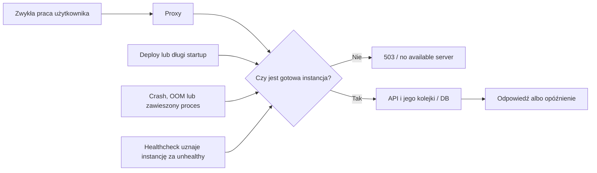

# Audyt wydajności i dostępności NEXUS — 13 września 2026

**Cel:** stabilna, szybka praca 50 użytkowników jednocześnie, następnie 100; wyjaśnienie powtarzającego się „no available server” i plan zmian.

**Zakres:** audyt kodu i istniejących wdrożeń, odczyty produkcji oraz rzeczywiste otwarcie aplikacji w Chrome. Bez zmian kodu aplikacji, konfiguracji i danych produkcyjnych; bez restartów, deployu i testu przeciążeniowego. Raport jest rekomendacją do wdrożenia, nie potwierdzeniem wykonania napraw.

**Analizowany kod:** `origin/main` oraz wersja wskazywana przez API: `ab10c8bb` (pełny SHA w linkach źródłowych poniżej). Kod odczytano z osobnego worktree; istniejące lokalne prace pozostawiono bez zmian. Źródła kodowe poniżej prowadzą do tego konkretnego commitu, ponieważ lokalny główny checkout jest starszy.

## 1. Werdykt i najważniejsza decyzja

**Na dziś nie ma wystarczających dowodów, żeby uznać NEXUS za gotowy na 50 lub 100 równocześnie aktywnych użytkowników z wymaganiem stabilnej pracy.** Dzisiejsza dostępność jest prawidłowa, ale nie zastępuje pomiaru pod obciążeniem. W kodzie pozostały mechanizmy, które mogą spowolnić cały system lub odebrać proxy ostatnią sprawną instancję.

Zgłoszenie użytkownika dotyczy **zwykłej pracy, bez jednej charakterystycznej akcji**. Dlatego nie należy przypisywać wszystkich awarii eksportowi, AI albo aktualizacjom. Sam dashboard generuje ruch w tle, a API współdzieli zasoby z automatami niezależnie od tego, co użytkownik właśnie robi.

Najważniejsze rekomendacje, w kolejności działania:

1. **Umożliwić rozpoznanie przyczyny następnego incydentu:** metryki proxy, kontenerów, API i bazy na wspólnej osi czasu; sondy co 30–60 s, działający alert i mierzenie błędów widocznych w przeglądarce.
2. **Odseparować pracę interaktywną od ciężkich zadań:** osobne procesy API, workerów i harmonogramu; ograniczyć globalnie eksporty/importy/AI. Zachować istniejące kolejki i mechanizmy przejmowania zadań.
3. **Usunąć konkretne mnożniki obciążenia:** N+1 dashboardów, równoczesne przeliczanie tego samego cache, dwie warstwy retry, nadmierny polling i jednoczesne ładowanie całej analityki.
4. **Przygotować wdrożenia i recovery z drugą gotową instancją:** obecny Compose nie daje gwarancji ciągłości podczas podmiany; startup nadal wykonuje rozbudowane operacje DB.
5. **Dopuścić 50, a następnie 100 osób dopiero po przejściu scenariuszy z rozdziału 7.** Test ma obejmować zwykłą pracę, zadania tła, deploy, reconnect i awarię pojedynczego procesu.

**Nie rekomenduję zakupu większego serwera jako pierwszej naprawy.** Dokumentacja hosta jest niespójna, metryk bieżącego CPU/RAM nie udało się odczytać, a większa maszyna sama nie usuwa blokowania jednej pętli zdarzeń ani przerw podmiany instancji.

## 2. Co faktycznie sprawdzono na produkcji

Odczyty wykonano 13.09.2026 wieczorem, od 18:27 UTC / 20:27 czasu polskiego. Krótka seria zawiera 12 kolejnych pomiarów każdej z dwóch lekkich tras, z przerwą około 10 s między rundami. Są to czasy całego żądania z komputera audytora, obejmujące sieć i pośredników, **nie czas samego serwera ani benchmark p95/p99**.

| Sprawdzenie | Wynik | Co to potwierdza |
|---|---|---|
| Frontend `/` i `/login` | HTTP 200; HTML skompresowany gzip | Chwilowa osiągalność publicznej aplikacji |
| `/login`, 12 pomiarów | 12 × HTTP 200; mediana 93 ms, zakres 79–1543 ms | Brak awarii w krótkiej próbie; rozrzut nie wskazuje samodzielnie źródła opóźnień |
| API `/api/health/live`, 12 pomiarów | 12 × HTTP 200; mediana 144 ms, zakres 135–575 ms | Proces odpowiadał; endpoint wskazuje SHA `ab10c8bb…` |
| API `/api/health` | HTTP 200, `healthy`, 177 ms w pierwszej próbie | Bieżące sprawdzenia zdrowia przeszły; raportowany dysk 27% |
| API `/api/health/deep` | HTTP 200, `healthy`; pierwsza próba 1,35 s | Sprawdzane struktury i odczyty DB dostępne; nie wydajność biznesowych zapytań |
| API `/api/health/alembic` | DB i kod: `0307_client_deletion_event_history`, `orphaned=[]` | Brak dryfu wykrywanego przez ten endpoint |
| Chrome, profil użytkownika | Dashboard i lista kandydatów załadowane; wizualnie poprawny dashboard, lista pokazuje **60 214 kandydatów** | Rzeczywisty odczyt po zalogowaniu; bez benchmarku czasu renderowania |
| Konsola badanej karty | Brak przechwyconych warning/error w odczycie | Dotyczy tylko tej krótkiej sesji i tych ekranów |
| Coolify, odczyt `action=list` | Kolejka `[]`, aplikacja `running:unknown`, konfiguracja commitu `HEAD` | Brak oczekujących wdrożeń w chwili odczytu; ten status nie dowodzi zdrowia wszystkich kontenerów |

Źródła bieżące: [frontend](https://nexus.dynaminds.pl/), [health](https://api.nexus.dynaminds.pl/api/health), [deep health](https://api.nexus.dynaminds.pl/api/health/deep), [Alembic](https://api.nexus.dynaminds.pl/api/health/alembic), [odczyt Coolify](https://github.com/B2B-net-S-A/NEXUS/actions/runs/34774672219). Dane pomiarowe zachowano obok raportu w `outputs/performance-audit-2026-09-13/`.

### Dowody historyczne, które zmieniają ocenę

- W próbce **100 uruchomień Uptime probe** z 05.09 21:08 UTC do 13.09 17:55 UTC było 97 sukcesów i 3 błędy. Dwa błędy to rzeczywiste **HTTP 503 frontendu**: [06.09 18:13 UTC](https://github.com/B2B-net-S-A/NEXUS/actions/runs/34051013024) oraz [08.09 06:21 UTC](https://github.com/B2B-net-S-A/NEXUS/actions/runs/34194283592). Trzeci dotyczył [Voyage `unhealthy` przy frontendzie HTTP 200](https://github.com/B2B-net-S-A/NEXUS/actions/runs/34203697193). **To nie oznacza ani trzech całkowitych awarii, ani 97% uptime.** Sondy są punktowe, a sprawdzenia mają różny zakres.
- W tej próbce mediana odstępu między startami sond wyniosła około **61 min**, maksimum około **363 min**. Workflow ma harmonogram godzinowy; bez ciągłych pomiarów nie znamy długości przerw pomiędzy sondami.
- [Ostatni deploy](https://github.com/B2B-net-S-A/NEXUS/actions/runs/34621868326) potwierdził 11.09 o 16:30 UTC zdrowe API na `ab10c8bb…`, frontend HTTP 200 i deep health. To dobry dowód końca wdrożenia, ale nie pomiar braku przerwy podczas niego.
- [Sentry daily monitor z 13.09](https://github.com/B2B-net-S-A/NEXUS/actions/runs/34756756967) zakończył się sukcesem, lecz faktycznie wypisał **`SENTRY_AUTH_TOKEN secret not set — skipping digest`**. Potwierdzony jest niedziałający digest; nie wyciągam z tego wniosku, że SDK Sentry w samej aplikacji jest wyłączone.
- [Nocne E2E z 13.09](https://github.com/B2B-net-S-A/NEXUS/actions/runs/34747273625) wykonało **13 z 83 przypadków, 1 z 14 plików**, wyłącznie `preview-chromium`. Brakuje konfiguracji użytkownika E2E; przepływy po zalogowaniu zostały pominięte. Zielone 13 testów nie potwierdza pełnej funkcjonalności ani wydajności. Testy szły z jednym workerem.

### Granice audytu

Nie uzyskano bezpośredniego odczytu aktywnych kontenerów, historii OOM/restartów/healthchecków, metryk hosta, logów proxy z chwili zgłoszeń ani bieżącego `pg_stat_statements`/planów SQL. Panel Coolify wymagał logowania; istniejący bezpieczny workflow udostępnił tylko metadane. Nie zmierzono produkcyjnych percentyli biznesowych API, Web Vitals ani rozmiarów aktualnych bundli.

Nie uruchamiano sztucznego ruchu 50/100 użytkowników na produkcji. **Ryzyko wykazane w kodzie nie jest dowodem przyczyny konkretnego historycznego incydentu.** Dopuszczenie skali wymaga osobnego testu na reprezentatywnym środowisku.

## 3. Co oznacza „no available server” i co już naprawiono

Komunikat jest zgodny z sytuacją, w której reverse proxy nie ma serwera kwalifikującego się do obsłużenia żądania. Możliwe przyczyny to unhealthy, podmiana kontenera, nieudany startup, zakończenie procesu/OOM albo błędny routing. **Nie oznacza automatycznie braku RAM, przeciążenia bazy ani „za wielu użytkowników”.** Dokumentacja [Traefik Docker provider](https://doc.traefik.io/traefik/v3.3/providers/docker/) opisuje odfiltrowanie niezdrowych instancji i HTTP 503 dla pustej usługi przy odpowiedniej konfiguracji providera.

**Ważna poprawka już istnieje.** Commit [03f2a30e](https://github.com/B2B-net-S-A/NEXUS/commit/03f2a30e076253c75eb08326b257e18631ceff51), opisany w dokumentacji jako poprawka z 11.09, zastąpił ciężkie `/api/health` lekkim `/api/health/live` w sondzie kontenera. W historii kodu opisano wcześniejszy mechanizm: kilka przekroczonych timeoutów sondy → unhealthy → odcięcie ruchu. Aktualne `/live` nie odpytuje bazy; działa na produkcyjnym SHA. **Nie odczytano jednak faktycznej komendy healthcheck aktywnego kontenera**, więc jej zastosowanie wymaga potwierdzenia operacyjnego. Źródła: [docker-compose.yml:182–208](https://github.com/B2B-net-S-A/NEXUS/blob/ab10c8bba7e06e79a146f4dc48e6e70e168cf7f1/docker-compose.yml#L182-L208), [backend/app/main.py:1547–1561](https://github.com/B2B-net-S-A/NEXUS/blob/ab10c8bba7e06e79a146f4dc48e6e70e168cf7f1/backend/app/main.py#L1547-L1561).

To usuwa istotne źródło fałszywego alarmu. Nadal możliwe jest zablokowanie samej pętli obsługującej `/live`, rzeczywista awaria procesu albo przerwa wdrożenia. Poprawka backendu nie wyjaśnia automatycznie dwóch potwierdzonych historycznych 503 **frontendu**.

Nie należy ponownie zgłaszać jako braków rzeczy już wdrożonych:

- Limity RAM są w **bazowym** compose: PostgreSQL 12 GiB, API 4 GiB, Qdrant 3 GiB, frontend 1 GiB. Są to wartości repo, nie odczyt aktualnego runtime. PostgreSQL ma zapisane strojenie i `max_connections=100`; rekomendacja „ustawić fabryczne 128 MB na 256 MB” ze starego audytu jest nieaktualna. [docker-compose.yml:60–108](https://github.com/B2B-net-S-A/NEXUS/blob/ab10c8bba7e06e79a146f4dc48e6e70e168cf7f1/docker-compose.yml#L60-L108), [docker-compose.yml:130–154](https://github.com/B2B-net-S-A/NEXUS/blob/ab10c8bba7e06e79a146f4dc48e6e70e168cf7f1/docker-compose.yml#L130-L154), [docker-compose.yml:224–228](https://github.com/B2B-net-S-A/NEXUS/blob/ab10c8bba7e06e79a146f4dc48e6e70e168cf7f1/docker-compose.yml#L224-L228).
- Istnieją timeouty locków części bootstrapów, kompresja odpowiedzi, paginacja/wirtualizacja kandydatów i anulowanie ich starych odczytów. [backend/app/services/startup_locks.py:1–36](https://github.com/B2B-net-S-A/NEXUS/blob/ab10c8bba7e06e79a146f4dc48e6e70e168cf7f1/backend/app/services/startup_locks.py#L1-L36), [frontend/src/components/v2/pages/CandidatesListV2.tsx:1721–1805](https://github.com/B2B-net-S-A/NEXUS/blob/ab10c8bba7e06e79a146f4dc48e6e70e168cf7f1/frontend/src/components/v2/pages/CandidatesListV2.tsx#L1721-L1805).
- Generowanie CV ma trwałe zadania i globalny limit 4 wykonywanych generacji. Nie wszystkie ścieżki importu/AI korzystają jednak z tego mechanizmu. [backend/app/services/cv_generator_b2b/job_leases.py:13–46](https://github.com/B2B-net-S-A/NEXUS/blob/ab10c8bba7e06e79a146f4dc48e6e70e168cf7f1/backend/app/services/cv_generator_b2b/job_leases.py#L13-L46).
- Deploy sprawdza frontend, API oraz deep health. Brak dowodu obciążeniowego nie jest brakiem jakiejkolwiek weryfikacji wdrożenia. [.github/workflows/deploy.yml:425–471](https://github.com/B2B-net-S-A/NEXUS/blob/ab10c8bba7e06e79a146f4dc48e6e70e168cf7f1/.github/workflows/deploy.yml#L425-L471).

## 4. Ustalenia i zalecane zmiany

**Priorytety:** P1 — wysoka wartość dla stabilności i warunek odpowiedzialnego dopuszczenia docelowej skali; P2 — optymalizacja lub dalsze profilowanie. P1 nie oznacza, że dana ścieżka powoduje każdy zgłaszany błąd. Pomiary czasów i zasobów poniżej to proponowane kryteria, nie obecne wyniki.

### F01 — P1: niepełna obserwowalność ukrywa rzeczywiste awarie

**Dowód:** sondy co godzinę, pomijany digest Sentry, brak odczytanej telemetrii hosta. Konfiguracja Alloy w repo opisuje wysyłanie logów do Loki, nie pełne zbieranie metryk. Frontend odrzuca w Sentry m.in. `Network Error`, timeouty i `ChunkLoadError`. Odpowiedź 503 proxy bez CORS może pojawić się w przeglądarce właśnie jako błąd sieci. [.github/workflows/uptime-probe.yml:4–46](https://github.com/B2B-net-S-A/NEXUS/blob/ab10c8bba7e06e79a146f4dc48e6e70e168cf7f1/.github/workflows/uptime-probe.yml#L4-L46), [alloy/config.alloy:14–54](https://github.com/B2B-net-S-A/NEXUS/blob/ab10c8bba7e06e79a146f4dc48e6e70e168cf7f1/alloy/config.alloy#L14-L54), [frontend/sentry.client.config.ts:25–68](https://github.com/B2B-net-S-A/NEXUS/blob/ab10c8bba7e06e79a146f4dc48e6e70e168cf7f1/frontend/sentry.client.config.ts#L25-L68), [frontend/src/lib/api.ts:213–234](https://github.com/B2B-net-S-A/NEXUS/blob/ab10c8bba7e06e79a146f4dc48e6e70e168cf7f1/frontend/src/lib/api.ts#L213-L234).

**Zmiana:** sondy FE i krótkiej gotowości API co 30–60 s z zewnętrznego systemu; licznik odpowiedzi proxy bez upstreamu, p95/p99 per trasa API, liczba żądań w toku, event-loop lag, pool wait, kolejki, CPU/RAM/OOM/restarty i DB locki. Każde zdarzenie musi mieć UTC, release i identyfikator żądania; ścieżki normalizowane, bez treści CV i danych osobowych. Błędy sieci próbkować i deduplikować zamiast całkowicie odrzucać. Brak wymaganej konfiguracji monitora musi być widoczny. Potwierdzić odbiorcę i rzeczywiste dostarczenie alertu testowego.

**Odbiór:** kontrolowane 503, timeout, niedostępny chunk i awaria procesu na stagingu dają alarm do 2 minut oraz pozwalają odróżnić problem aplikacji od proxy, bazy i hosta.

### F02 — P1: API współdzieli proces z 48 zarejestrowanymi zadaniami tła

**Dowód:** entrypoint uruchamia Uvicorn bez `--workers`; lifespan rejestruje 48 `create_task`. Część pętli jest wyłączona flagami, więc nie jest to liczba aktywnych integracji. Wszystkie uruchomione w tej roli dzielą CPU, pamięć, pętlę zdarzeń i zasoby DB z żądaniami użytkowników. [backend/entrypoint.sh:7534](https://github.com/B2B-net-S-A/NEXUS/blob/ab10c8bba7e06e79a146f4dc48e6e70e168cf7f1/backend/entrypoint.sh#L7534), [backend/app/main.py:690–780](https://github.com/B2B-net-S-A/NEXUS/blob/ab10c8bba7e06e79a146f4dc48e6e70e168cf7f1/backend/app/main.py#L690-L780).

**Zmiana:** role procesu `api`, `worker`, `scheduler` z osobnymi budżetami zasobów i kolejkami. Przenieść ciężkie generowanie/przeglądy/importy/eksporty poza proces HTTP. Utrzymać istniejące trwałe joby, lease i deduplikację; zinwentaryzować wszystkie harmonogramy pod kątem jednego wykonawcy. To nie wymaga przepisania systemu na mikroserwisy.

**Nie dodawać w ciemno workers.** Sockety/presence i cache są lokalne procesu; powiadomienie z instancji A nie trafia automatycznie do klientów B. Konieczny wspólny kanał zdarzeń, poprawna inwalidacja i limity połączeń. Sticky sessions nie rozwiązują rozsyłania zdarzeń między instancjami. [backend/app/api/ws.py:67–155](https://github.com/B2B-net-S-A/NEXUS/blob/ab10c8bba7e06e79a146f4dc48e6e70e168cf7f1/backend/app/api/ws.py#L67-L155), [backend/app/core/cache.py:13–42](https://github.com/B2B-net-S-A/NEXUS/blob/ab10c8bba7e06e79a146f4dc48e6e70e168cf7f1/backend/app/core/cache.py#L13-L42).

**Odbiór:** ciężkie zadania działają przy 100 zwykłych sesjach bez pogorszenia SLO CRUD. Restart API nie gubi przyjętej pracy; restart workera nie odcina HTTP. Dwie instancje nie dublują efektów zewnętrznych i poprawnie rozsyłają powiadomienia.

### F03 — P1: obecny sposób deployu nie zapewnia ciągłej obsługi

**Dowód:** FE i BE są pojedynczymi usługami compose budowanymi w docelowym przepływie Coolify. Dokumentacja [Coolify Rolling Updates](https://coolify.io/docs/applications/deployments/rolling-updates) wyraźnie odróżnia application-level rolling update od odtwarzania usług Compose. Włączenie opcji „rolling” nie zapewni bezprzerwowego deployu tego stacku. [docker-compose.yml:140–250](https://github.com/B2B-net-S-A/NEXUS/blob/ab10c8bba7e06e79a146f4dc48e6e70e168cf7f1/docker-compose.yml#L140-L250), [CLAUDE.md:82–94](https://github.com/B2B-net-S-A/NEXUS/blob/ab10c8bba7e06e79a146f4dc48e6e70e168cf7f1/CLAUDE.md#L82-L94).

**Zmiana:** po F02 oddzielić cykl życia DB/Qdrant od FE/API. Wdrożyć FE/API jako osobne usługi z gotowych obrazów obsługujące nakładanie instancji lub zaprojektować blue/green. Nowa instancja musi być gotowa przed usunięciem starej; zapewnić drenaż HTTP/WebSocket, kompatybilność dwóch wersji ze schematem oraz wspólny dostęp do plików. Budować testowany obraz poza hostem użytkowników i wdrażać identyfikowalny digest. Zweryfikować rzeczywiste wykonanie tego mechanizmu, nie samą konfigurację.

**Odbiór:** deploy i rollback przy ciągłym ruchu 50/100 sesji, zero 502/503 i utraty zapisów; logi pokazują co najmniej jedną gotową instancję przez całą podmianę. Końcowe zielone `/health` nie jest tym testem.

### F04 — P1: restart nadal uruchamia kosztowne operacje DB przed HTTP

**Dowód:** przed startem Uvicorna wykonywane są migracje, safety-net, zmiany danych i seed. Faza `_DATA_STATEMENTS` ustawia `statement_timeout=0`. Konkretny UPDATE w liniach 4921–4934 ustawia dokumentom `document_kind='cv'` bez pominięcia rekordów już mających tę wartość i bez znacznika jednorazowego wykonania. Może ponownie pisać te same wiersze, generować WAL oraz obciążenie autovacuum. Nie zmierzono czasu tej operacji na produkcji. [backend/entrypoint.sh:45–72](https://github.com/B2B-net-S-A/NEXUS/blob/ab10c8bba7e06e79a146f4dc48e6e70e168cf7f1/backend/entrypoint.sh#L45-L72), [backend/entrypoint.sh:4921–4985](https://github.com/B2B-net-S-A/NEXUS/blob/ab10c8bba7e06e79a146f4dc48e6e70e168cf7f1/backend/entrypoint.sh#L4921-L4985), [backend/entrypoint.sh:6990–7025](https://github.com/B2B-net-S-A/NEXUS/blob/ab10c8bba7e06e79a146f4dc48e6e70e168cf7f1/backend/entrypoint.sh#L6990-L7025).

**Zmiana:** migracje jako jeden kontrolowany krok przed rolloutem, z deadline i obsługą błędu; ciężkie backfille jako wznawialne batch jobs z markerami wykonania. Zwykły start ma sprawdzać kompatybilność i uruchamiać proces. Safety-net wygaszać etapami po potwierdzeniu parytetu migracji; nie usuwać go hurtem. Wyeliminować powtarzany UPDATE po sprawdzeniu semantyki. Zmierzyć czas każdej fazy startu.

**Odbiór:** przy poprawnym, niezmienionym schemacie restart jest krótki i przewidywalny, bez masowego ponownego zapisu dokumentów. Backup i lock innego procesu nie zawieszają startu bez końca; błąd migracji nie dopuszcza niekompatybilnego kodu do ruchu.

### F05 — P1: aktywne eksporty XLSX mogą zatrzymać obsługę innych użytkowników

**Dowód:** `GET /api/candidates/export` ładuje do 50 tys. pełnych obiektów ORM, tworzy `Workbook`, a `wb.save()` wykonuje bezpośrednio w `async def`. CSV tej trasy również powstaje w pamięci. Nowszy `POST /api/candidates/export` ma batch reads i `write_only=True`, lecz nadal synchronicznie dopisuje i zapisuje arkusz na pętli API. `StreamingResponse` nie cofa kosztu już zbudowanego pliku. [backend/app/api/candidates.py:2186–2305](https://github.com/B2B-net-S-A/NEXUS/blob/ab10c8bba7e06e79a146f4dc48e6e70e168cf7f1/backend/app/api/candidates.py#L2186-L2305).

**Zmiana:** wspólna implementacja eksportu z projekcją kolumn, strumieniowy CSV, ograniczona kolejka dużych XLSX w osobnym procesie; `202 + job_id`, status i pobranie gotowego pliku. Limit aktywnych eksportów i rozmiaru, deadline oraz sprzątanie. Offload do wątku bywa doraźną ochroną pętli przy I/O, lecz nie zapewnia skalowania CPU i pamięci — [dokumentacja Python](https://docs.python.org/3.10/library/asyncio-task.html#asyncio.to_thread).

**Odbiór:** 2 równoległe duże XLSX na danych testowych przy zwykłym ruchu 100 osób nie naruszają SLO CRUD, nie powodują OOM i nie blokują `/live`. Istniejący strumieniowy `GET /api/export/candidates` to inna trasa — nie trzeba go „naprawiać” tak, jak starszego GET. [backend/app/api/import_export.py:435–508](https://github.com/B2B-net-S-A/NEXUS/blob/ab10c8bba7e06e79a146f4dc48e6e70e168cf7f1/backend/app/api/import_export.py#L435-L508).

### F06 — P1: pule i czas zajmowania połączeń trzeba zbudżetować globalnie

**Dowód:** główny engine ma `pool_size=20`, `max_overflow=40` — do 60 połączeń **na proces**, nie na aplikację. Metering tworzy dodatkowo pulę 2+2. Compose ustawia PG `max_connections=100`. Dwa procesy główne mogą potencjalnie zażądać 120 połączeń, jeszcze przed workerami/meteringiem/migracjami. Nie oznacza to 120 stale otwartych połączeń. [backend/app/core/database.py:29–61](https://github.com/B2B-net-S-A/NEXUS/blob/ab10c8bba7e06e79a146f4dc48e6e70e168cf7f1/backend/app/core/database.py#L29-L61), [backend/app/services/ai_metering.py:123–134](https://github.com/B2B-net-S-A/NEXUS/blob/ab10c8bba7e06e79a146f4dc48e6e70e168cf7f1/backend/app/services/ai_metering.py#L123-L134), [docker-compose.yml:105](https://github.com/B2B-net-S-A/NEXUS/blob/ab10c8bba7e06e79a146f4dc48e6e70e168cf7f1/docker-compose.yml#L105).

W głównym engine nie określono jawnego budżetu timeoutów. Domyślny timeout pobrania połączenia SQLAlchemy wynosi 30 s; to już cały standardowy frontendowy timeout. Efektywne `statement_timeout`/`lock_timeout` mogą być skonfigurowane na roli lub bazie — trzeba je odczytać, nie zgadywać. [SQLAlchemy — connection pooling](https://docs.sqlalchemy.org/en/20/core/pooling.html).

Dodatkowy problem: preview dopasowania CV odczytuje jobs, a potem oczekuje na zewnętrzny reranking w tej samej transakcji, mogąc trzymać połączenie podczas oczekiwania na AI. [backend/app/api/cv_match_preview.py:318–333](https://github.com/B2B-net-S-A/NEXUS/blob/ab10c8bba7e06e79a146f4dc48e6e70e168cf7f1/backend/app/api/cv_match_preview.py#L318-L333), [backend/app/services/reranker_service.py:31–83](https://github.com/B2B-net-S-A/NEXUS/blob/ab10c8bba7e06e79a146f4dc48e6e70e168cf7f1/backend/app/services/reranker_service.py#L31-L83).

**Zmiana:** parametry per rola procesu, jawne `application_name`, pomiar checkout wait i czasu transakcji. Budżet wszystkich pul, instancji i narzędzi ma pozostawić rezerwę w PG. Zwolnić DB przed długim I/O przez rozdzielenie faz odczyt/DTO → zewnętrzna praca → krótki zapis z kontrolą wersji. Nie wstawiać losowych commitów do atomowych operacji. PgBouncer rozważyć dopiero po analizie zgodności asyncpg i prepared statements.

**Odbiór:** brak pool timeout i „too many clients” przy 100 sesjach; pool wait p95 <50 ms; długie AI nie monopolizuje połączeń, zwykła blokada rekordu nie blokuje całej aplikacji.

### F07 — P1: dashboardy generują zbędne SQL i równoległe przeliczenia cache

**Dowód N+1:** HoR wywołuje KPI osobno dla każdej osoby, po 3 zapytania. Roster 50 osób oznacza 150 SQL dla jednej sekcji jednego odczytu, roster 100 — 300. **Liczba osób w rosterze nie jest liczbą jednoczesnych użytkowników.** Gotowa grupowa funkcja `team_kpis` używa czterech zapytań; trzeba sprawdzić zgodność zakresu i definicji przed podmianą. Delivery Lead serializuje demands z dodatkowymi odczytami per rekord. [backend/app/services/dashboard_v2.py:797–801](https://github.com/B2B-net-S-A/NEXUS/blob/ab10c8bba7e06e79a146f4dc48e6e70e168cf7f1/backend/app/services/dashboard_v2.py#L797-L801), [backend/app/analytics/metrics.py:258–386](https://github.com/B2B-net-S-A/NEXUS/blob/ab10c8bba7e06e79a146f4dc48e6e70e168cf7f1/backend/app/analytics/metrics.py#L258-L386), [backend/app/services/dashboard_v2_sources.py:359–397](https://github.com/B2B-net-S-A/NEXUS/blob/ab10c8bba7e06e79a146f4dc48e6e70e168cf7f1/backend/app/services/dashboard_v2_sources.py#L359-L397), [backend/app/api/priority_work.py:310–337](https://github.com/B2B-net-S-A/NEXUS/blob/ab10c8bba7e06e79a146f4dc48e6e70e168cf7f1/backend/app/api/priority_work.py#L310-L337).

**Dowód cache:** lock chroni get/set słownika, lecz nie obliczenie między nimi. Wiele żądań po wygaśnięciu TTL może policzyć ten sam drogi snapshot równocześnie. Cache istnieje, ale nie zapewnia jednego wykonawcy obliczenia. [backend/app/core/cache.py:13–83](https://github.com/B2B-net-S-A/NEXUS/blob/ab10c8bba7e06e79a146f4dc48e6e70e168cf7f1/backend/app/core/cache.py#L13-L83), [backend/app/services/dashboard_v2.py:1679–1754](https://github.com/B2B-net-S-A/NEXUS/blob/ab10c8bba7e06e79a146f4dc48e6e70e168cf7f1/backend/app/services/dashboard_v2.py#L1679-L1754).

**Zmiana:** agregacje zbiorowe i relacje ładowane jednym zestawem zapytań; limit/deadline sekcji; mechanizm jednego przeliczenia na klucz, TTL z jitterem i ostatni poprawny snapshot podczas odświeżania. Zachować scope dostępu oraz widoczną świeżość danych. Przy replikach wspólny cache/inwalidacja albo trwałe prekomputowane agregaty.

**Odbiór:** liczba SQL nie rośnie liniowo z rosterem/demands. Sto jednoczesnych odczytów identycznego zimnego klucza powoduje jedno przeliczenie, bez mieszania uprawnień; cold dashboard p95 ≤1,5 s.

### F08 — P1: frontend może podtrzymywać przeciążenie bez klikania

**Retry:** QueryProvider ustawia `retry:1`, a Axios ponawia wybrane odczyty jeszcze 2 razy przy 502/503/504 lub błędzie sieci. Typowy query tworzący nowe `api.get` może wykonać **6 fizycznych prób**: `(1+1) × (1+2)`. Nie dotyczy query wyłączających retry lub samodzielnie przechwytujących błąd. Odstępy Axios są stałe, bez jitter i bez `Retry-After`. To ruch na bramie; do API trafia tylko część, dla której proxy ma już upstream. [frontend/src/components/QueryProvider.tsx:9–14](https://github.com/B2B-net-S-A/NEXUS/blob/ab10c8bba7e06e79a146f4dc48e6e70e168cf7f1/frontend/src/components/QueryProvider.tsx#L9-L14), [frontend/src/lib/api.ts:236–280](https://github.com/B2B-net-S-A/NEXUS/blob/ab10c8bba7e06e79a146f4dc48e6e70e168cf7f1/frontend/src/lib/api.ts#L236-L280).

**Polling:** KPI co minutę, powiadomienia co 30 s, sidebar co 5 min, kilka dashboardowych sekcji co minutę. Zadania onboarding odświeżają wszystkie strony co 30 s. Ręczny fallback przy niedziałającym WebSocket ma dodatkowy timer. [frontend/src/hooks/useMyKpis.ts:17–26](https://github.com/B2B-net-S-A/NEXUS/blob/ab10c8bba7e06e79a146f4dc48e6e70e168cf7f1/frontend/src/hooks/useMyKpis.ts#L17-L26), [frontend/src/components/NotificationsDropdown.tsx:214–222](https://github.com/B2B-net-S-A/NEXUS/blob/ab10c8bba7e06e79a146f4dc48e6e70e168cf7f1/frontend/src/components/NotificationsDropdown.tsx#L214-L222), [frontend/src/hooks/useNotifications.ts:256–276](https://github.com/B2B-net-S-A/NEXUS/blob/ab10c8bba7e06e79a146f4dc48e6e70e168cf7f1/frontend/src/hooks/useNotifications.ts#L256-L276), [frontend/src/components/v2/shell/SidebarV2.tsx:558–633](https://github.com/B2B-net-S-A/NEXUS/blob/ab10c8bba7e06e79a146f4dc48e6e70e168cf7f1/frontend/src/components/v2/shell/SidebarV2.tsx#L558-L633), [frontend/src/components/v2/dashboard/MyOnboardingTasks.tsx:9–22](https://github.com/B2B-net-S-A/NEXUS/blob/ab10c8bba7e06e79a146f4dc48e6e70e168cf7f1/frontend/src/components/v2/dashboard/MyOnboardingTasks.tsx#L9-L22).

Model dla **widocznej aktywnej karty** dashboardu rekrutacyjnego, z otwartymi zadaniami: `7 + c/5 + 2P` GET/min, gdzie `c` to 0–3 odczyty badge, a `P` liczba stron onboarding. Dla `c=2–3, P=1` daje **9,4–9,6 GET/min/kartę**, czyli około **8 RPS dla 50 kart i 16 RPS dla 100 kart**, bez działań użytkownika. To model z kodu, nie zmierzony ruch. Standardowy polling Query respektuje widoczność; nie zakładam, że ukryte karty zawsze podwajają wynik. Współdzielone klucze powiadomień policzono raz.

**Zmiana:** jeden właściciel retry z jednym budżetem i jitterem; odrębna polityka bezpiecznych zapisów. Jeden harmonogram powiadomień, rzadsza kontrola przy zdrowym WS, zatrzymanie niepotrzebnej pracy w tle. Jeden tani endpoint liczników zamiast pobierania rekordów; onboarding stronicowany na żądanie. Uzupełnić sygnały anulowania na kontraktach/analityce — wzorzec istnieje już dla kandydatów.

**Odbiór:** test QueryClient+Axios mierzy całkowitą liczbę prób przy 503/429/timeout; 5-minutowy HAR w 1 i 3 kartach, z WS zdrowym i uszkodzonym. Proponowany budżet: ≤4 odczyty/min aktywnego bezczynnego dashboardu przy zdrowym WS, z zachowaniem uzgodnionej świeżości; reconnect nie tworzy zsynchronizowanej lawiny.

### F09 — P1: wejście do Insights wywołuje duży pakiet analityki

**Dowód:** panel Rekrutacja montuje wszystkie sekcje od razu, także poza ekranem. Sam konserwatywny zestaw obejmuje ≥10 odrębnych query. 50 równoczesnych zimnych wejść oznacza ≥500 żądań analitycznych, 100 — ≥1000, poza shell. **To liczba żądań w pakiecie, nie RPS.** [frontend/src/components/insights/RekrutacjaPanel.tsx:85–211](https://github.com/B2B-net-S-A/NEXUS/blob/ab10c8bba7e06e79a146f4dc48e6e70e168cf7f1/frontend/src/components/insights/RekrutacjaPanel.tsx#L85-L211), [frontend/src/components/insights/InsightsSectionNav.tsx:69–81](https://github.com/B2B-net-S-A/NEXUS/blob/ab10c8bba7e06e79a146f4dc48e6e70e168cf7f1/frontend/src/components/insights/InsightsSectionNav.tsx#L69-L81).

**Zmiana:** ładowanie sekcji blisko viewportu lub po rozwinięciu, cache dobrany do raportu/okresu, wspólne agregaty backendowe z prawidłowym zakresem. Dla JS wykorzystać artefakty istniejącego buildu do ustalenia baseline i dopiero wtedy optymalizować importy. Nie ma aktualnego pomiaru pozwalającego uczciwie podać rozmiar bundla.

**Odbiór:** licznik requestów zimnego wejścia bez scrolla i po scrollu; test 50/100 wejść i zmiany okresu; budżet czasu pierwszej użytecznej sekcji i brak wpływu na p95 normalnej pracy pozostałych osób.

### F10 — P1: równoczesny import CV wymaga kolejki oraz unikalnych plików roboczych

**Dowód:** masowy import w UI ma 3 równoległe requesty **na kartę**, bez globalnego limitu. POST `/api/candidates/from-cv` czeka na parsowanie i utworzenie kandydata; ma standardowy timeout klienta 30 s. W tej trasie plik jest czytany w całości, nie wywołano istniejącego walidatora wielkości, a nazwa tymczasowa to `from_cv_tmp_{safe_name}`. Dwa równoczesne `CV.pdf` mogą korzystać z tej samej ścieżki, nadpisać ją lub usunąć podczas pracy drugiego żądania. To także ryzyko przypisania niewłaściwej treści dokumentu. Limit 4 **generacji** nie obejmuje tej ścieżki importu. [frontend/src/components/v2/pages/BulkImportCVsV2.tsx:45–46](https://github.com/B2B-net-S-A/NEXUS/blob/ab10c8bba7e06e79a146f4dc48e6e70e168cf7f1/frontend/src/components/v2/pages/BulkImportCVsV2.tsx#L45-L46), [frontend/src/components/v2/pages/BulkImportCVsV2.tsx:120–133](https://github.com/B2B-net-S-A/NEXUS/blob/ab10c8bba7e06e79a146f4dc48e6e70e168cf7f1/frontend/src/components/v2/pages/BulkImportCVsV2.tsx#L120-L133), [backend/app/api/candidates.py:5308–5388](https://github.com/B2B-net-S-A/NEXUS/blob/ab10c8bba7e06e79a146f4dc48e6e70e168cf7f1/backend/app/api/candidates.py#L5308-L5388).

**Zmiana:** UUID/bezpieczny unikalny plik roboczy per operacja, limit bajtów przed pełnym odczytem, trwały job i idempotency key, globalny limit wykonawców oraz limit oczekujących zadań. Upload → szybkie potwierdzenie przyjęcia → status → wynik. Przerwane połączenie nie może wymuszać ponownego tworzenia kandydata. Zachować bezpieczne odtwarzanie po restarcie.

**Odbiór:** równoczesny upload dwóch różnych dokumentów o identycznej nazwie zawsze zachowuje poprawne przypisanie treści. Pięciu–dziesięciu importerów działa równolegle ze 100 zwykłymi sesjami bez naruszenia SLO. Zbyt duży upload jest odrzucany wcześnie. Analogicznie przebudować duży import CSV: dziś cały plik i długa operacja mieszczą się w jednym requestcie. [backend/app/api/import_export.py:78–155](https://github.com/B2B-net-S-A/NEXUS/blob/ab10c8bba7e06e79a146f4dc48e6e70e168cf7f1/backend/app/api/import_export.py#L78-L155), [backend/app/api/import_export.py:290–325](https://github.com/B2B-net-S-A/NEXUS/blob/ab10c8bba7e06e79a146f4dc48e6e70e168cf7f1/backend/app/api/import_export.py#L290-L325).

### F11 — P1: healthcheck, gotowość i automatyczne odzyskiwanie to osobne wymagania

**Dowód:** `/live` potwierdza odpowiedź procesu, a `restart: unless-stopped` reaguje na zakończenie procesu, nie sam stan unhealthy. Frontend odpytuje `/` z timeoutem 3 s. Nie odczytano aktywnego nadzorcy zawieszonych procesów ani czasu drenażu. [docker-compose.yml:151–208](https://github.com/B2B-net-S-A/NEXUS/blob/ab10c8bba7e06e79a146f4dc48e6e70e168cf7f1/docker-compose.yml#L151-L208), [frontend/Dockerfile:53–58](https://github.com/B2B-net-S-A/NEXUS/blob/ab10c8bba7e06e79a146f4dc48e6e70e168cf7f1/frontend/Dockerfile#L53-L58). Zachowanie restart policy opisuje [dokumentacja Docker](https://docs.docker.com/engine/containers/start-containers-automatically/).

**Zmiana:** zachować lekkie liveness; ustalić krótką readiness podstawowych zależności z timeoutem, histerezą i ochroną przed odcięciem wszystkich instancji przy chwilowym zajęciu puli. Sondy AI/deep nie mogą sterować routingiem podstawowego CRUD. Dedykowana lekka sonda FE i niezależny test faktycznego renderu. Jeden kontrolowany nadzorca zawieszonych procesów, backoff i limit restartów; wyraźnie osobna gotowość workerów.

**Odbiór:** zawieszony proces jest automatycznie zastępowany, zdrowa instancja nadal obsługuje ruch. Niedostępne AI degraduje funkcję AI, a awaria DB nie powoduje niekontrolowanej pętli restartowania całego stacku.

### F12 — P2: profilowanie SQL, zasobów i przeglądarki zamiast kolejnych zgadywanych zmian

**Dowód:** lista kandydatów nadal używa dokładnego `count(*) OVER()` i OFFSET; opcjonalny match stats może objąć 100 kandydatów × 50 rekrutacji. Nie dowodzi to samo w sobie wolnego zapytania lub brakującego indeksu. [backend/app/api/candidates.py:1731–1789](https://github.com/B2B-net-S-A/NEXUS/blob/ab10c8bba7e06e79a146f4dc48e6e70e168cf7f1/backend/app/api/candidates.py#L1731-L1789). Dane w UI mają obecnie ponad 60 tys. kandydatów; stary punkt odniesienia 49 tys. jest za mały.

W dokumentacji `CLAUDE.md` widnieje CAX21, natomiast compose opisuje **CCX33, 8 vCPU / 32 GB**. Nie potwierdzono bieżącego typu hosta; nie wolno traktować starego opisu 4 CPU / 8 GB jako aktualnego. [CLAUDE.md:82](https://github.com/B2B-net-S-A/NEXUS/blob/ab10c8bba7e06e79a146f4dc48e6e70e168cf7f1/CLAUDE.md#L82), [docker-compose.yml:56–75](https://github.com/B2B-net-S-A/NEXUS/blob/ab10c8bba7e06e79a146f4dc48e6e70e168cf7f1/docker-compose.yml#L56-L75).

**Zmiana:** odczytać specyfikację i aktywne limity, CPU/RAM/I/O z pracy, tła, backupu i deployu. Z `pg_stat_statements` wybrać top według całkowitego czasu, wywołań i temp I/O; porównać delty w znanym oknie bez resetowania liczników. EXPLAIN ANALYZE/BUFFERS ciężkich zapytań robić na reprezentatywnym stagingu. Dopiero potem indeksy, kursor zamiast głębokiego OFFSET, rzadziej liczony total lub precomputing score, z zachowaniem jakości wyników. Dodać raport rozmiarów JS i Web Vitals do hosted CI/RUM.

**Odbiór:** porównywalny baseline przed/po i wyniki pierwszej/głębokiej strony, najczęstszych filtrów oraz match stats; brak pogorszenia trafności/rankingu i zakresów dostępu. CPU i RAM dobrane do zmierzonego szczytu z zapasem, nie do samej liczby zalogowanych osób.

## 5. Docelowy kształt rozwiązania i zasoby

Dla tej skali nie ma podstaw do zalecenia przepisywania aplikacji albo wdrażania Kubernetes. **Rekomendowany kierunek to zachowanie modularnego monolitu, rozdzielenie wykonawców i zapewnienie co najmniej jednej gotowej instancji podczas przełączeń. Jego wystarczalność trzeba potwierdzić bramkami 50/100.**

| Element | Zalecany kierunek | Warunek przed zwiększeniem równoległości |
|---|---|---|
| Frontend | Oddzielny rollout, nakładanie gotowych instancji, spójne wersje assetów | Stara karta działa po deployu; brak brakujących chunków |
| API | Początkowo 2 instancje/procesy po F02, później dobór z testu | Bez schedulerów w API; wspólne zdarzenia/cache, poprawny budżet DB i pliki |
| Workery | Oddzielne pule dla CPU/eksportów i długiego I/O/AI | Globalna concurrency, trwałe joby, lease, retry, idempotencja, limity kolejki |
| Scheduler | Jeden lider albo trwały claim per typ zadania | Brak podwójnych maili/importów przy dwóch instancjach |
| PostgreSQL | Osobny cykl życia, krótkie transakcje, mierzone pule i zapas | Potwierdzone ustawienia runtime, restore i plan recovery; ewentualny pooler po testach |
| Qdrant | Oddzielony od rolloutów HTTP, własny budżet | Awaria wyszukiwania semantycznego nie odcina podstawowych ekranów |
| Pliki CV/eksporty | Wspólna dostępność dla wszystkich wykonawców | Odczyt pliku po przełączeniu instancji, unikalność i retencja |
| Build | Poza hostem obsługującym użytkowników | Ten sam przetestowany obraz/digest trafia do wdrożenia |

**Dwie instancje na jednym hoście chronią przed awarią procesu i pomagają przy deployu, ale nie przed awarią hosta.** Jeśli wymaganie obejmuje także ciągłą pracę po utracie maszyny, potrzebne są przynajmniej dwa hosty aplikacyjne oraz osobny projekt dostępności DB, storage i proxy. Samo dodanie drugiego API przy jednej niedostępnej bazie nie tworzy pełnego HA.

Nie proponuję nowych rozmiarów maszyn bez pomiaru. Pierwszy eksperyment powinien wykorzystać potwierdzone istniejące zasoby po izolacji pracy. Cel roboczy to co najmniej 30% zapasu względem zmierzonego szczytu CPU/RAM przy profilu 100 użytkowników oraz zerowe OOM; przy replikach uwzględnić obciążenie po utracie jednej. Dodatkowy RAM nie zwiększy limitu 4 równoległych generacji CV ani przepustowości dostawcy AI.

## 6. Plan wdrożenia zmian

Szacunki są orientacyjne dla zespołu znającego repo, przy dostępie do środowisk i monitoringu; nie są terminem gwarantowanym.

| Etap | Zakres i odpowiedzialność | Wynik wymagany do zamknięcia |
|---|---|---|
| A — diagnoza i baseline, 1–2 dni | Ops + backend: F01, aktywna konfiguracja F11/F12, logi incydentów | Wiadomo, czy następny 503 pochodzi z FE/API/proxy i co zmieniło stan instancji; działający alert |
| B — ograniczenie zbędnego obciążenia, 3–5 dni | Backend + frontend: F07–F09, unikalne temp/limity uploadu z F10, usunięcie blokującej pracy z gorącej ścieżki F05 | Pomiar SQL/requestów/RAM przed i po, małe regresje funkcjonalne, brak maskowania 503 retry |
| C — izolacja i ciągłość, 1–2 tygodnie | Backend + Ops: F02–F06, kolejki F10, recovery F11 | Oddzielne API/workery, uzgodnione pule, krótki startup i działające przełączenie instancji |
| D — dopuszczenie skali, 2–4 dni plus soak/obserwacja | QA performance + Ops + właściciele modułów | Raport 50/100 z mieszaną pracą, deployem, awarią i integralnością zapisów; spełnione wszystkie bramki |

Zmiany realizować małymi, mierzalnymi PR, z regresjami odpowiadającymi mechanizmowi (np. licznik SQL, łączny retry, równoczesne uploady), hosted CI i normalną weryfikacją produkcji. Testy pełnej integracji i obrazów wykonywać w hosted CI, bez lokalnego Dockera. Każdy PR ma wykazać zmianę konkretnej metryki, zamiast kończyć się tylko „build zielony”.

**Przed uruchomieniem 50 osób:** metryki/alerty, ograniczenie ciężkiej pracy, usunięcie potwierdzonych ryzyk współbieżności i przejście bramki 50; jeżeli nieprzerwana praca ma obejmować aktualizacje, również F03/F04/F11. **Przed 100:** pełna bramka 100, soak oraz test pracy podczas utraty jednej instancji. Wymaganie dostępności całego hosta rozstrzyga dodatkowo zakres HA z rozdziału 5.

## 7. Jak udowodnić, że 50 i 100 osób może pracować

### 7.1 Środowisko i dane

Testy obciążeniowe uruchomić z osobnego generatora przeciw stagingowi o tej samej konfiguracji i porównywalnej mocy co produkcja. Dane syntetyczne lub prawidłowo zanonimizowane: minimum obecne **~60 tys. kandydatów**, realistyczna objętość tekstów CV, historii etapów, dokumentów, zamówień i aktywności; dodatkowy test 2× danych. Liczby pozostałych tabel najpierw odczytać — nie zakładać, że historyczne 158 tys. etapów jest aktualne.

Osobne tożsamości testowe, role i zakresy klientów; różne filtry/rekordy, a nie 100 kopii jednego admina korzystających z tego samego cache. Integracje, flagi, limity i indeksy odpowiadają produkcji. Wyłączone na produkcji moduły nie stają się automatycznie częścią bramki. E-mail/SMS/podpisy/zapisy do systemów zewnętrznych kierować do atrap testowych. Wydajność AI zmierzyć osobno z kontrolowanym limitem kosztu i na prawdziwym providerze; stub służy do testu odporności na opóźnienie, nie do deklarowania czasu modelu.

### 7.2 Profil zwykłej pracy

Początkowy profil modelowy, do poprawienia po HAR/RUM realnego dnia:

| Czynność użytkownika | Udział działań |
|---|---:|
| Lista kandydatów: wyszukiwanie, filtr, paginacja | 30% |
| Profil kandydata i przejście sekcji | 15% |
| Rekrutacje / pipeline | 15% |
| Klienci / kontrakty / zamówienia | 15% |
| Dashboard i metryki | 10% |
| Wyszukiwanie zaawansowane / dopasowanie | 10% |
| Zwykłe zapisy: notatka, zadanie, uzgodniona zmiana etapu | 5% |

Użytkownik robi przerwę 5–15 s między działaniami. Osobne scenariusze dla osób z dużymi portfelami, managerów i finansów. Pozostają aktywne WebSockety i realistyczny polling. Testować 1 kartę na osobę oraz dodatkowe karty w tle; nie mnożyć bezrefleksyjnie foreground pollingu przez liczbę kart.

**Użytkownicy ≠ RPS.** Orientacyjnie: `RPS = U × działania/min × średnia liczba requestów/działanie / 60 + polling`. Przy 6 działaniach/min, 3 requestach/działanie i obecnym modelu 9,6 GET/min pollingu: 50 osób ≈23 RPS, 100 ≈46 RPS. To hipoteza planistyczna, nie zmierzona przepustowość. Wartość 9,6 pochodzi z pełnego aktywnego dashboardu i jest konserwatywnym dodatkiem do tego mieszanego profilu; rzeczywisty polling poszczególnych tras ustalić z HAR. Po optymalizacji pollingu wynik powinien spaść.

Równolegle prowadzić test otwartego napływu, początkowo około 25/50 RPS oraz krótkie piki 2×, dopasowując wartości do realnych sesji. Pozwala to zauważyć przeciążenie, które zamknięty model VU może ukryć, zwalniając nowe iteracje wraz ze wzrostem czasu odpowiedzi. W k6 `arrival-rate` oznacza **iteracje**, więc trzeba przeliczyć requesty na iterację; mierzyć `dropped_iterations`. [Grafana k6 — modele napływu](https://grafana.com/docs/k6/latest/using-k6/scenarios/executors/constant-arrival-rate/), [metryki](https://grafana.com/docs/k6/latest/using-k6/metrics/reference/).

### 7.3 Scenariusze obowiązkowe

| Scenariusz | Przebieg | Co musi ujawnić |
|---|---|---|
| Baseline | 1 → 10 → 25 użytkowników; ciepły i zimny cache | Koszt pojedynczej akcji i pierwsze wąskie gardła |
| Bramka 50 | Ramp-up i minimum 30 min stabilnej pracy 50 osób | p95/p99 zwykłej pracy, kolejki i zapas zasobów |
| Bramka 100 | Ramp-up i minimum 60 min pracy 100 osób | Docelowa wydajność bez narastającej kolejki |
| Start dnia | 50, następnie 100 wejść/odświeżeń w krótkim oknie | Cold cache, burst zapytań, SSO/logowanie i limity wspólnego biurowego NAT |
| Zwykła praca + ciężkie tło | 100 sesji, 2 eksporty XLSX, 5–10 importerów i kolejka generacji CV; reprezentatywny sync/backup | Czy automaty niewidoczne dla użytkownika pogarszają zwykłe API |
| Insights / trudne filtry | Równoczesne wejścia, zmiany okresu, głęboka strona, match stats | Pakiety analityki i niekorzystne plany SQL |
| Deploy i rollback | Ruch i zapisy trwają podczas przełączenia | Brak 502/503, utraty żądań i niedostępnych assetów starej karty |
| Awaria procesu | Przerwanie jednej instancji API/workera na stagingu | Recovery, nieutracone joby, brak duplikatów, praca pozostałych |
| Awaria zależności / reconnect | Spowolnienie AI, zerwanie WS, czasowa blokada DB | Izolacja błędu, backoff z jitterem i brak lawiny ponowień |
| Zapas i soak | Krótko 150 aktywnych sesji, następnie ≥4 h przy 100 | Granica systemu, powrót po piku, wycieki i długotrwały wzrost kolejki |

Rozróżnić niedostępność infrastruktury (proxy 502/503/504), błędy aplikacji, kontrolowane 429/409 i błędy zależności. Dodatkowo mierzyć czas i powodzenie całego zadania użytkownika, a nie tylko pojedynczego requestu.

### 7.4 Proponowane bramki akceptacji

| Metryka | Cel dla normalnej pracy 50 i 100 osób |
|---|---|
| Wszystkie nieoczekiwane 5xx, w tym 500/502/503/504, oraz timeouty w testach nominalnych | **0**, w tym podczas zaplanowanego przełączenia jednej instancji |
| Powodzenie pełnych działań użytkownika w testach nominalnych | **100%** poprawnych scenariuszy zakończonych spodziewanym wynikiem; oczekiwane 4xx/konflikty i scenariusze awaryjne raportowane osobno |
| Utrata/zduplikowanie zapisów, błędne przypisanie CV | **0**; sprawdzone po recovery, nie tylko przez kody HTTP |
| Standardowy odczyt/zapis API | p95 ≤500 ms, p99 ≤1500 ms, osobno per ważna trasa |
| Złożony dashboard | p95 ≤1500 ms; pełne dane lub jawnie oznaczona degradacja, bez udawania pustki |
| Wyszukiwanie interaktywne bez generacji AI | p95 ≤2 s; ciężkie wyszukiwanie zwraca job i widoczny postęp |
| Widoki w przeglądarce | LCP p75 ≤2,5 s, INP p75 ≤200 ms; odrębny pomiar czasu do użytecznej listy po nawigacji |
| Pool DB | Brak wyczerpania; checkout wait p95 <50 ms; brak narastających idle-in-transaction |
| Event-loop lag | p99 <100 ms; brak wielosekundowych przerw korelujących z `/live` |
| Zasoby | Zero OOM i nieplanowanych restartów, brak narastania RAM po ustaleniu cache; zapas na pik i przełączenie |
| Kolejki | Przy stałym nominalnym ruchu czas oczekiwania nie rośnie bez końca; osobny SLO kolejki i czasu wykonania każdej klasy jobów |
| Otwarte modele napływu | Brak pominiętych iteracji przy zadanym profilu i wystarczającej mocy generatora |
| Monitoring | Alarm do 2 min, z jednoznacznym właścicielem i danymi do diagnozy |

Są to proponowane cele produktu. Ustalić profil urządzenia, sieci, wielkości stron i danych przed pomiarem; mierzyć API od przeglądarki i od serwera oddzielnie. Nie scalać szybkich healthchecków i wolnych tras biznesowych w jeden korzystnie wyglądający percentyl.

Dla generacji CV/importów/pełnego przeglądu mierzyć oddzielnie: czas przyjęcia joba, oczekiwanie w kolejce, wykonanie i odsetek poprawnych rezultatów. Nie obiecywać zakończenia pracy AI w 500 ms. Proponowany cel przyjęcia poprawnego zadania po zakończeniu uploadu to p95 ≤1 s; budżety kolejki ustalić na podstawie realnych czasów modeli i limitów dostawcy.

**Warunki przerwania testu:** dowolna utrata/integralność danych, OOM, niekontrolowana pętla restartów albo >1% nieoczekiwanych błędów przez 60 s. Po pierwszym przekroczeniu zapisać metryki, przerwać zwiększanie obciążenia i ustalić wąskie gardło. Próg przerwania jest bezpiecznikiem, a nie progiem zaliczenia: także mniejszy odsetek nieoczekiwanych błędów oblewa bramkę nominalną. Scenariusze awaryjne mają osobne oczekiwane błędy; nie maskować nimi błędów zwykłej pracy.

Po przejściu testów wdrażać etapowo: grupa pilotażowa → 25 → 50 → 100, z co najmniej pełnym dniem roboczym obserwacji po istotnym zwiększeniu liczby użytkowników. Proponowany operacyjny cel dostępności to **99,95% miesięcznie** dla zwykłej pracy (około 21,6 min budżetu niedostępności w 30 dniach), z osobnym raportowaniem degradacji AI. To cel do pomiaru, nie obietnica braku wszystkich możliwych awarii.

## 8. Co zebrać przy następnym „no available server”

1. Dokładny czas UTC i lokalny, URL/ekran, kod HTTP, identyfikator żądania oraz release frontendu/API. Nie prosić o przesyłanie haseł, tokenów ani zawartości CV.
2. Z proxy: usługa docelowa, liczba dostępnych upstreamów, status i powód ich usunięcia; ustalić, czy dotyczy FE, BE czy obu.
3. Z runtime: exit code, OOMKilled, restart count, wyniki i czasy ostatnich healthchecków, CPU/RAM/IO oraz rozpoczęcie/zakończenie deployu/startupu.
4. Z API/DB: event-loop lag, in-flight requests, checkout wait, aktywne zapytania, wait events/locki, liczba połączeń, typ i wiek najstarszego joba.
5. Zestawić zdarzenia ±5 minut. Odróżnić przyczynę pierwotną od skutku: np. eksport → blokada pętli → timeout sondy → usunięcie upstreamu → retry klientów.
6. Po odzyskaniu sprawdzić **frontend, realny odczyt i zapis testowy w uzgodnionym środowisku**, exact SHA, API/deep health i stan przyjętych zadań. Sam działający healthcheck nie zamyka incydentu.

Nie wykonywać profilującego `EXPLAIN ANALYZE` ciężkich zapytań, backfilli ani testu 100 użytkowników na produkcji podczas trwania awarii. Nie resetować `pg_stat_statements`/statystyk przed zachowaniem baseline.

## 9. Artefakty i warunek zamknięcia rekomendacji

W [katalogu dowodów](../outputs/performance-audit-2026-09-13/EVIDENCE.md) zapisano wyniki publicznych odczytów, krótką serię HTTP, snapshot deep health, historię wybranych workflowów oraz notatkę z weryfikacji. Powiązania do logów GitHub w raporcie umożliwiają sprawdzenie faktów bez kopiowania sekretów lub danych kandydatów.

Raport z wykonania przyszłych zmian powinien zawierać: PR i commit, wynik wymaganych CI, SHA/digest produkcji, aktywną konfigurację procesów i pul, wyniki scenariuszy 50/100, p95/p99 per kluczowa trasa, pomiary UI, error rate, zasoby, kolejki, wynik deploy/recovery pod ruchem oraz nierozwiązane ograniczenia.

**Decyzja po tym audycie:** wdrożyć stabilizację i pomiar przed deklarowaniem gotowości 50/100. Największy priorytet mają izolacja API, ciągłość wdrożeń, ograniczenie mnożników ruchu i działająca diagnostyka. Dzisiejszy prawidłowy odczyt nie jest jeszcze dowodem odporności aplikacji na docelowe obciążenie.
