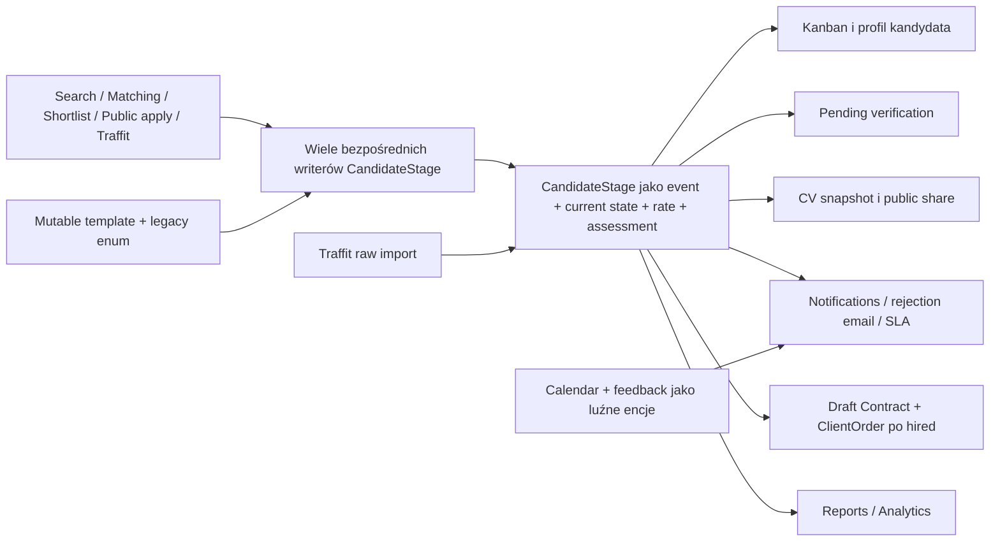
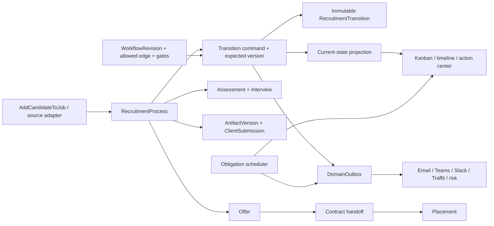

# Moduł 4 — Pipeline rekrutacyjny, submission do klienta, oferta i placement

## Audyt, rekomendacja docelowa i szczegółowy plan implementacyjny dla Claude Code

> Data audytu: 2026-07-16 (Europe/Warsaw)
>
> Stan kodu po finalnym re-anchor: `origin/main` =
> `6472b67aee8c879d2943a48dbaa1b1bd6057575d`
>
> Stan produkcji podczas finalnej weryfikacji: `/api/health.version` =
> `6472b67aee8c879d2943a48dbaa1b1bd6057575d`, status `healthy`, baza `healthy`
>
> Tryb: read-only audyt dokładnego `origin/main`, weryfikacja produkcji przez
> healthcheck oraz zalogowaną sesję przeglądarki; bez mutacji danych
>
> Status: rekomendacja i plan; implementacja nie została rozpoczęta w ramach
> tego zadania

## 1. Streszczenie zarządcze

NEXUS ma rozbudowany, działający operacyjnie pipeline: konfigurowalne szablony,
Kanban, drag-and-drop, bulk actions, pending verification, screening Championa,
scorecardy, kalendarz, feedback po rozmowach, brandowane CV, linki publiczne,
maile odrzucające, SLA, powiadomienia oraz automatyczne utworzenie draftu
kontraktu i zamówienia po przejściu na `hired`.

Problemem nie jest brak funkcji. Problemem jest brak jednego procesu, który
łączy te funkcje w spójną, transakcyjną i audytowalną całość.

`CandidateStage` pełni dziś jednocześnie role:

- historycznego zdarzenia zmiany etapu;
- nośnika bieżącego stanu candidate-job;
- miejsca przechowywania oczekiwanej i klienckiej stawki;
- rekordu approvalu stawki;
- magazynu odpowiedzi screeningu i scorecardu;
- wejścia do CV snapshotu;
- triggera maila, notyfikacji, kontraktu i zamówienia;
- źródła dla Kanbanu, SLA, raportów i analytics.

Jednocześnie co najmniej kilkanaście niezależnych ścieżek zapisuje
`CandidateStage` bez wspólnej komendy domenowej. Single move, bulk, shortlist,
proposals, public apply, LinkedIn, signing i Traffit stosują różne reguły.
W efekcie system może mieć kilka sprzecznych odpowiedzi na pytanie „gdzie
obecnie jest ten kandydat i co już naprawdę wydarzyło się w rekrutacji?”.

Najważniejsze ryzyka:

1. **Uprawnienia lifecycle nadal są za szerokie.** PR `03d3dd7` odciął viewera
   od modułu kandydatów i ograniczył client rate, ale scorecard, część
   screeningów, calendar i feedback nadal używają tylko `CurrentUser`.
   `RecruiterPlus`/`CandidateWriteAccess` obejmuje sourcera, a terminalny
   `hired` nie ma ownership scope.
2. **Pending verification można ominąć.** Bulk i bezpośrednie writery mogą
   przejść do `verified` lub dalej bez tego samego gate'u; approve/reject może
   działać na historycznym rekordzie.
3. **Porównanie stawek jest matematycznie błędne.** Surowa wartość godzinowa,
   dzienna lub miesięczna jest porównywana z miesięcznym budżetem bez
   normalizacji jednostki i waluty.
4. **Custom i klonowane pipeline'y tracą semantykę.** Etap bez
   `legacy_enum_value` jest zapisywany jako `new`; klonowanie celowo nie kopiuje
   tego mapowania. Reguły `hired`, `rejected`, raporty i UI mogą nie zadziałać.
5. **Efekty zewnętrzne nie są bezpiecznie związane z transakcją.** E-mail może
   zostać wysłany przed commitem, a błąd po pierwszym commicie może zwrócić 500
   mimo zapisanej zmiany etapu. Retry może wtedy powielić zdarzenie.
6. **„Wyślij klientowi” nie tworzy submission.** Tworzy lub kopiuje link do CV,
   ale nie zapisuje odbiorcy, dokładnej wersji dokumentu, rate snapshotu,
   wiadomości providera, daty wysłania, potwierdzenia ani odpowiedzi klienta.
7. **Nie istnieje wersjonowana oferta.** Opcjonalne
   `candidate_offer_response` na eventach stage nie dowodzi, jakie warunki
   kandydat zaakceptował.
8. **`hired` nie oznacza placementu.** Standardowy hook tworzy tylko draft
   `Contract` i `ClientOrder`, część ścieżek hook omija, a raporty potrafią już
   liczyć ten etap jak aktywny placement.
9. **Historia jest kasowalna.** „Usuń z rekrutacji” fizycznie usuwa historię i
   powiązane artefakty, ale może zostawić kontrakt lub zamówienie bez procesu.
10. **Frontend potrafi pokazać stan, którego backend nie zapisał.** Po błędzie
    move nie ma rollbacku optimistic state, a po sukcesie karta zachowuje stary
    `CandidateStage.id`; kolejne screening/scorecard/approval mogą działać na
    niewłaściwym rekordzie.

Weryfikacja live potwierdziła, że są to problemy widoczne operacyjnie, a nie
tylko teoretyczne:

- produkcyjny Kanban joba miał 15 kolumn, 12 aktywnych kart i karty starsze niż
  90 dni;
- terminalne „Zatrudniony” występowało przed nieterminalnym „Onboarding”;
- także karta `hired` nadal oferowała aktywne „Usuń z rekrutacji”;
- profil zatrudnionego pokazywał równolegle surowe `hired`, brak CV w momencie
  zgłoszenia, aktywne edycje stawek, generowanie CV i usunięcie z rekrutacji;
- zakładka „Historia” joba była historią requestu/sibling requests, nie
  historią przejść pipeline;
- importowany etap „Lista rezerwowa” był skonfigurowany jako terminalny
  `withdrawn`, przez co „on hold” semantycznie znika z aktywnego procesu.

Rekomendacja docelowa:

> Zbudować kanoniczny `RecruitmentProcess` z immutable ledgerem
> `RecruitmentTransition`, wersjonowanym workflow, optimistic lockingiem i
> transactional outbox. Następnie dodać prawdziwe `ClientSubmission`,
> `ArtifactVersion`, `Assessment`, `Interview`, `Offer`, `Placement` i
> `Obligation`. Wszystkie wejścia — UI, bulk, public apply, signing i Traffit —
> muszą wywoływać tę samą command service.

Plan jest rozpisany na 22 małe, zależne PR-y. Nie rekomenduję big-bang rewrite'u
ani kolejnych warunków `if stage == ...` dopisywanych do `pipeline.py`.

## 2. Zakres i granice modułu

### 2.1. W zakresie

- utworzenie i prowadzenie procesu candidate-job po bezpiecznym przypisaniu;
- definicje workflow, etapy, dozwolone przejścia i terminal outcomes;
- Kanban, pojedyncze i zbiorcze przejścia, reopen i korekty;
- ownership, capabilities, scope i audit trail;
- screening, scorecardy, weryfikacja stawek i approval;
- oczekiwana stawka kandydata oraz sell rate do klienta w kontekście procesu;
- wersja CV/artifactu przypisana do rekrutacji;
- realne submission do klienta, odbiorca, wysyłka i odpowiedź;
- kalendarz rozmów, M365, przypomnienia i feedback obu stron;
- oferta, jej wersje, approval, wysłanie i akceptacja;
- handoff do kontraktu, placement, start i zakończenie;
- rejection/withdrawal/on-hold i bezpieczne przywrócenie;
- SLA/obligations, notyfikacje i transactional outbox;
- wejście/wyjście Traffit dla lifecycle;
- projekcje Kanbanu, timeline, raporty i analytics lifecycle;
- migracja z `CandidateStage`, reconciliacja i cutover.

### 2.2. Zależności od poprzednich modułów

Moduł 4 zakłada, że wcześniejsze moduły dostarczają:

- z modułu 1: kanoniczny Job/Request, klienta, budget/rate policy, ownera,
  readiness i status publikacji;
- z modułu 2: kanonicznego kandydata, privacy/consent, marketability,
  dokumenty i komendę `AddCandidateToJob`;
- z modułu 3: eligibility, wynik matchingu, rekomendację i outcome linkowany do
  utworzonego procesu.

Pipeline nie powinien ponownie implementować prywatności, identity resolution
ani scoringu. Powinien konsumować ich jawne decyzje i zachowywać snapshot
decyzji użytej w danym momencie.

### 2.3. Granica z modułem kontraktów i delivery

Ten moduł kończy lifecycle rekrutacyjny na:

- zaakceptowanej, konkretnej wersji oferty;
- podpisanym kontrakcie;
- potwierdzonym starcie;
- aktywowanym `Placement`.

Dalszy timesheet, rentowność, przedłużenia, equipment, opieka nad konsultantem
i zakończenie współpracy są osobnym modułem kontraktowo-delivery. Muszą jednak
aktualizować placement przez zdefiniowane zdarzenia, a nie dryfować niezależnie.

### 2.4. Świadomie poza pierwszym rolloutem

- automatyczne odrzucanie ludzi przez AI;
- automatyczne wysyłanie profilu klientowi bez zatwierdzenia człowieka;
- pełny portal klienta, zanim powstanie bezpieczny submission/audience model;
- szeroki redesign wszystkich ekranów ATS;
- usunięcie legacy tabel przed zakończeniem shadow comparison;
- last-write-wins pomiędzy NEXUS i Traffit dla decyzji terminalnych;
- prawne decyzje o retencji i podstawie udostępnienia bez akceptacji DPO/legal.

## 3. Źródła dowodowe i ograniczenia

### 3.1. Stan repozytorium

Główny audyt wykonano na izolowanej kopii `origin/main=78aab280`, a finalny
re-anchor przez commit tree i pełny diff na `origin/main=6472b67a` wskazany w
metryce dokumentu. Lokalny checkout zawierał niezwiązany WIP i nieśledzone
raporty. Nie był traktowany jako prawda produkcyjna; niczego nie resetowano,
nie stashowano i nie modyfikowano poza dodaniem tego dokumentu.

Główna inspekcja rozpoczęła się na `78aab280`. Przed finalizacją wykonano
ponowny `git fetch`; `origin/main` przesunął się przez:

- `03d3dd7` — P0 access containment modułu kandydatów;
- `d3cc23d` — eligibility 409 UX oraz invalidacja Kanbanu po add/promote;
- `04f779c` — RBAC containment modułu klientów i bezpieczne projekcje;
- `6472b67` — kanoniczne Analytics API v1, metryki i deprecation legacy API.

Sprawdzono pełny diff i zaktualizowano raport. Te commity nie zmieniły
`CandidateStage`, głównego move/bulk, template semantics, pending verification,
submission, offer, placement, outbox, calendar/feedback ani Kanban move logic.
Naprawiły natomiast część wcześniejszych uwag: viewer nie ma już dostępu do
candidate module, client rate wymaga `CandidateFinanceAccess`, quick assign
używa `CandidateWriteAccess` i eligibility gate, a add/promote odświeża Kanban.
Commit klientowy nie dotknął audytowanych lifecycle writers ani frontendowego
pipeline. Commit Analytics również nie zmienił writerów ani lifecycle UI, ale
formalizuje przejściową definicję placementu jako pierwsze osiągnięcie `hired`;
zostało to uwzględnione w P1.13 i planie cutoveru. Raport nie przedstawia
zamkniętych punktów jako nadal otwartych.

Najważniejsze sprawdzone obszary:

- `backend/app/models/recruitment_pipeline.py`;
- `backend/app/models/pipeline_template.py`;
- `backend/app/models/candidate_stage_cv.py`;
- `backend/app/models/calendar_event.py`;
- `backend/app/models/interview_feedback.py`;
- `backend/app/models/contract.py` i `client_order.py`;
- `backend/app/api/pipeline.py`;
- `backend/app/api/pipeline_templates.py`;
- `backend/app/api/candidates.py`;
- `backend/app/api/jobs.py`;
- `backend/app/api/job_shortlist.py`;
- `backend/app/api/proposals_bulk.py`;
- `backend/app/api/calendar.py`;
- `backend/app/api/interview_feedback.py`;
- `backend/app/api/screenings.py` i `phase3.py`;
- `backend/app/api/candidate_stage_cv.py` i `public_share.py`;
- `backend/app/api/contracts.py` i `reports.py`;
- `backend/app/services/stage_notification_emitter.py`;
- `backend/app/services/rejection_email_scheduler.py`;
- `backend/app/services/signing/pipeline_hook.py`;
- `backend/app/services/traffit/importer.py` i `mappers.py`;
- `frontend/src/components/v2/pages/KanbanBoardV2.tsx`;
- `frontend/src/components/v2/pages/CandidateDetailV2.tsx`;
- `frontend/src/components/settings/PipelineTemplatesTab.tsx`;
- `frontend/src/components/feedback/InterviewFeedbackModal.tsx`;
- `frontend/src/app/jobs/[id]/page.tsx`;
- `frontend/src/app/pending-verifications/page.tsx`;
- `.github/workflows/ci.yml`.

### 3.2. Produkcja

Read-only sprawdzono w zalogowanej sesji:

- listę jobów;
- produkcyjny Job `3`, wszystkie zakładki związane z pipeline;
- jego Kanban i historię;
- profil kandydata z procesem zakończonym `hired`;
- `/pending-verifications`;
- `/settings/pipeline-templates` wraz z domyślnym i importowanym workflow;
- `/api/health` z wymaganym `User-Agent: dynaminds-smoke-test/1.0`.

Nie wykonano drag-and-drop, approvalu, odrzucenia, edycji stawki, wysyłki CV,
utworzenia tokena, feedbacku ani usunięcia procesu. Obserwacje potwierdzają
aktualny UX i konfigurację, nie liczbę wszystkich anomalii danych.

Finalny healthcheck w momencie audytu zwrócił:

- HTTP 200;
- `status=healthy`;
- `version=6472b67a...`;
- `checks.database=healthy`;
- `checks.m365=healthy`;
- `checks.m365_encryption=healthy`;
- `checks.traffit=degraded`;
- `checks.cloudtalk=unhealthy`;
- `checks.cortex=healthy`;
- `checks.anthropic=configured`.

Po wdrożeniu `d3cc23d9` ponowiono live check joba `3`. Nadal pokazywał 12 kart
w procesie, 15 kolumn, karty do 94 dni, terminalne „Zatrudniony” przed
„Onboarding” oraz aktywne „Usuń z rekrutacji” na karcie hired. Obserwacje
profilu kandydata i template wykonano podczas głównej inspekcji na `78aab280`;
finalny diff oraz aktualny kod `CandidateDetailV2` potwierdzają, że opisane
akcje refresh/share/remove nadal istnieją.

Następnie healthcheck potwierdził produkcyjny `6472b67a`, dokładnie zgodny z
finalnym `origin/main`. Diff klientowego containment nie zmienił żadnej
powierzchni pipeline sprawdzonej w tym live checku, a ostatni commit Analytics
zmienił backendowe metryki/API i CI, lecz nie frontend ani lifecycle writery.

Overall `healthy` nie oznacza, że procesy biznesowe są spójne. Endpoint nie
sprawdza obecnie m.in. orphan stages, hired-without-contract, outbox backlog,
pending approvals, workflow drift ani brakujących snapshotów.

### 3.3. Brak snapshotu administracyjnego

Nie pobrano `/api/admin/snapshot`, ponieważ audyt nie miał jawnie przekazanego
tokenu administracyjnego. Dlatego raport nie przedstawia jako zmierzonych:

- liczby procesów z wieloma możliwymi current rows;
- liczby `hired` bez kontraktu i kontraktów bez `hired`;
- liczby stage'ów spoza aktualnego template joba;
- liczby CV snapshotów pominiętych przez alternatywne writery;
- liczby przeterminowanych SLA lub zduplikowanych maili.

PR-00 zawiera bezpieczny, read-only preflight, który ma te liczby ustalić przed
pierwszą migracją.

### 3.4. Rozróżnienie dowodów

W dokumencie rozdzielono:

- **potwierdzone zachowanie kodu** — istniejące ścieżki i brak inwariantów;
- **potwierdzone zachowanie UI** — obserwacja bez mutacji na produkcji;
- **ryzyko wynikające z kodu** — osiągalna ścieżka błędu, której nie wywoływano
  na danych produkcyjnych;
- **hipotezę do zmierzenia** — liczebność problemu wymagająca SQL/logów;
- **rekomendację docelową** — proponowany kontrakt, jeszcze nie wdrożony.

## 4. Obecny przepływ i źródła rozjazdu

### 4.1. Obecny model



Nie ma centralnego miejsca, które gwarantuje, że:

- proces istnieje dokładnie raz;
- target stage należy do workflow joba;
- przejście jest dozwolone;
- stan nie zmienił się od czasu załadowania karty;
- approval i commercial gates są spełnione;
- CV i rate wskazują dokładne wersje;
- powstanie jeden trwały side-effect intent, a consumer bezpiecznie obsłuży
  dostawę co najmniej jednokrotną przez idempotencję lub reconciliation;
- raport, Kanban i integracja widzą ten sam current state.

### 4.2. Bezpośrednie writery

Potwierdzone runtime call-site'y tworzące lub zmieniające `CandidateStage`
obejmują między innymi:

| Wejście | Lokalizacja | Różnica względem głównego move |
|---|---|---|
| single move | `backend/app/api/pipeline.py:389-410` | najwięcej hooków, lecz brak atomiczności całego flow |
| approval/revert | `backend/app/api/pipeline.py:1361-1376` | operuje na historycznym row i dopisuje nowy |
| bulk move | `backend/app/api/pipeline.py:1462-1472` | omija większość gate'ów i terminal effects |
| bulk proposals | `backend/app/api/proposals_bulk.py:227-364` | inny eligibility/audit/snapshot contract |
| candidate endpoint | `backend/app/api/candidates.py:2283-2320` | może ominąć reason, approval i side effects |
| job shortlist | `backend/app/api/job_shortlist.py:206-309` | promotion nie ma jednego transition contract |
| public share/apply | `backend/app/api/public_share.py:368-387` | własna ścieżka wejścia |
| recommendations | `backend/app/api/recommendations.py:921-1033` | direct writer; nowy eligibility guard, ale nadal brak process command i job scope |
| request history | `backend/app/api/jobs.py:2279-2360` | własny insert i niepełny audit |
| signing hook | `backend/app/services/signing/pipeline_hook.py:38-103` | omija standardowe hired effects i idempotencję |
| Traffit | `backend/app/services/traffit/importer.py:1737-1761` | raw SQL, backdated/import semantics |

Architektoniczny cel nie brzmi „ujednolicić większość”. Po migracji runtime ma
nie posiadać żadnego legalnego bezpośredniego writera poza jednym command
service; backfill i migracje muszą być jawnie odseparowane.

## 5. Co już działa i co należy zachować

Audyt nie rekomenduje wyrzucenia całego modułu. Warto zachować i opakować:

- elastyczne `PipelineTemplate`, `PipelineStageDef` i `RejectionReason`;
- kategorię internal/external/terminal i terminal types;
- per-stage SLA, tracker public name i scorecard schema;
- Kanban z drag-and-drop, zaznaczeniem i podstawowymi bulk actions;
- strukturalne `ScreeningNote` i `InterviewFeedback`;
- integrację Calendar/M365, Teams meeting i recording discovery;
- brandowane CV, finalize i snapshot w storage;
- opóźnione maile odrzucające oraz reguły notyfikacji;
- content history i zewnętrzne identyfikatory Traffit;
- views i nowe Analytics API v1 z commitów `78aab280`/`6472b67`;
- istniejące modele `Contract` i `ClientOrder` jako downstream, ale nie jako
  zamiennik `Offer` i `Placement`;
- obecne ekrany jako compatibility surfaces podczas stopniowego cutoveru.

Kluczowa zmiana polega na przeniesieniu authority do spójnej domeny, a nie na
przepisywaniu wszystkiego od zera.

## 6. Ustalenia P0 — bezpieczeństwo i integralność

### P0.1. Brak kanonicznego agregatu rekrutacji

`CandidateStage` jest opisany jako historia przejść, ale jednocześnie przechowuje
mutable dane procesu (`backend/app/models/recruitment_pipeline.py:92-245`).
Bieżący stan jest inferowany z „najnowszego” row, przy czym różne query używają
różnej definicji najnowszego rekordu.

Brakuje:

- unikalnego `RecruitmentProcess` dla `(candidate_id, job_id)`;
- current transition pointer;
- `state_version` do optimistic concurrency;
- workflow revision przypiętej do procesu;
- statusu open/closed/voided;
- process owner/team;
- źródła authority;
- command idempotency.

**Skutek:** dwa równoległe requesty mogą oba przejść, retry może dopisać drugi
event, a raport i Kanban mogą wybrać inne latest row.

**Naprawa:** `RecruitmentProcess` + immutable `RecruitmentTransition`, opisane
w sekcji 12. `CandidateStage` jest źródłem backfillu, a po cutoverze może być
wyłącznie odbudowywalną compatibility projection — nigdy drugim ledgerem.

### P0.2. Własne i klonowane workflow tracą semantykę

Gdy `stage_def_id` nie ma `legacy_enum_value`, główny move fallbackuje do
`PipelineStage.new` (`backend/app/api/pipeline.py:303-327`). Klonowanie
szablonu nie kopiuje legacy mapowania, `scorecard_schema`, `client_id`,
zewnętrznych mappingów ani poprawnego stage-specific bindingu rejection reasons
(`backend/app/api/pipeline_templates.py:293-336`).

Skutki:

- własny etap może być serializowany i raportowany jako `new`;
- własny terminal `hired` może nie utworzyć artefaktów downstream;
- własny `rejected` może nie zaplanować prawidłowego maila;
- custom `cv_sent` nie musi uruchomić odpowiednich reguł;
- frontend rozpoznający `dst.stage === ...` nie otworzy wymaganych modali;
- wiele odmiennych etapów zlewa się w jeden legacy enum.

Produkcja pokazała dodatkowo, że sklonowany/importowany proces ma „Listę
rezerwową” oznaczoną jako terminalne `withdrawn`. Mapper Traffit mapuje `wait`
na `withdrawn` (`backend/app/services/traffit/mappers.py:248-253`). Operacyjne
„on hold” nie powinno zamykać procesu ani usuwać go z active counts.

**Naprawa:** stabilny `semantic_key` i wersjonowane stage revisions stają się
jedynym źródłem reguł. Clone musi mieć pełną semantyczną parytetowość albo
jawnie odrzucić element, którego nie potrafi przenieść. Legacy enum jest tylko
adapterem migracyjnym.

### P0.3. Niewłaściwy RBAC i brak scope

Commit `03d3dd7` wdrożył wartościowy pierwszy containment dla modułu
kandydatów: viewer został wykluczony, client rate wymaga
`CandidateFinanceAccess`, a resolver uwzględnia role dodatkowe. Nie rozwiązuje
to jednak authorization contract całego lifecycle.

Pozostałe potwierdzone przykłady:

- quick assign używa `CandidateWriteAccess`, które obejmuje sourcera, ale nie
  sprawdza owner/collaborator scope joba
  (`backend/app/api/recommendations.py:921-1033`);
- scorecard submit nadal używa `CurrentUser`
  (`backend/app/api/phase3.py:82-106`);
- expected rate używa ogólnego `CandidateWriteAccess`, obejmującego sourcera,
  i zapisuje mutable latest stage; client rate jest już prawidłowo zawężony do
  `CandidateFinanceAccess`
  (`backend/app/api/candidates.py:3018-3142`);
- calendar list/create/update/delete używa `CurrentUser`
  (`backend/app/api/calendar.py:100-651`);
- screening endpoints i interview feedback są dostępne zbyt szeroko;
- `RecruiterPlus` obejmuje sourcera
  (`backend/app/api/deps.py:174-185`);
- move nie sprawdza ownership/collaboration scope joba
  (`backend/app/api/pipeline.py:295-300`).

To pozwala roli projektowanej jako read-only lub ograniczony sourcing na
mutacje danych finansowych, ocen i terminalnego lifecycle. Samo ukrycie akcji w
UI nie jest zabezpieczeniem.

**Naprawa:** capabilities oraz resource scope:

- `recruitment.read`;
- `recruitment.assign`;
- `recruitment.transition`;
- `recruitment.transition_terminal`;
- `recruitment.reopen`;
- `recruitment.correct`;
- `recruitment.rate.edit_candidate`;
- `recruitment.rate.edit_client`;
- `recruitment.rate.approve`;
- `recruitment.assessment.write`;
- `recruitment.submission.send`;
- `recruitment.offer.approve`;
- `recruitment.placement.activate`;
- `recruitment.share.manage`.

Scope musi uwzględniać admin/global, job owner, collaborator, delivery lead i
client/account scope. Resolver ma brać pod uwagę wszystkie role użytkownika,
nie tylko primary `User.role`.

### P0.4. Pending verification można ominąć i podjąć decyzję na starym row

Główna ścieżka tworzy `pending`, gdy expected rate przekracza budżet
(`backend/app/api/pipeline.py:364-419`). Nie jest to jednak stan agregatu:

- kolejny move może ominąć pending;
- bulk może bezpośrednio utworzyć `verified` jako active;
- alternatywne writery nie uruchamiają gate'u;
- zmiana expected rate nie uruchamia ponownej oceny
  (`backend/app/api/candidates.py:3078-3142`);
- pending list pobiera historyczne pending rows
  (`backend/app/api/pipeline.py:1162-1196`);
- approve/reject nie potwierdza, że rekord jest current
  (`backend/app/api/pipeline.py:1213-1227,1307-1321`);
- równoległe approve i reject nie mają CAS/locka.

**Naprawa:** approval jako `GateInstance`/stan procesu. Gdy gate jest pending,
jedynymi legalnymi komendami są approve, reject lub cancel. Decyzja ma wymagać
`expected_state_version` i sprawdzić, że policy input nadal jest aktualny.

### P0.5. Stawki są porównywane bez normalizacji jednostki i waluty

Job budget jest opisany jako PLN/miesiąc
(`backend/app/models/job.py:78-80`), podczas gdy kandydat może mieć hourly,
daily lub monthly i inną walutę. Kod porównuje surowe wartości
(`backend/app/api/pipeline.py:374-387`).

Przykład: `150 PLN/hour < 25 000 PLN/month` jest liczbowo prawdziwe, ale nie
jest poprawną decyzją budżetową.

**Naprawa:** jeden `RateNormalizationService`, który zapisuje:

- source amount/currency/unit;
- target currency/unit;
- dni/godziny przyjęte przez politykę;
- kurs, źródło i timestamp;
- policy version;
- normalized amount;
- wynik `within_budget`, `above_budget` lub `manual_review`.

Brak bezpiecznej konwersji ma failować do manual review, nigdy do auto-approve.

### P0.6. Move i side effects nie są jedną bezpieczną transakcją

Główna ścieżka:

- tworzy stage i wiele rekordów;
- emituje powiadomienia przed finalnym commitem
  (`backend/app/api/pipeline.py:460-499`);
- emitter może wykonać SMTP
  (`backend/app/services/stage_notification_emitter.py:196-218`);
- commit następuje później (`backend/app/api/pipeline.py:640`);
- risk recompute wydarza się po pierwszym commicie; zwykłe wyjątki są łapane,
  ale błąd SQL może pozostawić sesję w failed transaction i wywołać późny
  `PendingRollbackError`/500;
- Teams używa procesowego `asyncio.create_task`.

Możliwe skutki:

- mail o przejściu, którego DB ostatecznie nie zatwierdziła;
- HTTP 500 po już zapisanym transition;
- retry po takim częściowym sukcesie tworzący duplikat;
- utracone Teams/Slack przy deployu/restarcie;
- odmienny stan side effectów i procesu.

**Naprawa:** transactional outbox w tej samej transakcji co transition. Worker
po commit obsługuje e-mail, in-app, Teams, Slack, WebSocket, risk recompute,
Traffit i downstream sagas z lease, retry, dead-letter i dedup key.

### P0.7. Bulk i pozostałe ingress omijają reguły single move

Backend bulk nie ma kompletnej walidacji joba, kandydatów, template, current
state, approval i terminal effects; przyjmuje nieograniczoną listę oraz może
powielać ID (`backend/app/api/pipeline.py:1430-1475`). Frontend natomiast nie
wykorzystuje atomowego bulk command — wysyła serię pojedynczych POST-ów.

Dla mieszanej grupy używa kontekstu pierwszego kandydata do części decyzji
rejection/internal-external. Screening i scorecard prompts mogą być pominięte
lub nadpisane.

**Naprawa:** jedna semantyka bulk:

- do 100 unikalnych items;
- `expected_version` i `idempotency_key` per item;
- dry-run validation;
- ten sam command handler co single;
- jawny tryb `atomic` albo `partial`;
- per-item result i reason code;
- brak terminal shortcuts.

### P0.8. Historia może zostać fizycznie usunięta

Endpoint „Usuń z rekrutacji” usuwa wszystkie `CandidateStage` dla pary
candidate-job (`backend/app/api/candidates.py:3145-3221`). Cascade może usunąć
CV snapshots, share tokeny i rejection audit. Contract lub ClientOrder mogą
pozostać.

UI oferuje tę akcję również na produkcyjnej karcie `hired` i profilu
zatrudnionego kandydata.

**Naprawa:** usunąć zwykły hard delete. Wprowadzić:

- `void_recruitment` dla błędnego utworzenia;
- `void_transition`/compensating event dla korekty;
- wymagany reason, actor, ticket/reference i correlation ID;
- specjalny workflow kompensacji dla wysłanej wiadomości, submission, oferty,
  kontraktu lub placementu;
- hard delete wyłącznie jako kontrolowana procedura privacy/retention poza
  zwykłym API operacyjnym.

### P0.9. Nie istnieje realne ClientSubmission

`cv_sent` jest tylko etapem. „Wyślij klientowi” na profilu tworzy/finalizuje CV,
generuje link i kopiuje go. Nie istnieje jeden rekord dowodzący:

- któremu klientowi i kontaktowi wysłano profil;
- jaki dokładnie artifact i hash wysłano;
- jaki sell rate, walutę, unit i warunki pokazano;
- przez jaki kanał i provider message ID;
- kto zatwierdził wysyłkę;
- kiedy wysłano, dostarczono, otwarto lub potwierdzono;
- jaki był response deadline;
- czy klient zaakceptował, odrzucił lub poprosił o informacje;
- jaka podstawa/consent pozwalała na udostępnienie.

Frontend wykonuje transition i osobny PATCH stawki, więc `cv_sent` może istnieć
bez complete rate snapshotu.

**Naprawa:** `ClientSubmission` i komenda `SubmitCandidateToClient`. Pierwsza
transakcja tworzy zatwierdzony submission w stanie `dispatch_pending`, snapshoty
i outbox intent. Transition do `submitted_to_client` następuje dopiero po
akceptacji przez providera albo po zapisaniu wiarygodnego, jawnie oznaczonego
manual evidence. Sam zamiar wysyłki nie może być raportowany jako „wysłano”.

### P0.10. Brak Offer i kanonicznego Placement

`candidate_offer_response` jest opcjonalnym polem na `CandidateStage`; nie
przechowuje wersji warunków ani dowodu akceptacji.

Standardowy `hired` tworzy wyłącznie draft `Contract` i `ClientOrder`
(`backend/app/api/pipeline.py:529-619`). Dodatkowo:

- start date jest ustawiany na dziś;
- sprawdzany jest tylko istniejący draft, nie każdy live contract;
- brak DB unique invariant per recruitment;
- concurrent requests mogą utworzyć duplikaty;
- bulk, Traffit i signing mogą ominąć hook;
- notification na draft może użyć semantyki `contract_activated`;
- raporty traktują samo `hired` jako placement/aktywny kontrakt.

W systemie współistnieją co najmniej: stage `hired`, `Contract`, `ClientOrder`,
ręczny `DrPlacementDetail` oraz activity typu placement. Żaden nie jest
kanonicznym placementem.

**Naprawa:** wersjonowane `Offer` oraz `Placement` powiązany dokładnie z jednym
process, accepted offer i właściwym contract. `placement_active` wymaga
podpisanego kontraktu i potwierdzonego startu.

### P0.11. Migrations/startup mogą dopuścić częściowy schemat

`backend/entrypoint.sh` toleruje błąd Alembic przez `|| echo`, safety net
wykonuje statementy pojedynczo i potrafi kontynuować po błędzie. `create_all`
nie doda brakujących kolumn i constraintów do istniejących tabel.

Przy tak rozbudowanej zmianie domeny zielony proces aplikacji z częściowym
schematem jest nieakceptowalny.

**Naprawa:** production startup fail-closed, `alembic upgrade heads`, schema
capability probe oraz health `unhealthy` przy brakującym kontrakcie DB. Zgodnie
z repo trapem każda nowa tabela/kolumna musi mieć idempotentny mirror w
`backend/entrypoint.sh`, dopóki ten mechanizm istnieje.

## 7. Ustalenia P1 — poważne błędy funkcjonalne

### P1.1. Target stage i rejection reason nie są bezpiecznie związane z workflow

`_resolve_stage_def` pobiera jawny stage ID globalnie
(`backend/app/api/pipeline.py:60-85`). Nie potwierdza, że stage należy do
workflow joba. Nieistniejący `stage_def_id` może fallbackować do legacy eventu,
a sprzeczne `stage` i `stage_def_id` nie są odrzucane.

`rejection_reason_id` jest sprawdzany pod kątem istnienia/active, ale nie zawsze
pod kątem tego samego template, stage i terminal category
(`backend/app/api/pipeline.py:329-362`).

Istnieje dodatkowy błąd kontraktu: schema przyjmuje free-text
`rejection_reason` (`backend/app/schemas/pipeline.py:30-31`) i router uznaje go
za spełnienie wymogu, ale nie zapisuje go do `CandidateStage`. Dla `withdrawn`
może to skończyć się naruszeniem DB CHECK i 500, ponieważ
`rejection_reason_id` pozostaje `NULL`; legacy `rejected` nie zawsze wymaga
żadnego trwałego reason.

Wymagane:

- jeden target: semantic `stage_revision_id`;
- stage należy do process workflow revision;
- edge from-current-to-target jest legalny;
- reason należy do właściwej terminal category i workflow;
- sprzeczny/nieistniejący target daje 422;
- zamknięty job, nieaktywny kandydat lub stale version daje kontrolowane 409.
- free-text reason jest albo zapisywany jako immutable structured snapshot,
  albo endpoint go nie akceptuje; nigdy nie „zalicza” niezapisanego inputu.

### P1.2. Template jest mutowalny retroaktywnie

Job może dostać nowy `pipeline_template_id` bez mapy migracji. Kanban buduje
kolumny z bieżącego template i może pominąć karty wskazujące stage ze starego
template (`backend/app/api/pipeline.py:736-791`).

Usuwanie stage'a liczy wszystkie historyczne użycia jak current use, przez co
stage może być praktycznie nieusuwalny po pierwszym przejściu. Inna ścieżka
może za to zmienić nazwę/kategorię i retroaktywnie zmienić znaczenie historii.

**Naprawa:** immutable workflow revisions. Edycja tworzy draft nowej wersji.
Job i process pinują revision. Migracja aktywnych procesów wymaga kompletnej
mapy stage-to-stage, dry-run i jawnego zatwierdzenia.

### P1.3. Frontend zachowuje stary ID po udanym move

Backend tworzy nowy `CandidateStage` i zwraca jego ID. W
`KanbanBoardV2.tsx`:

- zwykły `applyOptimistic`/`sendMove` przenosi obiekt ze starym `item.id` i
  ignoruje ID response (`818-925`);
- screening i scorecard mogą zostać otwarte dla starego row;
- specjalna ścieżka verified odczytuje `newStageId`, lecz karta nadal ma stary
  identyfikator (`980-1053`);
- późniejsze accept/reject z Kanbanu mogą wywołać endpoint na nieaktualnym ID
  (`1066-1105`).

**Naprawa natychmiastowa:** API zwraca pełny canonical current card; cache ma
być aktualizowany responsem, nie kopią starego obiektu. Po każdym mutation
invalidate current process/history/pending queries.

### P1.4. Brak rollbacku optimistic UI po błędzie

Catch zawiera literalne `TODO: revert optimistic on error`
(`frontend/src/components/v2/pages/KanbanBoardV2.tsx:924`). Karta może pozostać
w nowej kolumnie mimo 4xx/5xx. Custom stage, który frontend rozpozna jako
zwykły, a backend odrzuci z powodu gate'u, jest szczególnie ryzykowny.

**Naprawa:** React Query mutation z `onMutate` snapshot, `onError` restore i
`onSettled` invalidate. Konflikt 409 ma odświeżyć kartę i pokazać czytelny
komunikat, kto/co zmieniło stan.

### P1.5. Frontend nadal hardcoduje legacy stage

Logika modali i efektów jest warunkowana przez `dst.stage === verified`,
`cv_sent`, `rejected`, `withdrawn` lub `hired`. Custom/cloned stage serializowany
jako `new` omija screening, rate, rejection i hire UX.

**Naprawa:** backend zwraca `transition_requirements` i stable semantic
capabilities, np.:

```json
{
  "requires": ["candidate_rate", "approval", "rejection_reason"],
  "terminal_type": "rejected",
  "allowed": true,
  "expected_version": 17
}
```

Frontend renderuje flow z kontraktu serwera, nie z nazwy kolumny.

### P1.6. Terminal actions nie mają właściwego wizardu

`hired` jest osiągalne jednym drag-and-dropem i również bulk move. UI pokazuje
confetti, ale nie wymaga:

- daty planowanego startu;
- accepted offer/version;
- klienta i kontraktu;
- commercial approval;
- sell/buy rate;
- potwierdzenia konsekwencji;
- preview tworzonych artefaktów.

Odrzucenie i withdrawal również potrzebują reason, komunikacji, future email,
legalnego reopen i informacji o skutkach.

**Naprawa:** jawne command wizards dla submit, reject, withdraw, offer accept,
contract handoff, placement activate i reopen.

### P1.7. Reopen może nie anulować maila odrzucającego

Ruch z rejected do aktywnego etapu działa jak niejawny restore. Mail jest
planowany z opóźnieniem (`backend/app/services/rejection_email_scheduler.py`),
ale kolejny move nie gwarantuje anulowania pending dispatchu. Przywrócony
kandydat może dostać odrzucenie.

Dispatcher dodatkowo może wysłać duplikat przy crashu po sukcesie Graph, ale
przed zapisem `sent`: lock jest trzymany podczas network call, a status jest
commitowany później (`rejection_email_scheduler.py:187-337`).

**Naprawa:** explicit `restore_from_rejection`, które w jednej transakcji
tworzy compensating transition i anuluje niewysłany dispatch. Worker przed
wysyłką ponownie weryfikuje current state; claim i network call są oddzielone,
a provider correlation key umożliwia reconciliation.

### P1.8. CV snapshot nie jest prawdziwie jednolity ani immutable

`CandidateStageCV` przechowuje pełne BYTEA per stage
(`backend/app/models/candidate_stage_cv.py:43+`). To:

- duplikuje duże pliki przy każdym move;
- wiąże dokument z technicznym eventem zamiast procesem/submission;
- nie ma content hash/version chain;
- część writerów nie tworzy snapshotu;
- manual refresh może zmienić materiał po fakcie;
- handler `IntegrityError` w snapshot service może wykonać pełny rollback
  caller session.

Produkcja pokazała `hired` z komunikatem „Brak CV w momencie zgłoszenia” i
aktywnym generowaniem/odświeżaniem materiału. To nie pozwala ustalić, co klient
naprawdę widział.

**Naprawa:** deduplikowany `ArtifactVersion` z hash, object key, MIME, size,
renderer/template/redaction policy i immutable supersedes chain. Submission
wskazuje finalną wersję; refresh tworzy nową wersję.

### P1.9. Share token nie ma wystarczającego security/audytu

Tokeny są długowieczne, przechowywane w formie umożliwiającej operowanie raw
tokenem, nie są wystarczająco związane z audience/contact/purpose i nie mają
pełnego access/download audit, max views ani potwierdzonego legal context.
Rekruter znający raw token może wykonać revoke.

Zarządzanie linkami ma dodatkowy dead-end operacyjny: modal resetuje token po
zamknięciu, pozwala odwołać tylko właśnie utworzony token i nie ma listy
aktywnych linków ani revoke-by-ID. Kolejne otwarcia mogą tworzyć równoległe
aktywne linki, których użytkownik już nie potrafi odnaleźć
(`frontend/src/components/CVShareLinkModal.tsx:51-80,151-209`;
`backend/app/api/candidate_stage_cv.py:310-315,477-554`).

Publiczna karta może prezentować szeroki profil wraz ze screening answers.
Branded HTML pochodzi z edytowalnej treści; obecny publiczny iframe jest
sandboxowany bez scripts, ale authenticated printable flow otwiera blob
`text/html` w nowej karcie (`frontend/src/lib/authenticated-files.ts:89-106`).
To jest ryzyko stored active content, nie potwierdzony exploit.

**Naprawa:** hash tokenu, audience/purpose/artifact scope, krótki TTL, max
views, access log, no-store, rate limit, revoke reason, allowlist sanitizer,
CSP, sandbox preview i stripping zewnętrznych/aktywnych URL.

### P1.10. Screening, scorecard i feedback to kilka niezależnych prawd

Dane oceny występują w:

- `CandidateStage.screening_answers`;
- `CandidateStage.scorecard_answers`;
- `ScreeningNote`;
- `InterviewFeedback`;
- częściowo Activity/notes.

Nie mają wspólnej schema version, revisions, void/correction i gate policy.
Scorecard przyjmuje elastyczne `Any` i nie zawsze weryfikuje question IDs,
required fields ani stage/process consistency.

**Naprawa:** `Assessment` z typed schema, frozen schema version, immutable
revisions, author/source/side, decision i linkiem do process/interview.

### P1.11. Calendar i InterviewFeedback nie są bezpiecznie związane z procesem

`CalendarEvent` ma niezależne, opcjonalne `candidate_id`, `job_id` i
`client_id`. Caller może przekazać niespójny zestaw. `InterviewFeedbackCreate`
przyjmuje event/candidate/job oddzielnie i backend nie wyprowadza ich zawsze z
jednego procesu. Każdy feedback może też wyczyścić ogólne `needs_attention`,
mimo że oczekiwany feedback drugiej strony nadal nie istnieje.

Brakuje:

- process ID;
- interview side/round;
- no-show/reschedule history;
- expected feedback sides;
- feedback obligations;
- wersji/korekty feedbacku.

UI feedbacku jest w praktyce write-only i głównie osiągalne z notyfikacji. Na
409 sugeruje użycie PATCH, lecz nie ma pełnego edit flow.

`InterviewFeedbackModal` oczekuje `first_name/last_name`, podczas gdy canonical
candidate API używa `name/lastname`; nagłówek może pokazać `#ID` zamiast osoby
(`frontend/src/components/feedback/InterviewFeedbackModal.tsx:39-43,98-102,155-162`).

**Naprawa:** `Interview` aggregate i `FeedbackObligation`/`Assessment`; event
calendar staje się adapterem, a candidate/job/client są wyprowadzane z process.

### P1.12. Traffit zachowuje inną semantykę lifecycle

Importer zapisuje raw SQL, może aktualizować historyczne rows, commitować per
record i omija CV snapshot, audit, gates, terminal saga oraz outbox. Mapping
traci znaczenie, np. `wait -> withdrawn`, a stage lookup może wybrać pierwszy
pasujący external state z kilku template.

Nie należy zakładać, że każdy `wait` istnieje potem jako withdrawn row. Importer
nie przekazuje `rejection_reason_id`, podczas gdy DB CHECK wymaga reason dla
withdrawn (`backend/alembic/versions/0068_candidate_risk.py:140-153`). Import
może więc pominąć/odrzucić takie historyczne zdarzenie. Preflight ma porównać
external IDs z source i policzyć missing/failed/misclassified events.

Delta oparta o `created_at` może nie zobaczyć korekty starego transition.
Modele inbox/outbox/conflict istnieją jako fundament, ale nie są jeszcze
kanonicznym lifecycle runtime.

**Naprawa:** source event inbox, idempotency, workflow-aware mapping,
occurred_at/recorded_at, correction jako compensating transition oraz jawna
macierz authority. `hired`, rejection, offer i contract nie mogą używać
last-write-wins.

### P1.13. Raporty liczą eventy lub legacy enum zamiast procesów

Różne powierzchnie definiują latest inaczej:

- Kanban: `(moved_at DESC, id DESC)`;
- history: `moved_at` bez pełnego tiebreakera;
- overview/SLA/Slack: własne latest queries;
- job list: `MAX(id)`;
- import może dodać backdated event.

Raporty potrafią liczyć wszystkie stage rows w okresie, więc repeat/reopen
zawyża funnel. Phase 3 funnel używa distinct candidate, nie candidate-job
process. Lookback time-to-hire może obciąć prawdziwy start. Custom stages
zmapowane do `new` znikają z właściwych metryk.

Analytics views z `78aab280` i nowe API v1 z `6472b67` są wartościowym
fundamentem: centralizują definicje, okresy, capabilities, quality metadata i
kontrakt odpowiedzi. Nie są jednak jeszcze docelową prawdą lifecycle. Bieżące
`overview.placements_in_period` liczy `analytics_first_milestones.stage =
'hired'`, a KPI `first_placements` również mapuje pierwszy milestone `hired`.
PR-21 ma zachować publiczny kontrakt Analytics v1, lecz przepiąć jego wnętrze z
raw legacy stage na process facts, semantic state i prawdziwy `Placement`;
nie należy usuwać ani równolegle duplikować nowego API.

### P1.14. Rejection-email ma osobny problem dostępu i bezpiecznego HTML

Poza transactional outboxem obecny scheduler ma własne luki:

- `template_override_id` nie jest potwierdzany jako template kategorii
  rejection (`backend/app/services/rejection_email_scheduler.py:409-453`);
- dane kandydata/joba/użytkownika trafiają do HTML bez konsekwentnego escaping
  (`rejection_email_scheduler.py:456-509`);
- dowolny `CurrentUser` może odczytać recipient, subject, body i `last_error`
  (`backend/app/api/rejection_emails.py:103-116,194-219`);
- cancel opiera się na primary role i może ignorować role dodatkowe
  (`backend/app/api/rejection_emails.py:138-146`).

PR-04 musi objąć escaping/template category/read scope, a PR-09 trwały dispatch
i idempotency/reconciliation.

### P1.15. Public apply może zmienić istniejącą osobę i ominąć process contract

Holder publicznego invite tokena może podać e-mail istniejącego kandydata.
Obecna ścieżka potrafi wtedy zmienić imię/nazwisko, zastąpić CV, przypisać
`created_by` do autora linku i dopisać treść do profilu
(`backend/app/api/public_share.py:315-387`). Tożsamość i bezpieczny intake
należą docelowo do modułu 2, ale moduł 4 musi natychmiast zabezpieczyć samo
wejście do procesu.

`stage_exists` sprawdza dowolny historyczny row i nie ma atomowego locka:

- równoległe apply mogą utworzyć duplikat;
- dawny, zamknięty process może blokować świadomą re-aplikację;
- bezpośredni insert omija standardowe gates i side-effect policy.

Minimalny containment: public apply tworzy immutable intake/submission, nie
nadpisuje kanonicznej osoby na podstawie samego e-maila, a process powstaje
przez idempotentną command service.

### P1.16. Stage notifications mają niespójny constraint i role resolution

`specific_user_id` ma `ON DELETE SET NULL`, ale CHECK wymaga non-null dla
`recipient_type=specific_user`
(`backend/app/models/stage_notification.py:71-100,136-176`). Usunięcie
użytkownika może więc wejść w konflikt z constraintem. Resolver odbiorców
role-based sprawdza tylko primary role
(`backend/app/services/stage_notification_resolver.py:192-206`).

Migracja musi ujednolicić politykę `SET NULL`/disable rule, a resolver korzystać
z pełnego zbioru ról i process/resource scope. Delivery status należy do
outbox/delivery log, nie do implicit fire-and-forget.

## 8. Ustalenia P2/P3 — UX, operacje, wydajność i testy

### P2.1. Kanban nie skaluje się informacyjnie ani technicznie

- Produkcyjny board miał 15 szerokich kolumn i poziomy scroll; mobile nie
  zapewnia dostępu do wszystkich zakładek.
- Przy szerokości 390 px main content miał około 912 px.
- Summary chips zawijają się i konkurują z boardem.
- Karty 37–94 dni nie prowadzą do jawnego action center.
- Compact density ukrywa część screening/accept-reject controls.
- Wrapper draggable jest interaktywnym buttonem zawierającym checkbox, linki
  i przyciski, co tworzy problemy klawiatury i nested controls.
- Kanban backend ładuje pełną historię joba i deduplikuje w Pythonie
  (`backend/app/api/pipeline.py:672-817`).
- Orphan `stage_def_id` spoza aktualnego template może zostać niewidoczny.

Docelowo board powinien czytać paginowaną current projection, mieć filtrowanie,
swimlanes/owners, action center, accessible keyboard move i mobilny list view.

### P2.2. Profil kandydata dubluje proces i pokazuje surowe stany

Candidate recruitments card i widget częściowo dublują informacje. Widoczne są
surowe legacy enum oraz przetłumaczona etykieta, historia jest skrócona, a
akcje nie odróżniają active i terminal process.

Docelowo jedna timeline ma łączyć:

- transitions i korekty;
- gates/approvals;
- artifacts/submissions;
- interviews/feedback;
- offer;
- contract/placement;
- obligations/SLA;
- external synchronization/conflicts.

### P2.3. Job tabs i „Historia” wprowadzają w błąd

Zakładki joba nie są w pełni reprezentowane w URL, co utrudnia deep link,
back/forward i mobile. „Historia” na obserwowanym jobie była historią requestu,
nie audit trail procesu kandydatów. Powinna zostać precyzyjnie nazwana, a
pipeline audit powinien być dostępny per process oraz jako job activity stream.

### P2.4. Pending verification używa języka wewnętrznego

`/pending-verifications` na produkcji miał zero pozycji, ale tekst i breadcrumb
eksponowały techniczny termin „stage” i ucięty segment `pending-veri…`.
Widok powinien operować pojęciem procesu i approvalu, pokazywać normalized rate,
policy reason, age, owner i stale-state conflict.

### P2.5. Template editor dopuszcza niespójne konfiguracje

- nowy terminal defaultuje do `rejected`;
- UI nie oferuje kompletnej, bezpiecznej semantyki hired/withdrawn/on_hold;
- terminal może zostać wstawiony w środku procesu;
- `Zatrudniony` występuje przed `Onboarding` w produkcyjnym default workflow;
- mixed PL/EN internal labels są widoczne;
- PATCH może ustawić `archived=true` dla default/in-use i ominąć ochronę
  endpointu DELETE;
- można ustawić `is_default=false` na jedynym default, a DB nie ma partial
  unique gwarantującego dokładnie jeden aktywny default;
- reorder API dopuszcza częściową/niejednoznaczną konfigurację bez pełnej
  permutacji i wersji;
- brak constraintów spójności `is_terminal`, `terminal_type`, order i SLA;
- `sla_max_days=0` jest dozwolone przez schema, ale runtime interpretuje je jak
  wyłączone SLA.

Editor powinien walidować graph, terminal reachability, wymagane semantics,
duplicate semantic states, gates i migration impact przed publish.

Shortlist promotion ma własny integrity gap: nie egzekwuje
`evaluation_status == zatwierdzony`, a optimistic version jest realizowana jako
read-then-write zamiast atomowego `UPDATE ... WHERE version = expected
RETURNING` (`backend/app/api/job_shortlist.py:153-170,206-309`). Invalidacja
Kanbanu po promote została naprawiona w `d3cc23d`; pozostałe dwa problemy nadal
wymagają wspólnej process command.

### P2.6. Reminders i SLA nie są restart-safe

Calendar i Slack loops używają procesowych setów deduplikacji i krótkich okien.
Restart lub downtime może zgubić przypomnienie albo wysłać je ponownie. SLA
skanuje historię, ma hardcoded thresholds w części overview i nie posiada
persisted breach/ack/resolved/escalation.

Potrzebny jest persisted `Obligation` z `due_at`, pause/resume, business
calendar, logical dedup key, attempts i escalation policy.

### P2.7. CI nie chroni krytycznego flow

Selective pytest w `.github/workflows/ci.yml` nie uruchamia jako required m.in.:

- `test_pipeline.py`;
- `test_pending_verification.py`;
- `test_rejection_email_integration.py`;
- `test_rejection_email_scheduler.py`;
- `test_candidate_risk_service.py`;
- `test_candidate_stage_cv_snapshot.py`;
- `test_stage_notification_rules.py`.

`test_pipeline.py` jest dodatkowo live-server testem, który przy
`RUN_LIVE_TESTS=0` jest pomijany, potrafi używać przypadkowych danych i nie
failuje w części brakujących fixture'ów.

Frontend nie ma wystarczających testów `KanbanBoardV2` dla:

- nowego ID po move;
- optimistic rollback;
- stale version 409;
- custom semantic stages;
- required modal/gate;
- mixed bulk;
- multi-role;
- terminal wizard;
- mobile i keyboard accessibility.

Obecny flow-stage-transition E2E używa nieaktualnego endpointu, dopuszcza
status `<500`, może się skipnąć i nie weryfikuje realnego UI, notyfikacji ani
projekcji.

### P2.8. Shortlista nadal maskuje błędy i nie pokazuje pełnego workflow

Commit `d3cc23d` naprawił invalidację Kanbanu po promote, ale nie zmienił
`JobShortlistPanel`. Nadal:

- błąd pierwszego pobrania jest zamieniany na `[]`, po czym panel znika;
- każdy błąd PATCH — również 403/422/500 — jest opisany jak konflikt
  równoległej edycji;
- błąd DELETE jest ukryty;
- promote często pokazuje generyczny błąd Axios zamiast backend `detail`;
- model ma `owner_id`, `decision_reason_code`, `note` i `next_action_at`, ale UI
  pozwala zmieniać głównie evaluation/outreach.

Dowód: `frontend/src/components/v2/pages/JobShortlistPanel.tsx:57-112,115,159-213`
oraz `frontend/src/lib/candidate-search-api.ts:298-332`.

PR-03/PR-10 muszą dodać jawne loading/empty/error/conflict states, bezpieczne
delete confirmation, pełne reason codes i testy każdego statusu HTTP.

### P3.1. Nazewnictwo i prezentacja nie opisują biznesowego znaczenia

W UI współistnieją surowe `hired`, polskie etykiety, mixed English keys,
„stage”, „proces”, „rekrutacja”, „request” i „oferta” w różnych znaczeniach.
Przed nowym UI należy przyjąć słownik:

- Job/Request — zapotrzebowanie klienta;
- Recruitment Process — kandydat w konkretnym Job;
- Workflow Stage — prezentacyjna kolumna;
- Semantic State — stabilny stan biznesowy;
- Client Submission — konkretne przedstawienie profilu;
- Offer — wersjonowane warunki dla kandydata;
- Placement — potwierdzone obsadzenie i start.

### P3.2. Martwy `CandidatesBulkBar` nie jest aktywnym flow

`frontend/src/components/candidates/CandidatesBulkBar.tsx` nie ma call-site'u i
zawiera opisy pickerów, których sam nie renderuje. Claude nie powinien wdrażać
napraw bulk pipeline w tym komponencie. Aktywnym flow jest
`KanbanBoardV2.tsx`; martwy komponent należy osobno usunąć albo świadomie
podłączyć dopiero po decyzji produktowej.

## 9. Najważniejsze scenariusze awarii

### Scenariusz A — fałszywa karta po 422/500

1. Użytkownik przeciąga kartę.
2. UI optymistycznie przenosi ją do nowej kolumny.
3. Backend odrzuca custom stage lub gate.
4. Catch nie odwraca stanu.
5. Użytkownik działa na karcie w miejscu, którego DB nie potwierdziła.

### Scenariusz B — duplikat po częściowym sukcesie

1. Backend zapisuje transition i commit.
2. Późny SQL podczas risk recompute pozostawia sesję w failed transaction;
   zwykły wyjątek jest złapany, ale następna operacja kończy się
   `PendingRollbackError`.
3. Klient dostaje 500 mimo pierwszego commita.
4. Retry tworzy drugi event lub drugi terminal artifact.

### Scenariusz C — mail po restore

1. Kandydat przechodzi do rejected.
2. Scheduler zapisuje opóźniony mail.
3. Rekruter przywraca proces zwykłym dragiem.
4. Pending dispatch nie zostaje anulowany.
5. Kandydat otrzymuje odrzucenie mimo aktywnego procesu.

### Scenariusz D — hired bez placementu

1. Bulk/Traffit/signing zapisuje `hired` poza standardowym routerem.
2. Contract/ClientOrder hook się nie wykonuje.
3. Raport liczy placement.
4. Moduł contractorów nie ma właściwego aktywnego kontraktu.

### Scenariusz E — approval na starym pending

1. Powstaje pending verification.
2. Inna ścieżka przenosi proces dalej.
3. Pending list nadal pokazuje historyczny row.
4. Approver akceptuje go bez current version check.
5. System ma decyzję oderwaną od bieżącego procesu.

### Scenariusz F — klient widzi nieudowodnioną wersję CV

1. Rekruter finalizuje/generuje link.
2. Nie powstaje ClientSubmission z artifact hash i odbiorcą.
3. CV jest później odświeżone lub edytowane.
4. System nie potrafi jednoznacznie wykazać, co i komu wysłano.

## 10. Docelowy lifecycle

### 10.1. Stabilne stany semantyczne

Rekomendowany canonical lifecycle:

```text
identified
  -> screening_pending
  -> screening_completed
  -> internal_review
  -> internally_approved
  -> submission_preparation
  -> submission_approved
  -> submission_dispatch_pending
  -> submitted_to_client
  -> client_review
  -> client_interview_scheduled
  -> client_interview_completed
  -> feedback_pending
  -> client_approved
  -> offer_preparation
  -> offer_approved
  -> offer_dispatch_pending
  -> offer_sent
  -> offer_accepted
  -> contract_preparation
  -> contract_signed
  -> start_confirmed
  -> placement_active
  -> placement_ended
```

Terminal outcomes:

- `rejected_internal`;
- `rejected_client`;
- `candidate_withdrawn`;
- `offer_declined`;
- `offer_expired`;
- `job_cancelled`;
- `placement_failed`.

`on_hold` nie jest terminalem. Powinien być pause record z reason, ownerem,
`resume_due_at` i polityką zatrzymania SLA.

Nazwy kolumn Kanban mogą być dowolne i klientowe. Każda stage revision musi
jednak mapować się na stabilny semantic state i zestaw gates/effects. Dwa
prezentacyjne etapy mogą mapować się na jeden semantic state, ale raporty muszą
znać oba transition IDs i duration intervals.

### 10.2. Docelowy przepływ



## 11. Docelowe encje

### 11.1. `RecruitmentProcess`

Minimalne pola:

- `id` UUID/ULID;
- `candidate_id`, `job_id`, denormalizowany `client_id` z kontrolą zgodności;
- `attempt_no` i opcjonalny `previous_process_id`;
- `workflow_revision_id`;
- `current_stage_revision_id`;
- `current_semantic_state`;
- `state_version`;
- `status`: open, paused, closed, voided;
- `owner_user_id`, opcjonalny team/collaborators;
- `source_authority`;
- `opened_at`, `closed_at`, `voided_at`;
- `current_transition_id`;
- `created_at`, `updated_at`.

Rekomendacja to **jeden process na application attempt**, nie jeden wieczny
rekord candidate-job. Korekta, krótkie przywrócenie z odrzucenia i resume z
hold zachowują ten sam process. Prawdziwa re-aplikacja po definitywnym
zamknięciu tworzy nowy `attempt_no` z linkiem do poprzedniego procesu.

DB invariant: partial unique maksymalnie jednego niezamkniętego process dla
`(candidate_id, job_id)` oraz unique `(candidate_id, job_id, attempt_no)`.
Business owner musi zatwierdzić dokładną granicę „reopen vs nowy attempt” przed
PR-06, ponieważ wpływa ona na funnel, TTH, retencję i placement.

### 11.2. `RecruitmentTransition`

- immutable event ID;
- `process_id`;
- `from_stage_revision_id`, `to_stage_revision_id`;
- `from_semantic_state`, `to_semantic_state` snapshot;
- `version_before`, `version_after`;
- `occurred_at` i `recorded_at`;
- actor, origin, source external ID;
- reason code, structured reason, note;
- scoped `idempotency_key`, canonical request hash i correlation ID;
- gate decisions/policy versions;
- artifact/submission/offer references;
- metadata JSON tylko dla rozszerzeń, nie kluczowej semantyki;
- optional `corrects_transition_id`/`supersedes_transition_id` wskazywany
  wyłącznie przez nowy compensating event.

Brak UPDATE/DELETE w zwykłym runtime.

### 11.3. `WorkflowDefinition`, `WorkflowRevision`, `StageRevision`, `Edge`

- stabilna tożsamość workflow;
- immutable opublikowana revision;
- ordered presentation stages;
- stable `semantic_key`;
- category/terminal type;
- required gates/actions;
- allowed edges;
- SLA policy;
- tracker visibility/public label;
- scorecard/assessment schema reference;
- versioned rejection/withdrawal reasons;
- migration mapping między revisions.

### 11.4. `CommercialTermsSnapshot` i `GateInstance`

Commercial snapshot:

- candidate expected rate;
- client sell rate;
- unit/currency;
- normalized values;
- conversion policy/rate;
- margin snapshot, jeżeli dozwolony w tym module;
- source and actor.

Gate instance:

- process/transition target;
- gate type/policy version;
- input hash;
- pending/approved/rejected/cancelled/stale;
- required capability/approver scope;
- decision actor/time/reason;
- expiry.

### 11.5. `ArtifactVersion`

- logical artifact ID i immutable version ID;
- process/candidate context;
- object key;
- SHA-256, MIME, size;
- source document version;
- renderer/template/language;
- redaction/PII policy;
- generated/finalized by/at;
- supersedes version;
- malware/sanitization status;
- immutable/final status.

### 11.6. `ClientSubmission`

- process ID;
- client/contact/audience;
- final artifact version;
- commercial terms snapshot;
- channel: email, share link, portal, manual external;
- provider message/external ID;
- approval and consent/legal basis snapshot;
- prepared/sent/delivered/viewed/acknowledged/responded timestamps;
- dla każdego observed delivery/view/ack: `evidence_source`,
  `evidence_confidence`, `observed_at`, `provider_event_id`;
- response due;
- status: draft, approved, dispatch_pending, sent, failed, recalled, accepted,
  rejected, more_info;
- idempotency/correlation IDs;
- revision/supersedes.

### 11.7. `Assessment`

- process ID, optional interview ID;
- type: screening, technical scorecard, candidate feedback, client feedback;
- side/source;
- schema ID/version;
- immutable revision;
- typed answers;
- decision/outcome;
- author/occurred/recorded;
- supersedes/void reason.

### 11.8. `Interview`

- process ID;
- side: internal/client;
- round/type;
- status: scheduled, confirmed, completed, no_show, cancelled, rescheduled;
- start/end/timezone;
- M365/Calendar external IDs and change keys;
- attendees and client contact references;
- expected feedback sides;
- previous/rescheduled interview ID;
- recording/transcript policy references.

### 11.9. `Offer`

- process ID;
- version;
- immutable terms snapshot/hash;
- approver and approval time;
- prepared/approved/dispatch_pending/sent/viewed/accepted/declined/expired/rescinded;
- expiry;
- recipient and provider proof;
- evidence source/confidence dla sent/viewed/accepted;
- acceptance evidence and exact accepted version;
- supersedes offer ID.

### 11.10. `Placement`

- process ID — unique;
- accepted offer ID/version;
- contract ID — unique for live placement;
- client/job/candidate consistency;
- planned and confirmed start;
- status: pending_contract, pending_start, active, failed, ended;
- activated/failed/ended timestamps and reasons;
- downstream ownership.

### 11.11. `Obligation`

- source event/process/submission/interview/offer;
- obligation type;
- due_at and business calendar policy;
- owner/escalation target;
- pending, paused, overdue, acknowledged, resolved, cancelled;
- logical dedup key;
- attempts/last notification;
- pause intervals and resolution evidence.

### 11.12. `DomainOutbox` oraz integration inbox/conflict

Outbox:

- event type/version;
- aggregate ID/version;
- payload reference;
- immutable payload snapshot albo referencja do immutable version;
- PII classification, encryption policy i retention/purge deadline;
- logical dedup key;
- available_at;
- lease owner/expiry;
- attempts;
- sent/failed/dead;
- provider result/correlation.

Outbox logi nie mogą zawierać recipientów, CV, HTML ani feedbacku. Consumer nie
może rekonstruować wiadomości z później zmienionych rekordów; musi użyć
zatwierdzonego immutable snapshotu/referencji. Dostawa jest semantycznie
at-least-once. Exactly-once można deklarować tylko dla lokalnego intentu lub
artefaktu chronionego unique constraintem; provider bez idempotency API wymaga
reconciliation i evidence confidence.

Traffit inbox/conflict:

- immutable source payload/hash;
- external event/entity/version;
- received/processed status;
- authority decision;
- conflict snapshot and resolution;
- linked domain command/transition.

## 12. Nienaruszalne inwarianty

1. Istnieje najwyżej jeden otwarty process dla candidate-job, a każda nowa
   re-aplikacja ma rosnący `attempt_no`.
2. Każda runtime zmiana stanu używa jednej command service.
3. Każda komenda ma scoped idempotency key, canonical request hash i expected
   `state_version`; reuse klucza z innym payloadem zwraca 409.
4. Transition jest legalnym edge'em opublikowanej workflow revision.
5. Stage i reason należą do tej samej workflow revision.
6. Custom stage nie fallbackuje semantycznie do `new`.
7. Terminal reopen wymaga jawnej komendy, capability i reason.
8. Historia nie jest UPDATE/DELETE; korekta to compensating event.
9. Każdy ingress — UI, bulk, public apply, signing, Traffit, repair — używa
   tego samego invariant/command engine, ale jawnie deklaruje tryb
   `live_command`, `external_observed_event`, `historical_backfill` lub
   `repair/correction`. Side-effect policy zależy od trybu; historyczny import
   nie wysyła maili ani nie tworzy automatycznie kontraktu.
10. Viewer nie może wykonać żadnej mutacji.
11. Operacja wymaga resource scope, nie tylko ogólnej roli.
12. Pending gate blokuje wszystkie nielegalne przejścia.
13. Rate decision wskazuje jednostkę, walutę i policy version.
14. `submitted_to_client` nie istnieje bez dokładnego ClientSubmission i
   wiarygodnego evidence wysłania; `dispatch_pending` nie jest „wysłano”.
15. Submission wymaga klienta/odbiorcy, final artifactu, rate snapshotu,
   screening gate, legal context i dispatch intent.
16. Submission approval, snapshoty i dispatch intent powstają atomowo;
   transition `submitted_to_client` powstaje po provider acceptance/manual
   evidence jako osobna idempotentna komenda.
17. Share token jest hashowany, audience/purpose-scoped i audytowany.
18. Feedback candidate/job/process wynika z Interview, nie z dowolnych ID body.
19. Feedback jednej strony nie zamyka obowiązku drugiej strony.
20. Offer acceptance wskazuje konkretną, niezmienną wersję warunków.
21. Na process istnieje najwyżej jeden placement i jeden właściwy live contract.
22. `placement_active` wymaga podpisanego contract i confirmed start.
23. Contract lifecycle i placement nie mogą dryfować bez anomaly alertu.
24. Side effects wychodzą wyłącznie po commit przez outbox; lokalny intent jest
   unikalny, a at-least-once delivery ma idempotent consumer lub reconciliation.
25. Scheduler jest persisted i replayable po downtime.
26. Raporty liczą process/semantic facts, nie surowe legacy rows.
27. Current state we wszystkich API pochodzi z jednej projection/aggregate.
28. PII view/download/share pozostawia access audit.
29. Traffit ma jawnego ownera dla pola/stanu i conflict zamiast blind overwrite.
30. Migracja schema jest fail-closed i zweryfikowana capability probe.

## 13. Docelowe kontrakty API

### 13.1. Preflight transition

`POST /api/recruitment-processes/{id}/transitions/preflight`

Request:

```json
{
  "target_stage_revision_id": 123,
  "expected_version": 17,
  "intent": "manual_drag"
}
```

Response:

```json
{
  "allowed": false,
  "current_version": 17,
  "requirements": [
    {"type": "candidate_rate", "status": "complete"},
    {"type": "commercial_approval", "status": "pending"}
  ],
  "reason_code": "approval_required",
  "terminal_effects": []
}
```

Preflight jest wygodą UX, nie zabezpieczeniem. Execute powtarza całą walidację.

### 13.2. Execute transition

`POST /api/recruitment-processes/{id}/transitions`

```json
{
  "target_stage_revision_id": 123,
  "expected_version": 17,
  "idempotency_key": "uuid",
  "reason_code": null,
  "note": null,
  "gate_inputs": {},
  "occurred_at": null
}
```

Response zwraca pełny canonical current card, nowy `state_version`, transition
ID, pending actions i query invalidation version. 409 zawiera aktualny state i
bezpieczne informacje do refreshu.

Idempotency key jest scoped co najmniej do actor/source + process + command
type. Serwer zapisuje hash canonical payload. Ten sam klucz i ten sam payload
zwraca ten sam wynik; ten sam klucz z innym targetem/payloadem zwraca
`409 idempotency_key_reused`.

Zwykły użytkownik nie steruje `occurred_at`: dla UI czas ustala serwer.
Niestandardowy timestamp jest dozwolony tylko dla zaufanej integracji lub
repair capability, ma walidowany zakres, jawne source i osobny `recorded_at`.
Current state wynika z kolejności/version ledgeru, nigdy z sortowania po
`occurred_at`.

### 13.3. Bulk transitions

`POST /api/recruitment-processes/transitions/bulk`

- maksymalnie 100 unikalnych items;
- `expected_version` i idempotency key per item;
- dry-run;
- jawne `mode=atomic|partial`;
- per-item success/conflict/validation result;
- żadnej osobnej logiki domenowej.

### 13.4. Submit candidate to client

`POST /api/recruitment-processes/{id}/submissions`

Pierwsza komenda:

1. waliduje process, scope i current version;
2. waliduje client/contact/legal context;
3. wymaga final ArtifactVersion;
4. zapisuje CommercialTermsSnapshot;
5. tworzy ClientSubmission w `dispatch_pending` i outbox intent;
6. wykonuje transition do `submission_dispatch_pending`;
7. commit atomowo;
8. zwraca submission, transition i delivery pending status.

Po provider acceptance worker/consumer wykonuje idempotentną komendę
`MarkSubmissionSent`, która zapisuje evidence i transition do
`submitted_to_client`. Provider failure po commit nie cofa submission. Status
jest `failed/retryable`, nie fałszywe `sent`. Dla kanału manualnego wymagane jest
self-attested evidence z actor/time/channel; nie jest ono równoważne
provider-confirmed delivery. View linku nie dowodzi przeczytania wiadomości.

### 13.5. Reopen/correction

Osobne endpoints/commands:

- `restore_from_rejection`;
- `resume_from_hold`;
- `rollback_offer_acceptance`;
- `void_recruitment`;
- `correct_transition`.

Każdy zwraca plan kompensacji: pending e-mail, submission, offer, contract,
placement i external integrations.

## 14. Migracja i reconciliacja danych

### 14.1. Preflight classes

Przed backfillem policzyć i wyeksportować:

- pary candidate-job bez stage;
- kilka eventów z tym samym latest timestamp;
- stage_def spoza template joba;
- custom stage z legacy `new`;
- active process na archived/closed job;
- pending verification, który nie jest current;
- terminal stage z późniejszym aktywnym eventem;
- hired bez contract/order;
- contract/order bez odpowiadającego procesu;
- wiele live contracts dla candidate/job/process;
- CV stage bez snapshotu i wiele mutable snapshots;
- share tokens bez owner/audience/expiry;
- feedback event/candidate/job mismatch;
- CalendarEvent interview bez candidate/job;
- external Traffit `wait` bez odpowiadającego poprawnego eventu, odrzucony przez
  constraint albo błędnie zinterpretowany jako terminalne withdrawn;
- duplicate external IDs;
- backdated event zmieniający różne definicje current;
- rejection mail pending dla przywróconego procesu.

Raport ma podawać count, przykładowe IDs, severity i proponowaną klasę repair.
Nie może automatycznie naprawiać przypadków niejednoznacznych.

### 14.2. Deterministyczny backfill process

1. Freeze dokładnej wersji query.
2. Grupowanie `(candidate_id, job_id)`.
3. Porządek eventów `(moved_at ASC, id ASC)`.
4. Utworzenie process i transitions z `occurred_at=moved_at` oraz osobnym
   `recorded_at`.
5. Mapping legacy enum/stage_def do semantic state.
6. Niejasne mappingi trafiają do quarantine, nie do zgadywanego `new`.
7. Current pointer wynika z odtworzonego ledgeru.
8. Backfill jest idempotentny i rerunnable.
9. Shadow comparator porównuje legacy i canonical reads.

### 14.3. Reconciliation terminal artifacts

Osobne repair classes:

- `hired_no_contract`;
- `contract_no_process`;
- `duplicate_contract`;
- `wrong_client_job_contract`;
- `hired_then_rejected_with_live_contract`;
- `submission_like_stage_without_evidence`;
- `traffit_terminal_conflict`.

Automatyczna naprawa jest dozwolona tylko przy jednoznacznym, dowodowym
mappingu. Pozostałe przypadki trafiają do manual review queue z before/after
preview.

### 14.4. Dual-write i cutover

Rekomendowana kolejność:

1. schema + shadow backfill;
2. legacy read + canonical shadow read comparison;
3. command service zapisuje canonical event oraz compatibility legacy
   projection w tej samej transakcji albo publikuje durable projection intent z
   mierzalnym lagiem, catch-up i readiness guard;
4. migrate pojedynczy move;
5. migrate wszystkie ingress;
6. Kanban czyta canonical projection dla canary jobs;
7. submission/offer/placement uruchamiane na canonical process;
8. analytics porównuje facts;
9. stop legacy writes; po przełączeniu write authority rollback może zmienić
   read/UI, ale nie może przywrócić legacy-only writera;
10. legacy pozostaje read-only przez ustalony okres;
11. dopiero osobny, późny program usuwania pól/tabel.

## 15. Szczegółowy plan implementacyjny dla Claude — 22 PR-y

### Zasady wspólne dla każdego PR

Claude ma w każdym PR:

1. rozpocząć od `git fetch origin` i sprawdzić, czy funkcja nie została już
   wdrożona;
2. pracować na osobnej, aktualnej gałęzi `feat/...`, `fix/...` lub `chore/...`;
3. nie wciągać niepowiązanego lokalnego WIP;
4. nie używać lokalnego Dockera;
5. dodać najmniejszy sensowny host-native test;
6. dla DB użyć aktualnych Alembic heads i `alembic upgrade heads`;
7. zmirrorować każdą nową tabelę/kolumnę idempotentnie w
   `backend/entrypoint.sh`, zgodnie z repo migration trapem;
8. zachować backward compatibility do czasu jawnego cutoveru;
9. dodać metryki/logi i rollback flag tam, gdzie PR zmienia runtime;
10. przejść required CI, squash-merge, deploy i potwierdzić dokładny SHA przez
    `/api/health` z wymaganym User-Agent;
11. dla UI wykonać realną produkcyjną weryfikację i screenshot;
12. nie włączać automatycznie destructive repair ani integracji outbound.

### Fala 0 — baseline i containment

#### PR-00 — Runtime inventory i anomaly report

**Cel:** zmierzyć produkcyjny stan przed zmianą authority.

**Zakres:**

- read-only command/admin endpoint z klasami z sekcji 14.1;
- export JSON/CSV bez PII w logach;
- counts, sample IDs, severity, query version i run timestamp;
- baseline czasów Kanban/latest queries i outbox-like backlogów;
- dokument słownika obecnych lifecycle facts.

**Testy:** fixture każdej anomaly class; query nie mutuje danych; ograniczenie
liczby sample IDs; role admin only; timeout/chunking na dużej tabeli.

**Rollout/rollback:** endpoint domyślnie disabled lub admin capability; brak
migracji danych. Rollback przez wyłączenie route/flag.

**AC:** raport można powtórzyć i porównać; żadna anomalia nie jest naprawiana;
nie są logowane CV, e-maile, telefony ani treści feedbacku.

#### PR-01 — RBAC, capabilities i resource scope containment

**Cel:** zamknąć najgroźniejsze mutacje przed refaktorem domeny.

**Zakres:**

- capability resolver oparty o wszystkie role;
- job owner/collaborator/client/DL scope;
- rozszerzenie istniejącego modelu candidate capabilities na process/job scope;
- zamiana pozostałych `CurrentUser` na właściwe guardy w screening, scorecard,
  calendar, feedback i share;
- osobne capability dla expected rate oraz job-scoped quick assign;
- osobny guard terminal/hired/reopen/correction;
- stage-notification resolver używa pełnego zbioru ról; ujednolicenie
  `specific_user_id ON DELETE` z CHECK i bezpieczne disable orphan rule;
- audit denied reason bez ujawniania PII.

**Testy:** pełna macierz role × endpoint × own/other job × primary/secondary
role; viewer zawsze 403 dla mutation; sourcer nie wykonuje terminal action;
delete recipient nie narusza stage-notification constraint.

**Rollout/rollback:** bez feature flagi osłabiającej bezpieczeństwo. Monitorować
403 per endpoint/role; tylko korekta mappingu capability może być rollbackiem.

**AC:** żaden viewer mutation nie zapisuje rekordu; terminal actions wymagają
jawnej capability i scope; legalne dotychczasowe operacje recruitera/DL nadal
działają.

#### PR-02 — Integrity containment na legacy flow

**Cel:** ograniczyć corruption zanim powstanie nowy agregat.

**Zakres:**

- walidacja stage należy do job template;
- rejection reason należy do stage/template/category;
- usunięcie pozornego free-text reason: zapis immutable reason snapshot albo
  kontrolowane 422, nigdy spełnienie gate'u bez zapisu;
- odrzucenie sprzecznych `stage`/`stage_def_id`;
- pending-current guard;
- blokada zwykłego hard delete przy terminal/submission/contract;
- cancel unsent rejection mail przy restore;
- bulk limit 100, dedupe i walidacja IDs;
- current ordering wszędzie `(moved_at, id)`;
- blokada template PATCH bypass: default/in-use archive, zero defaults,
  niespójny terminal i niejednoznaczny reorder.

**Testy:** cross-template, missing stage, free-text rejected/withdrawn, stale
pending, repeated IDs, terminal delete, restore/rejection cancellation, same
timestamps, archive/default/reorder bypass.

**Rollout/rollback:** zmiany fail-closed; liczyć nowe 409/422 reason codes.

**AC:** nie można zapisać cross-template stage/reason; pending nie jest omijany
przez podstawowe routes; zwykłe API nie usuwa terminalnej historii.

#### PR-03 — Frontend move correctness i server requirements

**Cel:** usunąć fałszywy optimistic state i stary stage ID.

**Zakres:**

- mutation cache snapshot/rollback/invalidate;
- pełny response card zastępuje optimistic card;
- zawsze używać nowego ID/current version;
- conflict 409 UX;
- preflight requirements z backendu zamiast `dst.stage === ...`;
- wyłączenie drag/bulk do terminalu bez wizardu;
- wszystkie guardy Kanbanu i pending verification czytają pełne `roles[]`, a
  nie wyłącznie primary role;
- jawne stany błędu i retry dla shortlist/promote/remove zamiast `[]`, ukrytego
  błędu lub przedstawienia każdego PATCH jako konfliktu;
- tryb compact zachowuje screening, accept i reject przez dostępne menu akcji,
  zamiast usuwać operacje razem z detalami karty.

**Testy:** RTL/Vitest move success/new ID, 422 rollback, 500 rollback, 409
refresh, custom stage requirements, verified prompt, scorecard target ID,
secondary role w Kanbanie i pending verification, shortlist fetch/PATCH/DELETE
error taxonomy i retry, compact density z dostępnymi screening/accept/reject.

**Rollout/rollback:** compatibility response utrzymany; można flagować nowy
preflight per job. Error telemetry z process/stage IDs bez PII.

**AC:** UI nigdy nie pozostaje w niepotwierdzonej kolumnie; kolejna akcja
używa ID/version response; custom stage otwiera właściwe wymagania; użytkownik
z właściwą secondary role ma ten sam dostęp co z primary role; tryb compact
nie usuwa żadnej operacji screening/accept/reject; błędu shortlisty nie można
pomylić z prawdziwie pustą listą.

#### PR-04 — HTML i share security v2

**Cel:** zabezpieczyć dokładny materiał przekazywany klientowi.

**Zakres:**

- allowlist sanitizer dla branded/printable HTML;
- escaping placeholderów rejection email oraz validation, że override template
  ma kategorię rejection;
- read/cancel scope dla recipient/subject/body/last_error;
- usunięcie scripts, event handlers, iframe/object/embed i unsafe URLs;
- sandboxed preview i CSP;
- hash tokenów, audience/purpose scope, TTL, max views;
- lista aktywnych tokenów z metadanymi bez raw secret, revoke-by-ID/revoke-all i
  jawny invariant liczby aktywnych linków per submission/artifact;
- access/download audit, no-store, rate limit i revoke reason;
- migracyjna polityka wygaszenia starych tokenów.

**Testy:** XSS corpus (`script`, `onerror`, `javascript:`, SVG), expiry,
revocation, max views, concurrent view counter, rejection template category,
secondary-role cancel, unauthorized body read, create-close-reopen-list-revoke,
multiple-active-link policy, raw token absent in DB/logs.

**Rollout/rollback:** dual-read starych tokenów przez krótki okres; nowe tokeny
tylko v2. Stare wygaszane według jawnego planu, nie bezterminowo.

**AC:** każde view/download ma audit; finalized artifact ma hash; aktywna treść
nie wykonuje się w publicznym ani authenticated preview; użytkownik może
odnaleźć i odwołać każdy aktywny link bez znajomości raw tokenu.

### Fala 1 — fundament domeny

#### PR-05 — Semantic state registry i workflow revisions

**Cel:** odłączyć semantykę biznesową od legacy enum/nazwy kolumny.

**Schema:** `workflow_definitions`, `workflow_revisions`, `stage_revisions`,
`workflow_edges`, versioned reason definitions.

**Zakres:**

- stabilny `semantic_key`;
- immutable published revision;
- draft/publish/archive lifecycle;
- allowed edges i gate descriptors;
- mapping aktywnych legacy stages;
- clone zachowuje `client_id`, semantics, scorecard schema, reason-stage binding i
  jawnie obsłużone external mappings;
- validation graph/terminal/on_hold/SLA;
- exactly one active default, spójność terminal fields, order i `sla > 0`.

**Testy:** clone custom workflow, terminal reachability, duplicate order/key,
illegal edge, publish immutability, default workflow uniqueness.

**Rollout/rollback:** shadow tables, bez zmiany reads. Mapping report musi mieć
100% aktywnych stages albo quarantine.

**AC:** żaden aktywny stage nie ma niejawnego fallbacku do `new`; opublikowana
revision nie zmienia się retroaktywnie; Job może wskazać revision.

#### PR-06 — `RecruitmentProcess` w shadow mode

**Cel:** utworzyć kanoniczny agregat bez zmiany produkcyjnych writes.

**Schema:** `recruitment_processes` z partial unique open candidate-job,
`attempt_no`, `previous_process_id`, `state_version`, workflow revision,
owner/status/timestamps. Do PR-07 pointerem jest jawny
`legacy_current_candidate_stage_id`; canonical transition pointer pozostaje
nullable.

**Zakres:**

- deterministic backfill;
- quarantine/anomaly references;
- shadow current-state comparator;
- read-only admin detail;
- process ID propagation do response headers/payloadów, gdzie bezpieczne.

**Testy:** empty/history/backdated/tied timestamps, rerun idempotency, duplicate
open guard, attempt numbering, reopen vs re-apply, custom mapping,
closed/reopened history.

**Rollout/rollback:** additive schema i backfill; feature flag shadow comparator;
stary runtime pozostaje authority. Rollback wyłącza comparator, nie dropuje DB.

**AC:** każda jednoznaczna application attempt ma dokładnie jeden process i
para ma najwyżej jeden otwarty process; backfill rerun nie zmienia wyniku;
niejednoznaczne dane nie są automatycznie zgadywane.

#### PR-07 — Immutable transition ledger i command service

**Cel:** jedna transakcyjna maszyna stanów.

**Schema:** `recruitment_transitions`, command idempotency, process current FK,
minimalny `domain_outbox`.

**Zakres:**

- `TransitionRecruitmentProcess`;
- expected version/CAS lub row lock;
- edge, stage, reason, RBAC, job/candidate/gate validation;
- event + current pointer + outbox atomowo;
- scoped idempotency key + canonical request hash;
- source mode i side-effect policy (`live`, `observed`, `backfill`, `repair`);
- structured audit envelope;
- explicit reopen/correction primitives.

**Testy:** concurrent move, same key/same payload retry, same key/different
payload 409, stale version, illegal edge, cross-workflow target, trusted vs
untrusted `occurred_at`, commit failure, one durable outbox intent + idempotent
consumer/reconciliation.

**Rollout/rollback:** command nie ma jeszcze user traffic; contract tests i
shadow invocation. Rollback wyłącza route/flag, zachowuje ledger.

**AC:** jeden z dwóch concurrent moves wygrywa, drugi dostaje 409; retry zwraca
ten sam transition; side effect intent nie istnieje bez committed event.

#### PR-08 — Single move adapter i approval na nowym agregacie

**Cel:** pierwsza produkcyjna ścieżka przez command service.

**Zakres:**

- compatibility adapter obecnego `/pipeline/move`;
- new response card/version;
- approval/reject/cancel jako commands;
- pending gate current-only;
- compatibility legacy projection w tej samej transakcji lub przez durable
  projector z lag/catch-up readiness;
- per-job/team canary flag;
- mismatch telemetry.

**Testy:** pełny legacy API contract, pending bypass, concurrent decisions,
reopen, failure injection przed/po commit.

**Rollout/rollback:** canary internal jobs → team → procent jobs. Przed zmianą
write authority flag może wrócić do legacy. Po zmianie authority rollback
przełącza wyłącznie reads/UI; nie wolno ponownie tworzyć legacy-only zdarzeń.
Canonical events pozostają audytowalne i nie są kasowane.

**AC:** single move i approval używają aggregate version; legacy/canonical
projection są zgodne; historyczne pending nie jest actionable.

#### PR-09 — Transactional outbox worker

**Cel:** side effects wyłącznie po commit i z trwałym retry.

**Zakres:**

- lease/heartbeat/retry/backoff/dead-letter;
- adapters in-app/email/Teams/Slack/WebSocket/risk;
- provider correlation/dedup;
- immutable payload reference, PII classification, encryption, redaction i
  retention/purge policy;
- admin retry/cancel;
- health metrics backlog, oldest age, failure ratio;
- usunięcie procesowego `asyncio.create_task` z canary path.

**Testy:** crash po claim, crash po provider success, lease expiry, duplicate
worker, poison event, provider outage, retry idempotency/reconciliation,
sensitive payload absent in logs i purge retention.

**Rollout/rollback:** najpierw shadow/no-send, potem pojedynczy kanał. Kill
switch per adapter; transition nie zależy od dostępności providera.

**AC:** żaden adapter nie wysyła przed commit; restart nie gubi eventu; dead
letter jest widoczny; health degraduje się przy przekroczonym SLA backlogu;
system nie obiecuje provider exactly-once bez dowodu takiej gwarancji.

#### PR-10 — Wszystkie ingress przez jedną komendę

**Cel:** usunąć rozjazd writerów bez odtwarzania historycznych side effectów.

**Zakres:** kolejno bulk, proposals, shortlist promotion, recommendations,
public apply, LinkedIn, request history, signing i admin repair.

Każdy adapter deklaruje source mode. Live commands wykonują normalną politykę;
external observed/backfill/repair odtwarzają fakty i kierują niejednoznaczne
terminal effects do reconciliation, bez historycznych maili i auto-kontraktów.
Public apply nie może nadpisać istniejącej osoby po samym e-mailu. Shortlist
promotion musi wymagać zatwierdzonej ewaluacji i atomowego compare-and-set.

**Dodatkowo:** architecture test zabraniający runtime `CandidateStage(...)` i
raw INSERT/UPDATE poza dozwolonym compatibility projector/backfill.

**Testy:** wspólny invariant contract suite dla każdego adaptera; source,
actor, eligibility i concurrency są spójne, a side effects odpowiadają jawnej
source-mode policy; osobne testy public identity collision, shortlist approval
i atomic version oraz historical hired/rejected bez komunikacji.

**Rollout/rollback:** per-adapter flag; obserwować mismatch/reason codes. Nie
przełączać kolejnego adaptera, dopóki poprzedni nie ma stabilnego okresu.

**AC:** wszystkie runtime writes mają process/transition/idempotency; direct
write architecture test jest required w CI.

#### PR-11 — Bulk command v2

**Cel:** bezpieczne operacje zbiorcze bez N odmiennych flow.

**Zakres:**

- max 100 unique items;
- dry-run;
- per-item expected version/key;
- partial/atomic mode;
- requirement aggregation bez używania pierwszego kandydata jako wzorca;
- kolejka modal/wizard dla różniących się requirements;
- per-item result i retry tylko failures.

**Testy:** mixed internal/external rejection, mixed gate states, one stale item,
duplicate IDs, partial provider effects, bulk hired prohibited/wizarded.

**Rollout/rollback:** nowy endpoint i UI za flagą; legacy bulk pozostaje tylko
dla nonterminal safe moves do czasu cutoveru.

**AC:** single i bulk mają ten sam outcome dla każdego item; nie ma pominiętych
screening/scorecard/gate; retry nie powiela sukcesów.

### Fala 2 — stawki, artefakty i submission

#### PR-12 — Commercial terms i rate approval policy

**Cel:** poprawna, wersjonowana decyzja finansowa.

**Schema:** `commercial_terms_snapshots`, `gate_instances`, opcjonalna tabela
rate conversion policy/rates.

**Zakres:**

- `RateNormalizationService`;
- policy version i manual review;
- candidate/client rate na process snapshot, nie latest stage;
- zmiana inputu unieważnia stary approval;
- approval capability/scope;
- UI pokazuje source i normalized comparison.

**Testy:** hourly/daily/monthly, currency mismatch, missing FX, rounding,
policy change, stale approval, concurrent edit/approve.

**Rollout/rollback:** shadow comparison starej i nowej decyzji; nie auto-approve
przy rozbieżności. Canary policy po przeglądzie finansowym.

**AC:** żadna decyzja nie porównuje surowych niezgodnych liczb; rate change
re-evaluates gate; audit odtwarza założenia.

#### PR-13 — Immutable `ArtifactVersion`

**Cel:** dokładny, deduplikowany dokument w procesie.

**Zakres:**

- content-addressed hash/object metadata;
- renderer/template/redaction versions;
- finalize/supersedes;
- migration/backfill CandidateStageCV;
- savepoint/retry zamiast caller-wide rollback;
- access audit link;
- compatibility adapter dla istniejącego UI.

**Testy:** same content dedupe, failed storage, hash mismatch, refresh creates
new version, old version still readable by authorized audit, missing source CV.

**Rollout/rollback:** dual-read; nowe finalizacje zapisują artifact v2 oraz
legacy reference. Nie usuwać BYTEA przed storage reconciliation.

**AC:** submission może wskazać immutable hash; refresh nie nadpisuje wersji;
każdy aktywny process ma jawny artifact status.

#### PR-14 — `ClientSubmission` i komenda przygotowania

**Cel:** utworzyć brakujący biznesowy dowód przedstawienia kandydata.

**Zakres:**

- schema/model/state machine submission;
- contact/audience/client consistency;
- final artifact, commercial terms i legal context;
- draft/approve/recall;
- idempotency;
- access/share tokens scoped do submission.

**Testy:** mutable draft rejected, wrong client/contact, missing rate/consent,
duplicate retry, recall audit, old artifact retained.

**Rollout/rollback:** additive, najpierw draft only. Existing `cv_sent` bez
evidence jest oznaczane legacy/unverified, nie backfillowane jako „sent”.

**AC:** każdy nowy submission ma exact recipient/artifact/rate/context; legacy
stage nie jest fałszywie uznany za dowód wysłania.

#### PR-15 — Realne „Wyślij klientowi” i lifecycle odpowiedzi

**Cel:** połączyć zatwierdzenie, dispatch i transition bez fałszywego sukcesu.

**Zakres:**

- submission workbench: odbiorca, artifact preview, redaction, rate, message,
  legal confirmation;
- atomowa komenda approval + `dispatch_pending` transition + outbox;
- po provider acceptance: idempotent `MarkSubmissionSent` i transition do
  `submitted_to_client`;
- provider result, retry oraz evidence source/confidence dla observed
  sent/delivered/viewed/acknowledged;
- client response: accept/reject/more-info;
- response obligation i recall;
- lista aktywnych links/submissions/revoke.

**Testy:** provider outage, retry, duplicate click, view audit, recipient scope,
recall, response race, no `submitted_to_client` before evidence, Graph bez
open/delivery proof, manual self-attested send.

**Rollout/rollback:** najpierw internal email canary, następnie share link;
manual external channel wymaga jawnego evidence field. Kill switch dispatch,
drafts pozostają.

**AC:** UI nie pokazuje „wysłano” przed provider acceptance/evidence; nie
interpretuje view linku jako przeczytania e-maila; można wykazać co, komu,
kiedy i za jaką stawkę wysłano oraz jak silny jest dowód; current process i
submission są spójne.

### Fala 3 — oceny i rozmowy

#### PR-16 — Unified `Assessment` z immutable revisions

**Cel:** jedna prawda o screening/scorecard/feedback.

**Zakres:**

- typed schema/version;
- screening, scorecard i feedback adapters;
- immutable revisions/supersedes/void;
- author/source/side/decision;
- process/stage/interview consistency;
- optional transition gate.

**Testy:** required/type/question ID, schema changed later, edit creates
revision, unauthorized author, closed process, concurrent edits.

**Rollout/rollback:** dual-write legacy JSON/notes przez adapter; new reads
canary. Nie kasować legacy odpowiedzi.

**AC:** każda ocena ma frozen schema version; korekta nie niszczy poprzedniej;
gate czyta canonical latest valid revision.

#### PR-17 — `Interview` aggregate i M365 adapter

**Cel:** rozmowa należy do process, nie luźnych trzech FK.

**Zakres:**

- interview side/round/status;
- CalendarEvent/M365 adapter;
- candidate/job/client derived from process;
- scheduled/confirmed/completed/no-show/cancelled/rescheduled;
- external IDs i out-of-order callbacks;
- expected feedback sides.

**Testy:** mismatched IDs, M365 retry, reschedule history, no-show, cancel,
external update out of order, recording link authorization.

**Rollout/rollback:** nowe interviews przez v2 za flagą; legacy events backfill
tylko gdy mapping jednoznaczny.

**AC:** nie można utworzyć interview ze sprzecznym candidate/job/client;
auto-complete nie zamienia no-show w completed; reschedule zachowuje chain.

#### PR-18 — Feedback obligations i action center

**Cel:** trwałe zebranie wymaganych decyzji po rozmowie.

**Zakres:**

- obligation per candidate/client side;
- feedback UI create/edit revision;
- `needs_attention` jako projection;
- reminder/escalation;
- decision-driven suggestion/controlled transition;
- wspólny typed adapter display-name używający canonical `name/lastname`, z
  kontrolowanym fallbackiem dopiero przy rzeczywiście brakującym rekordzie.

**Testy:** one side does not close other, later stage move does not change
side, update no duplicate notification, overdue/restart, 409 edit UX, render
pełnego imienia z `name/lastname` i fallback tylko dla missing candidate.

**Rollout/rollback:** action center read-only shadow, potem notifications.

**AC:** użytkownik widzi brakujący feedback i ownera; completion obu stron jest
deterministyczne; każda decyzja ma revision/audit; modal nie pokazuje `#ID`,
gdy canonical candidate response zawiera imię i nazwisko.

### Fala 4 — oferta, kontrakt i placement

#### PR-19 — Versioned `Offer`

**Cel:** udowodnić dokładne warunki zaproponowane i zaakceptowane przez osobę.

**Zakres:**

- offer terms snapshot/hash;
- approval;
- prepared/approved/dispatch_pending/sent/viewed/accepted/declined/expired/rescinded;
- recipient/provider evidence wraz z source/confidence;
- version/supersedes;
- acceptance evidence;
- migration tylko jawnych, dowodowych legacy przypadków.

**Testy:** sent dopiero po provider acceptance/manual evidence, accept exact
version, edit after send creates new version, expired or rescinded cannot
accept, duplicate acceptance, wrong process/recipient.

**Rollout/rollback:** draft offers first; sending behind flag. Nie interpretować
`candidate_offer_response` automatycznie jako pełny dowód acceptance.

**AC:** contract preparation nie jest dostępne bez accepted Offer version;
zmiana terms nigdy nie mutuje wysłanej wersji.

#### PR-20 — `Placement` i idempotentny contract handoff

**Cel:** zastąpić niejednoznaczne `hired` kanonicznym obsadzeniem.

**Zakres:**

- Placement state machine;
- unique process/contract constraints;
- accepted offer -> pending contract;
- idempotent Contract + ClientOrder draft saga;
- job/client/candidate consistency;
- signing callback przez command/outbox;
- planned/confirmed start;
- active/failed/ended;
- poprawne notification types;
- contract termination synchronizuje placement.

**Testy:** concurrent handoff, existing active contract, signing replay/out of
order, wrong client, missing start, failed start, termination drift.

**Rollout/rollback:** shadow placement dla nowych accepted offers; legacy hired
hook disabled dopiero po canary. Kill switch sagi nie cofa accepted offer.

**AC:** jeden process nie tworzy dwóch live contracts/placements; active wymaga
signed contract + confirmed start; wszystkie live ingress używają tego samego
handoffu, a historyczne/observed events trafiają do reconciliation bez
automatycznego tworzenia kontraktu.

#### PR-21 — Projections, Kanban V3, analytics i finalny cutover

**Cel:** przełączyć odczyty na nową prawdę i zakończyć migrację bez big-bang.

**Zakres backend:**

- rebuildable current-state projection;
- paginowany Kanban/current cards;
- process-stage intervals;
- submission/interview/offer/placement facts;
- analytics views v2 z kompatybilnym okresem;
- shadow mismatch dashboard;
- stop legacy writes i architecture enforcement.

**Zakres frontend:**

- wszystkie osiem job tabs jest osiągalne przy szerokości 390 px bez utraty
  pozycji; aktywny tab jest odtwarzalny z URL i działa back/forward;
- semantyka `tablist`/`tab`/`tabpanel`, `aria-selected`, roving focus oraz
  obsługa klawiatury zgodna z wzorcem WAI-ARIA;
- accessible Kanban + mobile list;
- toggle gęstości ma jednoznaczną accessible name i ogłasza bieżący tryb;
- draggable wrapper, checkbox, link kandydata i przyciski/menu akcji są
  rozdzielone semantycznie: brak zagnieżdżonych interactive controls, osobny
  keyboard-operable drag handle;
- action center;
- unified process timeline;
- requirements/wizards;
- terminal locks i correction UX;
- submissions/offers/placement evidence.

**Testy:** projection rebuild, ledger consistency, repeat/reopen metrics,
candidate in multiple jobs, custom stages, cursor pagination, wszystkie osiem
tabs przy 390 px, URL/back/forward, role/aria/keyboard tab pattern, accessible
density toggle, drag handle bez nested interactive controls, mobile list, full
E2E happy path i wszystkie terminal branches.

**Rollout/rollback:** read canary per team/job, dual-read comparison, ustalony
okres bez krytycznych mismatch, potem global read switch i stop legacy writes.
Rollback flag wraca do legacy reads tylko w okresie kompatybilności.

**AC:** Kanban/job list/profile/SLA/reports pokazują ten sam current state;
funnel unit to process; placement metryka wymaga Placement; żaden runtime path
nie zapisuje CandidateStage jako authority; przy 390 px każdy z ośmiu tabów
jest osiągalny; stan taba jest linkowalny; taby, toggle gęstości i drag handle
mają pełną obsługę klawiatury i poprawne accessible names/roles; DOM nie
zawiera zagnieżdżonych interactive controls.

## 16. Minimalna macierz testów wymagana przed cutoverem

### 16.1. Domena i concurrency

- każdy allowed i forbidden edge;
- stale expected version;
- dwa concurrent moves;
- idempotent retry po timeout oraz same-key/different-payload 409;
- reopen tego samego attempt vs prawdziwa re-aplikacja jako nowy attempt;
- terminal reopen/correction;
- custom/cloned workflow;
- cross-workflow stage/reason;
- tied timestamps i backdated external event;
- one open process per candidate-job.

### 16.2. Role i scope

- viewer, user, sourcer, recruiter, DL, head, admin;
- primary i secondary roles;
- own job, collaborator job, unrelated job, client scope;
- read vs rate/edit/transition/terminal/correction/share/offer/placement;
- PII access audit.

### 16.3. Gates i commercial terms

- unit/currency combinations;
- missing conversion/manual review;
- rate update invalidates approval;
- pending blocks every ingress;
- concurrent approve/reject;
- stale approval input hash.

### 16.4. Submission i artifacts

- immutable hash/version;
- failed storage and sanitizer corpus;
- token expiry/revoke/max views/access log;
- atomic submission + transition;
- provider failure/retry/duplicate click;
- dispatch pending nie jest raportowany jako submitted/sent;
- provider/manual evidence source i confidence;
- recall and response race;
- exact recipient/artifact/rate proof.

### 16.5. Interviews i assessment

- cross-entity mismatch;
- reschedule/cancel/no-show;
- M365 retry/out-of-order;
- both feedback sides;
- schema validation and revisions;
- restart-safe reminders;
- closed process/correction.

### 16.6. Offer, contract i placement

- offer version acceptance;
- expire/rescind/decline;
- two concurrent handoffs;
- signing callback replay;
- active contract prevents duplicate;
- confirmed start required;
- failed start and termination;
- reconciliation fixtures.

### 16.7. Integration i outbox

- event committed before send;
- worker crash at every boundary;
- duplicate workers and lease expiry;
- provider success before DB finalize;
- live vs observed vs backfill side-effect policy;
- Traffit replay, correction, out-of-order, conflict and dry-run;
- restore cancels unsent rejection.

### 16.8. UI/E2E

- full happy path:
  `screening -> approval -> submission -> interview -> feedback -> offer ->
  contract -> confirmed start -> active placement`;
- wszystkie terminal branches;
- optimistic success/error/409;
- mixed bulk;
- custom semantic stage requirements;
- keyboard drag alternative;
- 390 px mobile;
- URL deep links;
- timeline evidence.

### 16.9. Migracje i operacje

- empty DB i upgrade production-like schema;
- multiple Alembic heads przez `upgrade heads`;
- entrypoint mirror completeness;
- startup fail-closed przy brakującej kolumnie/constraint;
- rerunnable backfills;
- projection rebuild;
- rollback flags;
- health degradation dla outbox/schema/anomaly thresholds.

## 17. Observability i operational readiness

Minimalne metryki:

- transition commands: success/409/422/500 per source;
- idempotent replay count;
- current projection mismatch count;
- direct-write detector violations;
- pending gate age i stale decisions;
- process without artifact/submission/offer/placement consistency;
- outbox backlog, oldest age, retries, dead letters per adapter;
- rejection dispatch cancelled/duplicate-risk/reconciled;
- interview obligations overdue;
- workflow revision adoption/mapping gaps;
- Traffit inbox lag/conflicts;
- Kanban query p50/p95 i cards/page;
- legacy-vs-canonical analytics delta.

Health/readiness:

- `/api/health` powinien być `unhealthy` przy brakującym schema capability;
- może być `degraded` przy starym outbox backlogu, projection lag lub niedziałającej
  wymaganej integracji;
- business anomaly counts nie powinny ujawniać PII;
- admin status ma pokazywać kill switches, consumer heartbeat i najstarszy
  event.

Alerty:

- direct runtime CandidateStage write;
- więcej niż jeden open process;
- transition bez current pointer;
- submission bez artifact/rate;
- placement bez signed contract/start;
- outbox oldest age ponad kanałowe SLA;
- Traffit terminal conflict;
- schema probe failure.

## 18. Instrukcja startowa dla Claude Code

Claude powinien zacząć dokładnie tak:

1. Przeczytać `AGENTS.md` i ten dokument w całości.
2. Wykonać `git fetch origin` oraz porównać aktualny `origin/main` z SHA audytu.
3. Sprawdzić wszystkie zmiany od SHA audytu w plikach pipeline/lifecycle i
   zaktualizować plan, jeśli inny PR już rozwiązał część zakresu.
4. Sprawdzić `git status`; nie resetować, nie stashować i nie absorbować
   cudzych zmian.
5. Utworzyć branch tylko dla PR-00.
6. Nie tworzyć jeszcze nowych tabel procesu przed uzyskaniem baseline anomaly
   report.
7. Nie wykonywać automatycznych napraw produkcyjnych w PR-00.
8. Nie używać lokalnego Dockera.
9. Uruchomić wyłącznie małe host-native testy zmienionego obszaru.
10. W PR opisać schema/query assumptions, privacy of output, rollout i rollback.
11. Doprowadzić PR przez CI, merge, deploy i exact-SHA healthcheck.
12. Po każdym PR z UI sprawdzić produkcyjny flow w przeglądarce.
13. Nie zaczynać kolejnej fali, dopóki poprzednia nie ma spełnionych AC i
    obserwowalności.

### Pierwsze pliki do ponownej inspekcji

- `backend/app/models/recruitment_pipeline.py`;
- `backend/app/models/pipeline_template.py`;
- `backend/app/api/pipeline.py`;
- `backend/app/api/pipeline_templates.py`;
- `backend/app/api/candidates.py`;
- `backend/app/services/candidate_stage_cv_service.py`;
- `backend/app/services/stage_notification_emitter.py`;
- `backend/app/services/rejection_email_scheduler.py`;
- `backend/app/services/signing/pipeline_hook.py`;
- `backend/app/services/traffit/importer.py`;
- `frontend/src/components/v2/pages/KanbanBoardV2.tsx`;
- `frontend/src/components/v2/pages/CandidateDetailV2.tsx`;
- `.github/workflows/ci.yml`;
- `backend/entrypoint.sh`.

## 19. Definition of Done modułu

Moduł można uznać za ukończony dopiero, gdy:

- istnieje jeden current RecruitmentProcess na candidate-job;
- wszystkie runtime mutations przechodzą przez jedną command service;
- transitions są immutable, idempotentne i concurrency-safe;
- stage revision/semantic state jest authority, a legacy enum nie steruje
  biznesowymi skutkami;
- approval nie może zostać ominięty żadnym ingress;
- stawki są porównywane w zgodnych jednostkach/walutach;
- UI po sukcesie używa nowego current ID/version, a po błędzie wraca do prawdy;
- terminal actions mają jawne wizards, capability i compensations;
- external side effects zawsze wychodzą po commit przez durable outbox, z
  at-least-once/idempotency/reconciliation contract;
- restore anuluje niewysłany rejection dispatch;
- historia nie jest fizycznie kasowana zwykłym API;
- każdy nowy `submitted_to_client` ma ClientSubmission, exact artifact/rate i
  evidence wysłania; dispatch pending nie jest liczony jako submitted;
- offer acceptance wskazuje konkretną wersję warunków;
- placement active wymaga signed contract i confirmed start;
- contract/placement/process są reconciled;
- interviews i feedback są związane z process i mają revisions/obligations;
- SLA/reminders przeżywają restart i downtime;
- Traffit używa inbox/outbox/conflicts oraz wspólnej command service;
- Kanban, job list, profil, SLA i raporty pokazują ten sam current state;
- analytics liczy candidate-job processes i realne placement facts;
- critical tests są required w CI;
- migracje są fail-closed i sprawdzane schema probe;
- cutover przeszedł okres shadow comparison bez krytycznych mismatch;
- wdrożony SHA jest potwierdzony healthcheckiem i UI produkcyjnym.

## 20. Decyzje, których nie wolno podejmować milcząco

Przed implementacją odpowiednich PR-ów owner biznesowy/DPO/finance powinien
zatwierdzić:

1. canonical lifecycle i znaczenie `hired` vs `placement_active`;
2. granicę „reopen tego samego attempt” vs „nowa re-aplikacja”;
3. kto może zatwierdzać rate, offer, terminal i reopen;
4. source of truth dla kursów i przelicznika day/month;
5. wymagane dane i legal context przed submission;
6. TTL/max views/retencję publicznych links i artifacts;
7. które strony feedbacku są obowiązkowe dla typów interview;
8. business calendar i escalation SLA;
9. authority NEXUS vs Traffit per field/state;
10. zasady automatycznej vs manualnej reconciliacji historycznych `hired`;
11. moment, w którym kontrakt oznacza pending placement, a kiedy active;
12. okres shadow comparison i kryterium legacy retirement.

Brak decyzji ma powodować bezpieczny `manual_review`/feature OFF, a nie ukryte
założenie w kodzie.

## 21. Rekomendowana kolejność biznesowa

1. **Natychmiast:** PR-00–04 — zmierzenie stanu, RBAC, integrity, UI correctness
   i share security.
2. **Fundament:** PR-05–11 — semantic workflow, process, ledger, command,
   outbox i wszystkie ingress.
3. **Prawdziwe przedstawienie klientowi:** PR-12–15 — commercial terms,
   artifacts i ClientSubmission.
4. **Decyzje rekrutacyjne:** PR-16–18 — assessments, interviews i obligations.
5. **Zamknięcie rekrutacji:** PR-19–20 — Offer, Contract handoff i Placement.
6. **Finalizacja:** PR-21 — projections, UI, analytics, cutover i legacy stop.

Największą wartość biznesową po containment da PR-15: od tego momentu NEXUS
zacznie wiedzieć, co rzeczywiście wysłano klientowi. Największą redukcję ryzyka
architektonicznego dają PR-06–10: od tego momentu system będzie miał jeden
proces i jeden sposób jego zmiany.
