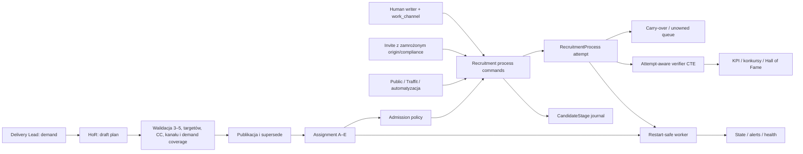

# Handoff do review Claude’a — Priority Lock + Carry-over Duty

Data: 2026-07-28

Status: implementacja lokalna i skupiona weryfikacja zakończone; PR oraz CI
`PENDING`

Branch: `codex/recruitment-priority-lock`

Pierwotny commit bazowy worktree:
`85195914f70936a06d8ef23d488b9c7ce2be3232`

Aktualna baza brancha po rebase:
`7c7c2a5bab28fd29ef64f6bfafdea3aa29d02441`

Migracja: `0200_recruitment_priority_work` po
`0199_candidate_stage_removals`

Granica produkcyjna: **brak merge, deployu, aktywacji, migracji i testów
produkcyjnych**

Ten dokument jest kontraktem niezależnego review. Nie autoryzuje merge,
produkcji, zmiany Coolify, uruchomienia reconciliation ani przełączenia
`off → shadow → enforce`.

## 1. Podsumowanie

Implementacja uzależnia rozpoczynanie nowej ludzkiej pracy kandydat–request od
opublikowanego planu Head of Recruitment i jednocześnie zachowuje każdy otwarty
proces jako obowiązkowy carry-over.

Dostarczono lokalnie:

- demandy Delivery Lead dla własnych opublikowanych requestów;
- wersjonowany draft/publish, atomowe supersede i review po trzech dniach
  roboczych w Warszawie;
- compare-and-swap lineage, który odrzuca drugą publikację sibling draftu
  opartego o nieaktualny current plan;
- 3–5 assignmentów A–E z targetami, kanałami, Competence Category i
  uzasadnieniami;
- kanoniczny `RecruitmentProcess` z attemptem, pochodzeniem, ownerem,
  pierwszym verifierem i zamrożoną eligibility;
- admission policy `off`, `shadow`, `enforce` oraz per-user rollout;
- carry-over, blockery, jednorazowe wyjątki, handoff, audyt, worker,
  reconciliation i health;
- jeden command service dla pełnego lifecycle `CandidateStage`, łącznie ze
  stawkami, SLA, pending accept/reject i delete;
- niezmienny terminalny replay Traffit: identyczny event jest no-op, a nowszy
  otwiera attempt `N+1`;
- attempt-aware progress/rank unlock oraz kwalifikację miesięczną przed
  `LIMIT 10`;
- zamrożenie decyzji planu na invite linku i użycie jej przy inbound routing;
- attempt-aware KPI/konkursy/Hall of Fame;
- dashboardy HoR, DL i rekrutera/sourcera/TAC oraz kontekst joba;
- addytywną migrację, startup safety-net i skupione testy.

Domyślna wartość `RECRUITMENT_PRIORITY_MODE` to `off`. W tym trybie Priority
Lock nie odrzuca nowej ludzkiej pracy. Nadal obowiązują niezależne inwarianty,
np. signing/B2B nie może utworzyć brakującego procesu. Korekta definicji KPI
jest świadomie niezależna od flagi.

## 2. Mapa architektury



Zasada rozdzielenia:

- job membership odpowiada na pytanie „czy użytkownik ma dostęp do pipeline’u
  tego requestu?”;
- admission policy odpowiada niezależnie „czy może rozpocząć nową parę?”;
- owner, collaborator, self-claim, admin ani CC nie zastępują assignmentu.

Przy aktywnym Priority Work job membership może pochodzić również z aktywnego
opublikowanego assignmentu albo ownership otwartego carry-over. Nie stanowi to
obejścia admission policy.

Listy jobów stosują ten sam assignment/carry scope wyłącznie wtedy, gdy
efektywny tryb użytkownika nie jest `off`. Globalny mode jest sufitem, a
per-user mode może go osłabić; globalne albo per-user `off` zachowuje legacy
list scope.

## 3. Model domenowy i inwarianty

### 3.1. Encje Priority Work

| Encja | Cel i inwariant |
|---|---|
| `RecruitmentPriorityPlan` | wersja draft/published/superseded, jeden aktualnie opublikowany plan, `row_version`, review date |
| `RecruitmentPriorityPlanMember` | aktywny/wstrzymany użytkownik operacyjny, pojemność; wstrzymanie wymaga powodu |
| `RecruitmentPriorityDemand` | demand DL, minimum 3 rekomendacje, termin/kanał, `row_version`; jeden aktywny demand per job |
| `RecruitmentPriorityAssignment` | slot A–E, job, demand, kanał, targety, snapshot CC; unikalny rank i job per member |
| `RecruitmentPriorityBlocker` | pending/accepted/rejected/resolved; jeden aktywny pending/accepted blocker per assignment |
| `RecruitmentPriorityException` | jednorazowe i maksymalnie siedmiodniowe pozwolenie HoR; atomowa konsumpcja; KPI-ineligible |
| `RecruitmentPriorityUserMode` | tryb użytkownika, który może tylko osłabić tryb globalny |
| `RecruitmentPriorityState` | singleton current plan, heartbeat, reconciliation, metrics i last error |
| `RecruitmentPriorityAlert` | restart-safe alert z unikalnym trwałym `dedupe_key` |
| `RecruitmentPriorityAuditEvent` | append-only audit operacji uprzywilejowanych |

### 3.2. Rozszerzenie `RecruitmentProcess`

Proces przechowuje:

- `origin_assignment_id` i `eligibility_assignment_id`;
- `opened_by_user_id`;
- niezmienny po pierwszej akceptacji `credit_user_id`;
- `origin_kind` i `priority_compliant_at_open`;
- zamrożone `kpi_eligible`, powód i czas decyzji;
- bieżący `owner_user_id`;
- potwierdzenie ownership przez HoR;
- `attempt_no`, poprzedni proces, aktualny semantic state i wskazanie legacy
  stage.

Otwarcie zamkniętej lub voided pary tworzy nowy attempt i ponownie przechodzi
policy. Tylko otwarty process jest kontynuacją.

Dla Traffit replay identycznego terminalnego eventu nie mutuje zamkniętego
attemptu. Dopiero event o nowszej chronologii tworzy attempt `N+1`; historia
terminalnego attemptu pozostaje immutable.

Pierwszy zaakceptowany verifier:

- zostaje `credit_user_id`;
- staje się ownerem, o ile HoR wcześniej nie zrobił jawnego handoffu;
- zamraża eligibility;
- nie może zostać nadpisany przez kolejne `verified`;
- nie zmienia się przy handoffie ani supersede planu.

Otwarty proces z `owner_user_id IS NULL` albo z nieaktywnym ownerem jest
raportowany jako unowned carry-over zarówno w serwisie, jak i workerze.

### 3.3. Demandy i publikacja

Demand:

- tworzy tylko rola `delivery_lead`;
- dotyczy wyłącznie requestu, którego użytkownik jest aktualnym DL;
- wymaga requestu `published`;
- ma minimum 3 rekomendacje;
- jest udostępniony jako list/create/update/status; **brak DELETE**.

Przy publikacji:

- każdy aktywny członek ma 3–5 ciągłych rang od A;
- D/E wymagają powodu;
- suma targetów weryfikacji równa się pojemności;
- pojemność różna od 12 wymaga powodu;
- target weryfikacji i rekomendacji każdego assignmentu jest dodatni;
- request i demand istnieją i są aktywne, request jest `published`;
- podstawowa lub dodatkowa CC musi pasować albo musi istnieć uzasadnienie;
- każde użyte zapotrzebowanie ma pełne pokrycie targetu rekomendacji i kanału.

Publikacja blokuje singleton state i draft. Oprócz `row_version` draftu
sprawdza `_assert_publish_lineage`: `plan.previous_plan_id` musi być równy
aktualnemu `state.current_plan_id`. To jest compare-and-swap token. Dwa sibling
drafty sklonowane z tego samego planu są serializowane, ale tylko pierwszy
wygrywa; drugi otrzymuje `409 PRIORITY_VERSION_CONFLICT` z encją
`plan_state`. Zachowanie ma test sibling draftów.

Kanały:

| Rola operacyjna | Dozwolony assignment |
|---|---|
| sourcer | `database` |
| recruiter | `linkedin` |
| TAC | `database`, `linkedin`, `mixed` |
| role łączone | suma możliwości; TAC dopuszcza wszystkie |

`mixed` jest jawnym kanałem TAC. W runtime assignment `mixed` akceptuje
`database` albo `linkedin`; pozostałe assignmenty wymagają zgodności 1:1 z
`work_channel`.

### 3.4. Rank gate i carry-over

Wszystkie assignmenty mogą początkowo przyjmować nowych kandydatów. Niższy rank
zostaje zamknięty dopiero, gdy:

1. osiągnął własny target zaakceptowanych weryfikacji; oraz
2. istnieje wyższy rank poniżej targetu weryfikacji **lub** rekomendacji; oraz
3. ten wyższy rank nie ma zaakceptowanego, nierozwiązanego blockera.

Gate dotyczy wyłącznie nowej pary. Istniejący otwarty process zawsze może być
obsługiwany, również po supersede planu, wstrzymaniu członka lub osiągnięciu
targetu.

## 4. Admission policy

### 4.1. Tryby

| Sytuacja | `off` | `shadow` | `enforce` | Eligibility |
|---|---|---|---|---|
| istniejący otwarty process | allow | allow | allow | zachowaj decyzję |
| nowa para, aktywny assignment i zgodny kanał | allow | allow | allow | true |
| brak assignmentu / paused / zły kanał | allow | allow + violation | `409 PRIORITY_WORK_LOCKED` | off/shadow true; enforce brak zapisu |
| request zamknięty, brak kontynuacji | legacy allow | allow + `SHADOW_JOB_NOT_OPEN` | `409 ... JOB_NOT_OPEN` | wg trybu |
| lower rank zablokowany przez wyższy | allow | allow + violation | `409 ... HIGHER_RANK_BEHIND` | wg trybu |
| zaakceptowany blocker wyższego ranku | allow | allow | allow | assignment |
| ważny one-use exception | nieużywany | nieużywany | atomowo consume i allow | false |
| otwarty public/invite inbound na request `published` | allow | allow | allow | decyzja przy pierwszej akceptacji |
| Traffit external observation | allow | allow | allow | false, brak invented owner/credit; terminal replay immutable |
| signing/B2B bez procesu | deny | deny | deny | nie dotyczy |
| void przez nie-HoR | legacy behavior | legacy behavior | deny | zachowany audit procesu |

W trybie `enforce` zwykłe usunięcie nie służy porzuceniu carry-over. HoR może
wykonać kanoniczny void; fizyczne usunięcie stage history jest dozwolone
dopiero po stanie `voided`. `off` i `shadow` zachowują dotychczasowy endpoint
korekcyjny, ale nadal najpierw zapisują trwały void procesu.

### 4.2. Zamrożenie invite

`CandidateInviteLink` ma:

- `origin_assignment_id`;
- `priority_compliant_at_create`.

Tworzenie linku:

- jest możliwe tylko dla requestu `published`;
- przechodzi policy w kanale `linkedin`;
- nie konsumuje wyjątku;
- zamraża assignment i wynik compliance na linku.

Nowy kandydat przekazuje oba pola do
`open_process(origin_kind=external_inbound)`. Dla duplikatu e-mail pola trafiają
do `ApplicationSubmission.raw_payload` i są użyte przy późniejszym
rozstrzygnięciu. Supersede planu między utworzeniem linku a aplikacją nie
przelicza decyzji linku.

Jeżeli request został w międzyczasie zamknięty, obowiązuje ogólna reguła
`JOB_NOT_OPEN`: `shadow` zapisze naruszenie, a `enforce` odrzuci nową parę.

Twórca linku nie otrzymuje automatycznie KPI. Przy pierwszej zaakceptowanej
weryfikacji:

- zamrożone compliant assignment daje eligibility temu attemptowi;
- w przeciwnym razie sprawdzany jest assignment verifiera w momencie akceptacji;
- w `off/shadow` zachowana jest kompatybilność KPI;
- w `enforce` brak assignmentu daje `kpi_eligible=false`.

## 5. Kanoniczny command service

Plik:
`backend/app/services/recruitment_process_commands.py`.

Publiczne operacje:

- `open_process`;
- `transition_process`;
- `update_latest_client_rate`;
- `update_latest_expected_rate`;
- `record_accepted_verification`;
- `accept_pending_verification`;
- `reject_pending_verification`;
- `void_process`;
- `delete_voided_stage_history`;
- `claim_stage_sla_alert`;
- `release_stage_sla_alert`;
- `handoff_process`;
- `sync_external_observed_process`;
- `sync_external_observed_processes`.

Command:

- blokuje `Candidate`, następnie `Job`, a dopiero potem pobiera świeży snapshot
  procesu/stage; ta sama kolejność obowiązuje external sync single i batch;
- batch sortuje pary deterministycznie przed lockami, co usuwa race podwójnego
  wyliczenia/utworzenia attemptu `N+1`;
- naprawia legacy gap przed admission;
- odróżnia idempotentne ponowienie `open_process` od próby reaktywacji
  zamkniętego attemptu;
- zamraża decision/provenance na procesie;
- synchronizuje pointer, status, attempt i semantic state;
- robi `flush`, ale nie `commit`.

Seedery przekazują jawny `work_channel`. Pole `source_authority` opisuje
pochodzenie danych, lecz nie pozwala pominąć admission policy. Ten sam warunek
obowiązuje live writery i seed flow.

Istniejący caller pozostaje właścicielem całej transakcji, własnych walidacji,
activity, CV snapshot, notyfikacji i innych side effectów. Review nie powinno
zakładać, że zostały przeniesione do commandu.

### Custom `StageRevision`

Live command i backfill używają tego samego bridge:

1. wyszukują opublikowany `StageRevision` po `source_stage_def_id`;
2. zapisują `workflow_revision_id`, `stage_revision_id`, `semantic_key` i
   terminality;
3. dla definicji bez opublikowanej mapy używają jawnego fallbacku legacy albo
   `unmapped`;
4. custom stage nie może cicho odziedziczyć lustrzanego enum `new`.

To mapowanie steruje m.in. open/closed procesu i pilnością carry-over.

## 6. Mapa writerów

| Przepływ | Plik | Command |
|---|---|---|
| move/revert/bulk move | `backend/app/api/pipeline.py` | `transition_process` |
| pending verification accept/reject | `pipeline.py` | `accept_pending_verification` / `reject_pending_verification` |
| assign i LinkedIn import | `backend/app/api/candidates.py` | `open_process` |
| expected/client rate | `candidates.py` | `update_latest_expected_rate` / `update_latest_client_rate` |
| remove from recruitment | `candidates.py` | `void_process` + `delete_voided_stage_history` |
| application submission resolution | `backend/app/api/application_submissions.py` | `open_process(external_inbound)` |
| public invite application | `backend/app/api/public_share.py` | `open_process(external_inbound)` z frozen fields |
| shortlist | `backend/app/api/job_shortlist.py` | `open_process` |
| manager historical add | `backend/app/api/jobs.py` | `open_process`; manager nie omija policy |
| bulk proposals | `backend/app/api/proposals_bulk.py` | `open_process` |
| recommendation assignment | `backend/app/api/recommendations.py` | `open_process` |
| signing | `backend/app/services/signing/pipeline_hook.py` | `transition_process(require_existing=True)` |
| B2B automation | `backend/app/services/b2b_contract_automation.py` | `transition_process(require_existing=True)` |
| SLA Slack | `backend/app/tasks/slack_sla_alerts.py` | claim/release SLA |
| seedery | `backend/seed.py`, `backend/seed_v6_pipeline.py` | `transition_process` z jawnym `work_channel`; authority nie omija policy |
| Traffit insert | `backend/app/services/traffit/importer.py` | jawny raw adapter + `sync_external_observed_processes` |
| Traffit rejection metadata | `backend/app/services/traffit/rejection_backfill.py` | jedyny dozwolony raw update metadanych |

### Writer fence

`backend/tests/test_priority_work_writer_architecture.py` sprawdza:

- konstruktor i SQLAlchemy insert `CandidateStage`;
- raw insert;
- SQLAlchemy update/delete;
- bezpośrednie przypisania krytycznych pól:
  `stage`, `stage_def_id`, verification approval/rejection, stawki klienta i
  kandydata, budget snapshot oraz `sla_alerted_at`;
- raw update;
- brak delete stage/process w seederze;
- jawny `work_channel` przy ludzkim ingressie.

Dopuszczone wyjątki są dwa i mają wąski zakres: insert Traffit zsynchronizowany
z procesem oraz idempotentny update metadanych odrzucenia Traffit.

Podczas review wykonać także:

```bash
rg -n \
  "CandidateStage\\(|insert\\s*\\(\\s*CandidateStage|insert\\s+into\\s+candidate_stages|update\\s+candidate_stages|delete\\s+from\\s+candidate_stages" \
  backend/app backend/seed.py backend/seed_v6_pipeline.py -i
```

## 7. API

Wszystkie trasy mają prefix `/api/priority-work`.

| Metoda i trasa | Rola | Kontrakt |
|---|---|---|
| `GET /current` | `OperationalUser` | effective mode i aktualny plan |
| `GET /mine` | `OperationalUser` | własne assignmenty i carry-over |
| `GET /team` | **tylko HoR** | Team Allocation Board, demandy, coverage, unowned, overdue |
| `GET /demands` | DL własne / HoR wszystkie | lista demandów |
| `POST /demands` | **tylko DL** | demand dla własnego opublikowanego requestu |
| `PATCH /demands/{id}` | aktualny DL requestu / HoR | update pól lub statusu z `expected_version` |
| `POST /plans/draft` | **tylko HoR** | nowy albo sklonowany draft |
| `PUT /plans/{id}` | **tylko HoR** | zastąpienie członków draftu z `expected_version` |
| `POST /plans/{id}/publish` | **tylko HoR** | walidacja, `row_version` i lineage CAS, atomowa publikacja |
| `GET /jobs/{job_id}` | `OperationalUser` | kontekst assignment/blocker/carry-over |
| `POST /assignments/{id}/blockers` | assignee / HoR | zgłoszenie blockera |
| `PATCH /blockers/{id}` | HoR decyduje; assignee/HoR rozwiązuje | lifecycle blockera |
| `POST /processes/{id}/handoff` | **tylko HoR** | nowy aktywny owner, niezmienny credit |
| `GET /exceptions` | **tylko HoR** | lista wyjątków |
| `POST /exceptions` | **tylko HoR** | utworzenie one-use exception |
| `POST /exceptions/{id}/revoke` | **tylko HoR** | odwołanie niewykorzystanego wyjątku |
| `PUT /users/{id}/mode` | **tylko HoR** | per-user rollout; `enforce` wymaga aktywnego planu 3–5 |
| `GET /status` | **tylko HoR** | persisted readiness i worker metrics |
| `GET /reconciliation/status` | **tylko HoR** | status i shadow comparison |
| `POST /reconciliation/run` | **tylko HoR** | batch `1..5000` par |
| `GET /alerts` | **tylko HoR** | durable alert feed |
| `GET /audit` | **tylko HoR** | newest append-only events |

Nie istnieje `DELETE /demands/{id}`. Zakończenie demandu odbywa się przez
status w `PATCH`.

`GET /api/jobs` dodatkowo przyjmuje
`priority_work=assigned|carry_over|either` niezależnie od legacy `mine`,
ownera i collaboratorów. Rekord zawiera `priority_assignment` i
`priority_carry_over_count`.

Assignment/carry rozszerza również scope tej listy, ale dopiero przy
efektywnym mode różnym od `off`. Wyliczenie respektuje globalny sufit i
per-user osłabienie, więc użytkownik ustawiony na `off` nie otrzymuje szerszej
widoczności przez Priority Work.

### 7.1. Uprawnienia

Uprzywilejowane trasy używają:

```python
HeadOfRecruitmentOnly = Annotated[
    User,
    Depends(require_roles(UserRole.head_of_recruitment)),
]
```

Plain `admin` nie posiada żadnych uprawnień zarządczych Priority Work. Może
wejść wyłącznie na te ogólne odczyty, które dopuszczają `OperationalUser`.
Admin działający także jako HoR albo DL korzysta z jawnie posiadanej roli
biznesowej, nie z roli admin.

| Aktor | Może | Nie może |
|---|---|---|
| Head of Recruitment | team, plan, publikacja, decyzja blocker, handoff, exception, mode, status, reconciliation, alert, audit | ominąć admission bez jawnego wyjątku |
| Admin bez innych ról | ogólne odczyty `OperationalUser` | zarządzanie zespołem, publikacja, decyzja o blockerze, handoff, wyjątek, tryb, reconciliation |
| Delivery Lead | list/create/update/status własnych demandów | opublikować plan, handoff, exception, cudzy demand |
| Recruiter | własny plan/carry; LinkedIn na assignmencie; kontynuacja | database bez innej roli; owner/collaborator bypass |
| Sourcer | własny plan/carry; database na assignmencie; kontynuacja | LinkedIn/mixed bez innej roli |
| TAC | własny plan/carry; jawny database/LinkedIn/mixed; kontynuacja | ominąć assignment przez rolę TAC |
| Public/invite | złożyć aplikację do otwartego requestu | wybrać ownera lub otrzymać credit jako twórca linku |
| Traffit | zapisać external observation przez adapter | utworzyć eligibility/credit |
| Signing/B2B | przejść istniejący process | otworzyć nową parę |
| read-only `user` | brak danych operacyjnych Priority Work | wszystkie mutacje |

Sprawdzanie ról korzysta z `has_role`/`has_any_role`, czyli uwzględnia role
główną i dodatkowe.

### 7.2. Konflikty

Admission denial zwraca:

```json
{
  "detail": {
    "code": "PRIORITY_WORK_LOCKED",
    "action": "open_process",
    "candidate_id": 123,
    "job_id": 456,
    "active_plan_id": 7,
    "reason": "JOB_NOT_ASSIGNED",
    "next_action": "CONTACT_HEAD_OF_RECRUITMENT",
    "message": "..."
  }
}
```

UI opiera się na `code` i `reason`, nie na polskim tekście.
`PRIORITY_VERSION_CONFLICT` jest osobnym błędem optimistic locking i nie należy
go mylić z blokadą admission. Dla stale sibling draftu wskazuje encję
`plan_state`.

## 8. KPI, konkursy i Hall of Fame

### 8.1. Attempt-aware `VERIFIER_ANCHORED_CTE`

CTE:

1. buduje `process_windows` po `(candidate_id, job_id, attempt_no, id)`;
2. używa także voided attempt jako granicy czasowej, aby jego zdarzenia nie
   przeciekły do kolejnego attemptu;
3. dla sklasyfikowanego, nie-voided attemptu wybiera pierwszy milestone w jego
   oknie;
4. `verified` uznaje tylko przy `verification_status=active`;
5. dla zaakceptowanego pending używa `approved_at`, nie pierwotnego `moved_at`;
6. wymaga verified anchor w tym samym attemptcie;
7. zalicza wyłącznie milestone’y nie wcześniejsze niż anchor;
8. przypisuje je do zamrożonego `credit_user_id`;
9. wymaga `kpi_eligible=true`;
10. pozwala na fallback tylko legacy sprzed pierwszego sklasyfikowanego
    procesu i respektuje jawne `false`.

W konsekwencji nowy attempt nie dziedziczy verifiera ani milestone’ów
poprzedniego.

`assignment_progress` i rank gate czytają tę samą attempt-aware semantykę.
`cv_sent` liczy się jako progress wyłącznie po wcześniejszym zaakceptowanym
`verified` w tym samym `RecruitmentProcess` attempt. Zdarzenie z wcześniejszego
attemptu nie może domknąć targetu ani odblokować niższej rangi.

### 8.2. Definicje

| Metryka | Po zmianie |
|---|---|
| verification | pierwszy zaakceptowany `verified` w attemptcie |
| recommendation | `cv_sent` |
| client interview | `client_interview` |
| placement | `hired` |
| credit | pierwszy zaakceptowany verifier |
| handoff | zmienia ownera, nie credit |
| exception / Traffit | `kpi_eligible=false` |

`VERIFIER_ANCHORED_CTE` jest używany przez KPI per-user/team, raporty,
konkursy rekrutacyjne oraz **Hall of Fame**. Hall of Fame liczy `hired` z tego
CTE, nie surowego stage movera.

### 8.3. KPI 4/MD, precision i freeze

Miesięczny ranking rekomendacji używa `cv_sent`. Warunek nagrody:

- `4 × liczba minionych dni poniedziałek–piątek` zaakceptowanych
  weryfikacji;
- `cv_sent / verified >= 75%`.

Ranking może pokazywać niezakwalifikowane osoby, ale
`qualified_for_award` usuwa je przed zapisaniem zwycięzców.

Finalny miesięczny ranking filtruje warunki 4/MD oraz 75% w SQL przed
sortowaniem i `LIMIT 10`. Dzięki temu zakwalifikowana osoba z pozycji 11+
wchodzi do top 10, gdy wyższe surowe wyniki zostaną zdyskwalifikowane.

Punkty kwartalne pozostają:

- rekomendacja: 5;
- client interview: 15;
- placement: 150.

Istniejące nagrody i trzy miejsca podium nie zmieniają się.
`freeze_competition(type, period)` bierze transakcyjny advisory lock i najpierw
odczytuje istniejące `CompetitionWinner`. Jeżeli snapshot już istnieje, zwraca
go bez wywołania live recompute i bez nadpisania. Zamrożony okres jest
write-once. Historyczne podium pozostaje niezmienne.

Korekta KPI zacznie działać po wdrożeniu kodu również przy
`RECRUITMENT_PRIORITY_MODE=off`. Wymaga to jawnej zgody biznesowej przed merge.

## 9. Worker, alerty i health

Worker:

- ma minimalny interwał 60 sekund, domyślnie 300;
- zapisuje heartbeat, metrics, reconciliation timestamps i last error;
- wygasza nieużyte wyjątki;
- upsertuje alert po unikalnym `dedupe_key`, zwiększając
  `occurrence_count`;
- rozwiązuje alerty nieobecne w kolejnym sweepie;
- nie używa process-local setu do deduplikacji, więc restart nie resetuje
  stanu.

Metryki:

- aktualny plan i wersja;
- overdue po trzech dniach roboczych;
- aktywni użytkownicy bez coverage;
- unowned carry-over, w tym z nieaktywnym ownerem;
- procesy i procent sklasyfikowanej eligibility;
- shadow violations;
- aktywne alerty.

W globalnym `off` health oznacza moduł jako `disabled`. W `shadow/enforce`
brak, stale albo error heartbeat degraduje subcheck. Deep health sprawdza
wszystkie nowe tabele, `recruitment_processes` oraz wymagane kolumny.

## 10. Migracja i safety-net

### 10.1. Bieżący kontrakt

`0200_recruitment_priority_work`:

- `down_revision = "0199_candidate_stage_removals"`;
- tworzy 11 enumów;
- tworzy 10 tabel Priority Work;
- dodaje 11 nullable kolumn do `recruitment_processes`;
- dodaje 2 nullable kolumny do `candidate_invite_links`;
- dodaje FK, indeksy i partial unique constraints;
- dodaje osobne indeksy
  `ix_recruitment_processes_origin_assignment_id` oraz
  `ix_recruitment_processes_eligibility_assignment_id`;
- tworzy singleton state `id=1`;
- kończy się introspekcyjną kontrolą exact schema parity:
  - wymaganych kolumn;
  - nazwanych constraintów i ich typów;
  - foreign keys wraz z tabelą docelową i oczekiwanym `ON DELETE`;
  - indeksów wraz z unique/partial, dokładną kolejnością kolumn i
    pełną znormalizowaną semantyką predykatu; porównanie nie opiera się na
    tokenach i rozróżnia `=` od `<>` oraz `IS NULL` od `IS NOT NULL`;
  - checku `expected_recommendations >= 3`;
- nie wykonuje historycznego backfillu.

W aktualnym worktree `alembic -c alembic/alembic.ini heads` zwraca dokładnie:

```text
0200_recruitment_priority_work (head)
```

Jest to dowód bieżącego stanu grafu po lokalnych zmianach, a nie twierdzenie,
że historyczny graf repo zawsze był liniowy albo jedno-headowy.

Hosted CI ma wykonać `upgrade heads` dwukrotnie. Dopiero wynik CI na finalnym
SHA potwierdzi upgrade PostgreSQL, retry-safety i brak konfliktu po aktualizacji
bazy brancha.

### 10.2. Startup safety-net

`backend/entrypoint.sh`:

- tworzy/uzupełnia `priorityoriginkind` przed użyciem w kolumnach;
- addytywnie dodaje nullable process provenance oraz oba invite fields;
- po utworzeniu metadanych finalizuje FK, singleton state oraz indeksy
  `origin_assignment_id` i `eligibility_assignment_id`;
- nie uruchamia historycznego backfillu.

Review musi porównać safety-net z migracją. Nie wolno przyjąć, że
`IF NOT EXISTS` dowodzi zgodności typu, kolumny, constraintu, polityki
`ON DELETE` ani definicji indeksu; właśnie dlatego migracja posiada końcową
introspekcję katalogów.

### 10.3. Reconciliation

`backfill_recruitment_processes`:

- wybiera pary deterministycznie;
- na zwykłym przebiegu odrzuca istniejące procesy przed `LIMIT`;
- działa batchami 500 rekordów transakcyjnych;
- klasyfikuje historię jako `legacy`;
- pozostawia `kpi_eligible=NULL`;
- wyznacza legacy verifiera z pierwszego zaakceptowanego `verified`;
- używa mapowania opublikowanego custom `StageRevision`;
- nie przejmuje ownership procesu o authority innej niż backfill;
- opcjonalnie resyncuje tylko rekordy authority `backfill`.

Endpoint dopuszcza limit `1..5000`. Brak advisory locka dla całego
reconciliation, więc runbook musi wymuszać jednego caller’a naraz albo review
musi dodać lock przed produkcją.

Durable baseline w repo pochodzi z 2026-07-16 i nie jest bieżącym odczytem:

- 176 634 `CandidateStage`;
- 79 581 par kandydat–job;
- 53 818 otwartych par;
- 4 544 niejednoznaczne remisy latest-stage;
- 79 488 latest stage poza template joba, głównie Traffit.

Przed reconciliation trzeba odświeżyć liczby read-only, oszacować czas/WAL,
potwierdzić backup/restore i zacząć od małego batcha.

### 10.4. Rollback schematu

Alembic downgrade usuwa kolumny, tabele i historię audit/ownership. Nie jest
bezpiecznym rollbackiem behawioralnym.

Rollback behawioralny:

1. obniżyć affected users do `shadow/off` albo globalnie do `off`;
2. nie usuwać planów, procesów, eligibility, auditów, alertów ani wyjątków;
3. w razie konieczności wycofać kod przez osobny reviewed PR;
4. KPI trzeba wycofać osobno — zmiana Priority mode nie zmienia definicji KPI.

## 11. Frontend

| Powierzchnia | Zachowanie |
|---|---|
| `TeamAllocationBoard` | HoR draft/publish, A–E, capacity/CC/channel errors, demand coverage, blockery, carry-over, unowned, worker i reconciliation |
| `PriorityRequestsPanel` | DL listuje, tworzy oraz aktualizuje pola/status własnego demandu; widzi target, termin, coverage i blockery |
| `MyPriorityQueue` | plan przed KPI, A–E i osobne pilne `Do dokończenia` |
| `JobPriorityContext` | assignment, blocker i carry-over bez przeciążania legacy `job.priority` |
| `JobsListV2` | niezależny filtr/badge assigned/carry-over |
| add-candidate surfaces | wspólny parser `PRIORITY_WORK_LOCKED` |

UI korzysta z istniejących tokenów po
`frontend/docs/ds/ADDING-BLOCKS.md`. Testy obejmują loading, error, empty,
shadow i overdue w skupionych komponentach; nie należy z tego wyprowadzać
wniosku o pełnym browser E2E.

## 12. Dowody lokalne

Zakres:

- 8 modułów backendowych;
- 110 funkcji testowych;
- 147 przypadków po parametryzacji;
- 9 skupionych plików frontendowych;
- 39 testów frontendowych.

| Kontrola | Wynik |
|---|---|
| skupione testy backend Priority Work | **147 passed** |
| skupione testy frontend | **9 plików / 39 passed** |
| Ruff check i format: app, migracja, testy | **pass** |
| Python compile app + migracja | **pass** |
| `bash -n backend/entrypoint.sh` | **pass** |
| `alembic ... heads` | **pass**, bieżący worktree: jeden head `0200` |
| frontend typecheck | **pass** |
| frontend lint | **pass** |
| frontend token guard | **pass** |
| rebase / range-diff / audyt sześciu zmian upstream | **pass**, baza `7c7c2a5b` |
| lokalny Docker | nie uruchamiano |

Nie należy opisywać tego jako pełnego test suite ani zielonego CI.

Hosted evidence:

- URL draft PR: `PENDING`;
- finalny branch SHA: `PENDING`;
- stan required checks: `PENDING`;
- PostgreSQL `upgrade heads` i repeated upgrade: `PENDING`;
- full backend pytest: `PENDING`;
- pełny frontend Vitest/coverage/build: `PENDING`;
- secret/security scan: `PENDING`.

## 13. Nierozstrzygnięte ryzyka

1. **Live inventory jest nieznane.** Liczby z 2026-07-16 są wyłącznie
   planistyczne.
2. **Zmiana KPI działa także w `off`.** Wymaga jawnej zgody biznesowej przed
   merge.
3. **Dni robocze oznaczają poniedziałek–piątek.** Święta ustawowe nie są
   odejmowane.
4. **Reconciliation nie ma globalnego advisory locka.** Operacyjnie musi być
   single-run.
5. **Traffit ma jawne raw adaptery.** Trzeba szczególnie sprawdzić savepoint,
   commit boundary i preservation of authority.
6. **Writer fence nie wykrywa każdego dynamicznego SQL.** Potrzebny jest także
   ręczny search.
7. **Link do zamkniętego requestu zostanie zablokowany w `enforce`.** To wynika
   z reguły `JOB_NOT_OPEN`; stakeholderzy muszą zaakceptować zachowanie
   publicznego formularza i komunikat dla aplikanta.
8. **Brak produkcyjnego browser E2E.** To świadoma granica zadania.
9. **Overdue nie wygasza planu.** Plan działa do kolejnej publikacji.
10. **Demand update ma row-version i audit, ale nie osobny immutable row per
    edit.** Jeżeli potrzebny jest pełny ledger before/after, trzeba go dodać.

Każdy problem z writer closure, frozen eligibility, attempt isolation, RBAC,
transakcyjnością, migracją lub carry-over jest automatycznym **NO-GO**.

## 14. Kolejność review Claude’a

1. Potwierdzić, że PR nadal bazuje na `7c7c2a5b` lub nowszym `main`, a
   ewentualne kolejne zmiany upstream nie naruszają zintegrowanych deep-linków,
   wyszukiwania, entrypointu ani seedów.
2. Zweryfikować `_assert_publish_lineage` oraz test sibling draftów: drugi
   publisher musi dostać `PRIORITY_VERSION_CONFLICT/plan_state`.
3. Porównać model, migrację `0200`, deep health i `entrypoint.sh`; sprawdzić
   exact parity constraints, FK `ON DELETE`, kolumn i pełnej semantyki
   predykatów indeksów (w tym przeciwne operatory) oraz oba indeksy assignment
   provenance; uruchomić hosted `upgrade heads` dwukrotnie.
4. Przejrzeć truth table policy: off/shadow/enforce, closed request, channel,
   blocker, rank gate, exception i carry-over.
5. Przejrzeć lock ordering i granice transakcji commandu, szczególnie bulk,
   pending verification, delete i Traffit.
6. Powtórzyć ręczny writer search z sekcji 6.
7. Zweryfikować invite frozen origin/compliance dla nowego kandydata i
   duplicate `ApplicationSubmission`.
8. Zweryfikować custom `StageRevision` w live command i backfill.
9. Zweryfikować CTE na wielu attemptach, voided attempt, pending po supersede,
   handoff, legacy, exception i inbound.
10. Potwierdzić użycie CTE przez Hall of Fame i write-once freeze.
11. Przejrzeć każdą dependency API; plain admin ma otrzymać 403 na wszystkie
    uprzywilejowane trasy.
12. Przejrzeć payloady frontend/backend i wszystkie powierzchnie wspólnego
    błędu.
13. Wymagać zielonych required checks na finalnym SHA przed GO.

## 15. Runbook `off → shadow → enforce`

### Faza A — dormant

1. Merge tylko po review i GO.
2. Deploy kodu/migracji z globalnym trybem jawnie `off`.
3. Potwierdzić deployed full SHA, `/api/health`, `/api/health/deep` i aktualny
   Alembic head.
4. Potwierdzić brak `PRIORITY_WORK_LOCKED` z powodu Priority Lock w zwykłych
   ludzkich flow.
5. Zweryfikować delta KPI przed zamrożeniem nowego konkursu.
6. Odświeżyć inventory i wykonać mały reconciliation batch przez jednego
   operatora.

### Faza B — shadow

Semantyka rollout:

- globalny mode jest sufitem;
- per-user mode może tylko zmniejszyć restrykcyjność;
- brak row w `recruitment_priority_user_modes` oznacza dziedziczenie globalnego
  mode;
- globalne `off` wymusza `off` wszystkim.

Przed zmianą globalnego mode trzeba ustawić jawny per-user mode dla **każdego**
aktywnego użytkownika operacyjnego. Nie wolno liczyć na brak row:

1. opublikować pełny plan;
2. ustawić non-pilot users na `off`;
3. ustawić cohort shadow na `shadow`;
4. dopiero potem ustawić globalny mode na `shadow`;
5. obserwować pełne trzy dni robocze.

Warunki wyjścia:

- świeży heartbeat;
- zrozumiane shadow delta;
- brak niewyjaśnionego unowned carry-over;
- prawidłowe blockery i rank gate;
- zaakceptowane query latency;
- spójny process/stage reconciliation.

### Faza C — enforce pilot

1. Najpierw zapisać jawne `off` albo `shadow` wszystkim non-pilot users.
2. Potwierdzić aktywny, pełny plan 3–5 dla każdego pilota.
3. Ustawić pilot users na `enforce`.
4. Dopiero potem ustawić globalny mode na `enforce`.
5. Przetestować assignment, kanał, closed request, off-plan lock, rank gate,
   blocker, carry-over, pending po supersede, wyjątek, handoff i void.
6. Rozszerzać cohort dopiero po pełnym okresie review bez utraty danych,
   bypassu, attribution drift ani stale worker state.

Endpoint per-user blokuje zapis `enforce` bez poprawnego planu, ale użytkownik
bez row dziedziczy globalny mode. Dlatego pełna jawna macierz per-user przed
globalnym przełączeniem jest obowiązkowym preflightem.

### Rollback

- affected user: obniżyć do `shadow` albo `off`;
- szerszy incydent: globalnie `off`;
- zachować dane i audyt;
- nie używać Alembic downgrade;
- osobno wycofać KPI, jeżeli problem dotyczy metryk.

## 16. Scenariusze Chrome po autoryzowanym deployu

Uruchomić w zalogowanym profilu użytkownika i zachować screenshoty/dowody:

1. DL tworzy demand minimum 3 dla własnego opublikowanego requestu.
2. Inny DL i plain admin otrzymują 403; nie ma akcji DELETE demandu.
3. HoR widzi błąd dla 2 i 6 assignmentów, braku targetu, złego kanału,
   niepokrytego demandu, braku CC reason i braku D/E reason.
4. HoR publikuje poprawny plan; stale update tego samego draftu dostaje version
   conflict.
5. Dwie równoległe publikacje różnych draftów opartych o ten sam current plan:
   dokładnie jedna ma wygrać, druga ma dostać konflikt.
6. Recruiter otwiera kandydata w kanale LinkedIn na swoim assignmencie i jest
   blokowany na obcym requestcie.
7. Sourcer działa przez database, a LinkedIn dostaje channel lock.
8. TAC działa zgodnie z jawnym database/LinkedIn/mixed.
9. Owner, collaborator, self-claim i admin nie omijają admission policy.
10. Aktywny assignment i carry-over dają job membership, ale nie tworzą
    dodatkowego prawa do nowej pary poza policy.
11. Request zamknięty blokuje nową parę; istniejący process nadal przechodzi.
12. Lower rank po targetcie jest blokowany, dopóki wyższy zalega; zaakceptowany
    blocker zwalnia gate, resolved przywraca normalną ocenę.
13. Po supersede istniejące osoby są na górze `Do dokończenia`.
14. Pending verification zaakceptowany po supersede zachowuje origin,
    eligibility i pierwszego verifiera.
15. HoR handoff zmienia ownera, ale `credit_user_id` pozostaje identyczny;
    plain admin otrzymuje 403.
16. Nieaktywny owner trafia do unowned queue i alertu.
17. One-use exception działa raz, wygasa/revoke poprawnie i nie daje KPI.
18. Invite link zamraża assignment/compliance; aplikacja po supersede zachowuje
    ten origin, także po duplicate-review.
19. Link po zamknięciu requestu pokazuje uzgodniony komunikat
    `JOB_NOT_OPEN` w enforce.
20. Traffit zachowuje observation bez invented credit.
21. Signing/B2B przechodzi tylko przy istniejącym processie.
22. Job list badges/filters zgadzają się z job detail i `/mine`.
23. HoR status pokazuje heartbeat, overdue, brak coverage, unowned,
    eligibility i shadow delta.
24. KPI i live competitions zgadzają się dla sekwencji
    `verified → cv_sent → client_interview → hired`.
25. Dwa attempty tej samej pary nie dziedziczą milestone’ów.
26. Hall of Fame wskazuje first verifier, a nie stage movera.
27. Zamrożony historyczny podium snapshot pozostaje identyczny po ponownym
    freeze/read.

## 17. GO/NO-GO

- [ ] Branch jest oparty o aktualny `main` bez obcych zmian.
- [ ] CAS lineage i test sibling draftów przechodzą w hosted CI.
- [ ] Draft PR istnieje i wskazuje finalny SHA.
- [ ] Wszystkie required CI checks są zielone na tym SHA.
- [ ] `upgrade heads` i repeated upgrade przechodzą na PostgreSQL.
- [ ] Migracja i startup safety-net są równoważne oraz retry-safe.
- [ ] Backup/restore readiness jest zaakceptowane przed reconciliation.
- [ ] Writer fence i ręczny search nie znajdują bypassu.
- [ ] Traffit adapter zachowuje atomowość i authority.
- [ ] Plain admin nie ma uprzywilejowanych praw Priority Work.
- [ ] Demand minimum 3, full target/channel coverage i published-only działają.
- [ ] Closed request blokuje nową parę, ale carry-over nadal działa.
- [ ] Wszystkie ludzkie flow przekazują poprawny `work_channel`.
- [ ] Custom `StageRevision` jest poprawnie mapowany.
- [ ] Invite zamraża origin/compliance w obu ścieżkach inbound.
- [ ] Attempt-aware KPI nie przenosi creditu między attemptami.
- [ ] Hall of Fame używa wspólnego CTE.
- [ ] Competition freeze jest write-once.
- [ ] Handoff zmienia ownera bez zmiany credit/eligibility.
- [ ] Nieaktywny owner jest unowned.
- [ ] Off mode nie tworzy blokad Priority Lock.
- [ ] Zmiana KPI w off ma zgodę stakeholderów.
- [ ] Shadow delta, inventory i reconciliation są zrozumiane.
- [ ] Worker, alerty i health są świeże.
- [ ] Scenariusze Chrome przechodzą po autoryzowanym deployu.

Do zamknięcia wszystkich odpowiednich punktów werdykt brzmi:
**NO-GO dla produkcyjnego enforce**.
