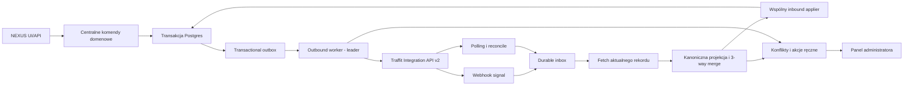

# NEXUS ↔ Traffit — rekomendacja i kompletny plan implementacyjny dla Claude

> Data dokumentu: 2026-07-16  
> Status: handoff implementacyjny; dokument nie oznacza zgody na aktywację synchronizacji produkcyjnej  
> Cel biznesowy: bezpieczna, stopniowa migracja zespołu z Traffita do NEXUS przy równoległej pracy obu grup i widoczności zmian po drugiej stronie w maksymalnie 15 minut  
> Odbiorca wykonawczy: Claude pracujący w repozytorium `/Users/arturtwardowski/NEXUS`

## 1. Decyzja rekomendowana

Zbudować pełną integrację dwukierunkową dla uzgodnionego rdzenia ATS, ale wdrażać ją jako serię małych PR-ów z domyślnie wyłączonymi zapisami do Traffita.

Rekomendowany model odpowiedzialności:

- Traffit pozostaje źródłem prawdy dla rekrutacji, workflowów, definicji etapów i słowników procesowych.
- NEXUS importuje te dane i traktuje powiązane rekrutacje jako zarządzane w Traffit.
- Oba systemy mogą zmieniać dane kandydata, przypisania do rekrutacji, bieżący etap, odrzucenia, notatki i pliki.
- Zmiany różnych pól są scalane automatycznie.
- Zmiany tego samego pola albo rozbieżne przejścia etapów nigdy nie nadpisują się automatycznie; tworzą sprawę dla administratora.
- Notatki są append-only, pliki wersjonowane, a usunięcia i anonimizacje wymagają ręcznej decyzji.
- Docelowe SLO widoczności to 15 minut, ale uruchomienie konkretnej domeny jest blokowane, jeśli API Traffita nie pozwala udowodnić tego SLO.

Nie rekomenduję:

- jednorazowego przełączenia całego zespołu;
- traktowania timestampu „ostatni zapis wygrywa” jako mechanizmu rozwiązywania konfliktów;
- kopiowania całego obecnego WIP-u do `main`;
- aktywowania outboundu przed sandboxem, 72-godzinnym shadow sync i uzgodnieniem aktywnego zakresu;
- automatycznych hard-delete'ów;
- równoległego działania legacy daily sync i nowego appliera.

## 2. Instrukcja startowa dla Claude

Claude ma rozpocząć od aktualnego `AGENTS.md` i czystej gałęzi utworzonej z najnowszego `origin/main`.

Obowiązkowe zasady:

1. Nie używać lokalnego Dockera ani lokalnych testów kontenerowych.
2. Nie pracować bezpośrednio na historycznym branchu WIP.
3. Nie resetować, nie stashować i nie usuwać cudzych zmian ani lokalnych dokumentów.
4. Nie cherry-pickować całego commita WIP; można ręcznie przenieść wyłącznie sprawdzone fragmenty.
5. Każda faza ma osobny, mały PR i przechodzi hosted CI przed scaleniem.
6. Wszystkie nowe flagi pozostają wyłączone po wdrożeniu kodu.
7. Nie wykonywać zapisów do produkcyjnego Traffita w ramach developmentu lub smoke testu.
8. Do GitHub write operations stosować repozytoryjny workflow i `codex-gh`, jeśli obowiązujące instrukcje środowiska tego wymagają.

Bezpieczny start:

```bash
git fetch origin
git log --oneline --decorate -10 origin/main
git status --short

# Preferowany jest osobny worktree, aby nie dotykać istniejącego WIP-u.
git worktree add ../NEXUS-traffit-integration \
  -b feat/traffit-bidirectional-integration origin/main
```

Przed wykonaniem tych komend Claude musi potwierdzić aktualne nazwy branchy i lokalizację worktree. Nie wolno nadpisywać istniejącej ścieżki.

## 3. Zweryfikowany stan wyjściowy

Stan obserwowany 2026-07-16:

| Element | Stan |
|---|---|
| Produkcja `/api/health` | `healthy` |
| Wersja produkcyjna | `a301ee433e7e298d16529352590dabea654f3db5` |
| `checks.database` | `healthy` |
| `checks.traffit` | `degraded` |
| `origin/main` przy końcowym odświeżeniu dokumentu | `99d9d70` — branch przesuwał się podczas audytu, więc SHA trzeba ponownie pobrać |
| Lokalny branch z próbą implementacji | `wip/uncommitted-main-snapshot-2026-07-15` |
| Lokalny commit WIP | `297c151` |
| Merge-base WIP z aktualnym `origin/main` | historyczny `6c229f3` |
| Dystans WIP przy końcowym odświeżeniu | 3 commity lokalne, 60 commitów za `origin/main` |

Te wartości są tylko punktem odniesienia. Claude musi odświeżyć `origin/main`, produkcyjny health i deployed SHA na początku swojej pracy oraz przed każdym wdrożeniem.

### 3.1 Co działa dziś na `origin/main`

Obecny produkcyjny model to zasadniczo synchronizacja jednokierunkowa Traffit → NEXUS:

- legacy importer i zaplanowany `traffit_daily_sync_loop`;
- dzienna delta z 48-godzinnym overlapem;
- tygodniowy full reconcile;
- import kandydatów, rekrutacji, workflowów, etapów, aktywności/notatek, źródeł i plików;
- trwały watermark `traffit_sync_state`;
- idempotentne upserty oparte o `external_source='traffit'` i `external_id`;
- admin trigger/status dla legacy sync;
- health status Traffita.

Kluczowe pliki istniejącego rozwiązania:

```text
backend/app/services/traffit/client.py
backend/app/services/traffit/importer.py
backend/app/services/traffit/mappers.py
backend/app/tasks/traffit_sync.py
backend/app/api/admin_traffit.py
backend/app/models/traffit_sync_state.py
backend/tests/test_traffit_client.py
backend/tests/test_traffit_mappers.py
backend/tests/test_traffit_sync.py
docs/traffit-discovery.md
docs/traffit-daily-sync-completion-report.md
docs/traffit-migration-completion-report.md
```

Nie ma zatwierdzonego, wdrożonego i aktywnego mechanizmu, który gwarantuje NEXUS → Traffit dla całego uzgodnionego zakresu.

### 3.2 Najpierw naprawić stan `traffit=degraded`

Nowa integracja nie może być aktywowana, dopóki obecny check Traffita nie jest stabilnie `healthy` przez minimum 48 godzin.

Claude powinien ustalić:

- czy ostatni legacy run zakończył się błędem;
- która faza ma błędy lub stary watermark;
- czy problemem są poświadczenia, throttling, błędna odpowiedź tenanta, brak świeżego runu czy deadlock schedulera;
- czy `TRAFFIT_SYNC_ENABLED` jest świadomie włączone;
- czy produkcja i `origin/main` mają zgodny kontrakt health.

Naprawa tego problemu powinna być osobnym PR-em i osobnym kryterium wejścia, nie ukrytą częścią dużej integracji.

## 4. Ocena poprzedniej próby i zasady odzyskiwania kodu

Commit `297c151` jest ratunkowym snapshotem mieszającym integrację Traffit z innymi tematami. Nie jest bezpiecznym kandydatem do merge lub cherry-pick jako całość.

WIP zawiera wartościowe prototypy:

- modele inbox/outbox/link/conflict/run/lease;
- dynamiczne kontrakty pól;
- 3-way merge;
- outbound adaptery;
- webhook inbox;
- worker z leader lease;
- panel administracyjny i preview;
- testy jednostkowe;
- filtr redagujący sekret webhooka z access logów.

Claude może używać tych plików jako materiału referencyjnego przez `git show`, ale ma ręcznie przenosić rozwiązania na aktualny model z `origin/main`.

Przykład bezpiecznego podglądu:

```bash
git show 297c151:backend/app/services/traffit/merge.py
git show 297c151:backend/tests/test_traffit_integration_engine.py
```

### 4.1 Znane blokery w WIP-ie

Poniższe problemy muszą mieć test regresyjny przed wykorzystaniem jakiegokolwiek powiązanego kodu.

#### P0 — możliwe wyzerowanie lokalnych pól kandydata

W prototypie baza wspólna zawierała więcej pól niż snapshot z Traffita. Merge interpretował pole nieobecne w odpowiedzi jako `null`, a następnie mógł zapisać `None` do NEXUS przy niezwiązanej zmianie.

Naprawa wymagana:

- jeden kanoniczny zestaw synchronizowanych ścieżek dla base/NEXUS/Traffit;
- jawny sentinel `MISSING`, odróżniony od `null`;
- pole nieobecne w odpowiedzi nie jest zmianą i nie może czyścić wartości;
- test: zdalna odpowiedź bez `source`, `city`, `country`, `region` i availability nie zmienia tych pól przy aktualizacji emaila;
- test właściwości: projekcja nie może generować patcha dla ścieżki nieobecnej w kontrakcie odpowiedzi.

#### P1 — shadow cursor zapisywany, lecz niewykorzystywany

Dry-run zapisywał `shadow_cursor_*`, ale następny run wyliczał `since` z kursora live. Efektem byłby wielokrotny pełny odczyt i niepotrzebne zużycie API.

Naprawa wymagana:

- osobny persisted cursor dla każdego strumienia i trybu `shadow`/`live`;
- shadow nigdy nie przesuwa kursora live;
- kolejny shadow run startuje z shadow cursora z 48-godzinnym overlapem;
- przejście shadow → live wymaga świadomego baseline, nie kopiowania kursora bez raportu parity.

#### P1 — ręczne sprawy niewidoczne w UI

Panel pobierał wyłącznie konflikty ze statusem `open`, podczas gdy delete, mapping i schema issue używały `manual_action_required`.

Naprawa wymagana:

- jeden widok kolejki obejmujący `open`, `manual_action_required` i `error`;
- osobne filtry „Konflikty”, „Akcje ręczne”, „Błędy techniczne”;
- status API i badge muszą liczyć wszystkie nierozwiązane sprawy;
- test RBAC: zwykły użytkownik widzi badge/status, ale nie resolve/retry/control.

#### P1 — błędne rozwiązywanie konfliktu custom field

Ścieżka `custom_fields._SID` była budowana jako płaski klucz zamiast zagnieżdżonego obiektu. Mogło to wysłać `null` lub pominąć decyzję admina.

Naprawa wymagana:

- wspólne `get_path`/`set_path` dla ścieżek zagnieżdżonych;
- decyzja dla `custom_fields._SID` tworzy `{"custom_fields":{"_SID": value}}`;
- testy dla wyboru NEXUS, Traffit, merged value i ręcznego override.

#### P1 — sekret webhooka w URL i logach

Oficjalna dokumentacja nie opisuje podpisu HMAC webhooków. Fallback z sekretem w URL jest dopuszczalny tylko wtedy, gdy sekret zostanie usunięty z access logów, Sentry breadcrumbs, reverse-proxy logs i śladów requestu.

Naprawa wymagana:

- przechowywać tylko SHA-256 sekretu;
- redagować ostatni segment route przed formatterem `uvicorn.access`;
- nie logować pełnego URL webhooka przy rejestracji;
- test `LogRecord` potwierdzający brak plaintextu;
- sprawdzić również konfigurację Traefik/Coolify, której filtr aplikacji nie kontroluje;
- jeśli tenant potwierdzi podpis HMAC, wymagać podpisu i pozostawić URL-secret jako defense in depth.

#### P1 — podwójna sprawa dla jednego DELETE

Endpoint tworzył manualną sprawę i event, a worker tworzył drugi konflikt.

Naprawa wymagana:

- jedna funkcja `create_manual_issue()`;
- jeden rekord i jedno ID zwracane przez `202`;
- dopiero decyzja admina może utworzyć outbox event wykonujący dozwoloną operację;
- unikalność po `idempotency_key` zabezpiecza retry requestu.

#### P1 — migracja z nieaktualnego headu

WIP-owa migracja `0161_traffit_bidirectional_persistence` powstała na historycznym `0160`, podczas gdy aktualny `origin/main` ma późniejsze migracje, m.in. `0165_strip_traffit_employed_marker`, również odchodzącą od `0160`.

Naprawa wymagana:

- wygenerować nową migrację na aktualnym grafie Alembic;
- nie kopiować `revision` ani `down_revision` z WIP-u;
- uwzględnić faktyczny wielogłowicowy stan repo;
- dodać idempotentny mirror nowych tabel/kolumn/indexów do `backend/entrypoint.sh` zgodnie z repozytoryjną pułapką produkcyjną;
- hosted CI musi wykonać `alembic ... upgrade heads` na Postgresie 16.

#### P0 — shadow backlog może zostać wysłany po przełączeniu live

Prototyp dopuszczał ponowne claimowanie eventów oznaczonych jako `shadowed`/`dry_run`. Po 72 godzinach shadow przełączenie flagi mogłoby wysłać stary backlog create/update/note/stage.

Naprawa wymagana:

- shadow event jest terminalny i nigdy nie jest kandydatem do live send;
- shadow payload służy wyłącznie do parity/reportingu;
- świadoma promocja tworzy nowy live event z nowym idempotency key;
- każdy promowany event przechodzi aktualny pre-read i ponowną walidację;
- backendowy test potwierdza, że flip `dry_run=false` nie wysyła żadnego starego shadow eventu.

#### P0 — istniejący, niepołączony kandydat NEXUS nie ma bezpiecznego create predecessor

WIP generował `candidate.update`, file, assignment lub stage dla kandydata bez entity linku. Worker kończył manual action zamiast utworzyć najpierw kandydata w Traffit.

Naprawa wymagana:

- centralna komenda rozpoznaje stan `linked`/`unlinked`;
- pierwsza operacja dla `unlinked` tworzy `candidate.create`;
- kolejne operacje zależą od zakończonego create i nowego entity linku;
- obowiązuje kolejność `create → file → assignment → stage → note`;
- baseline kohorty NEXUS jest jawnie zbudowany przed go-live.

#### P0 — legacy importer nie jest link-aware dla kandydatów utworzonych z NEXUS

Importer identyfikuje część kandydatów wyłącznie przez `Candidate.external_source == 'traffit'`. Kandydat powstały w NEXUS i następnie utworzony w Traffit ma entity link, ale nadal lokalne źródło NEXUS. Jego późniejsze etapy/notatki/aktywności mogą zostać pominięte.

Naprawa wymagana:

- resolver zawsze zaczyna od `traffit_entity_links`;
- legacy external ID jest wyłącznie fallbackiem/backfillem;
- wszystkie zsynchronizowane domeny używają wspólnego appliera;
- E2E: local candidate → remote create → remote stage/note → poprawny apply do tego samego local candidate.

#### P0 — echo notatek, etapów i przypisań może tworzyć duplikaty

Marker notatki istniał, ale odpowiedź Traffita nie była wiązana z pierwotną lokalną `Note`. Podobnie lokalny `CandidateStage` lub assignment mógł zostać ponownie utworzony przez import historii.

Naprawa wymagana:

- inbound parsuje `[NEXUS:<event_uuid>]`, wiąże remote ID z istniejącą notatką i nie tworzy drugiej;
- timeout/retry notatki najpierw wyszukuje marker;
- assignment ma trwały link po naturalnym kluczu;
- transition ma correlation/ledger oddzielony od aktualnego stanu;
- echo remote aktualizuje link i potwierdza event, zamiast dopisywać drugą historię;
- testy deploy/retry/out-of-order dla wszystkich trzech domen.

#### P0 — konflikt etapów jest niesymetryczny

Prototyp wykrywał rozbieżność głównie przed outboundem. Inbound import historii mógł zaakceptować zdalny etap bez porównania z lokalną zmianą od wspólnej bazy.

Naprawa wymagana:

- baseline etapu per candidate–recruitment;
- jeden state-machine applier dla ruchu inbound i outbound;
- trzystronne porównanie bieżących stanów przed zapisem;
- konflikt blokuje tylko ruch tej relacji;
- jawny audit dla inbound bypass lokalnego approval gate.

#### P0 — częściowy custom field payload może usunąć pozostałe klucze

Cały `Candidate.custom_fields` mógł zostać zastąpiony słownikiem zawierającym tylko zmieniony `_<SID>`.

Naprawa wymagana:

- projekcja, snapshot i konflikt per `custom_fields.<SID>`;
- merge patch, nie replacement całego JSON;
- test zachowania wszystkich nieobecnych kluczy.

#### P0 — automatyczne łączenie tylko po emailu jest zbyt ryzykowne

Sam `lower(email)` nie wystarcza do automatycznego połączenia rekordów kandydata.

Priorytet identity resolution:

1. istniejący entity link;
2. potwierdzony stabilny GUID;
3. jednoznaczne minimum dwóch cech, np. email + telefon albo email + LinkedIn;
4. w pozostałych przypadkach manual match/conflict.

Nigdy nie łączyć automatycznie, gdy zapytanie daje więcej niż jeden rekord.

#### P0 — brak świeżego kontraktu metadata nie blokuje outboundu

Fallbackowy zestaw pól nie może autoryzować zapisu. Bez świeżego tenantowego kontraktu create/PATCH i potwierdzonych clear semantics outbound kandydatów ma pozostać zablokowany.

Naprawa wymagana:

- backend preflight wymaga świeżego schema hash dla create i PATCH;
- HTTP 400 odświeża kontrakt i ponownie kwalifikuje pola;
- unsupported field trafia do quarantine, ale nie otwiera fallbackowego zapisu;
- control endpoint zwraca `409` z listą niespełnionych gate'ów.

#### P0 — niepełny reconcile przypisań

Webhook nie zastępuje trwałego baseline relacji candidate–recruitment.

Naprawa wymagana:

- osobny stream assignments;
- aktualny remote set porównywany z ledgerem;
- naturalny klucz i cursor `(timestamp, id)`;
- brak po dwóch kompletnych skanach i grace tworzy jedną manual action;
- parametr `entities` reconcile faktycznie ogranicza run i jest testowany.

#### P0 — brak backendowego go-live preflight

Sam przycisk lub flaga nie może uruchomić live send. Endpoint control musi odmówić (`409`) przy braku któregokolwiek z poniższych:

- świeże POST/PATCH contracts;
- potwierdzona strategia create/dedupe;
- kompletne rejection mappings;
- baseline i count/hash parity;
- zero dead-letter;
- brak nierozwiązanych blocker conflicts;
- potwierdzony file SLO;
- zakończone 72 h shadow;
- zdefiniowana kohorta użytkowników.

### 4.2 Co przenosić, a co przepisać

| Element WIP | Rekomendacja |
|---|---|
| `merge.py` | przenieść koncepcję, przepisać z sentinel `MISSING` i testami property-based |
| `field_contracts.py` | przenieść po ponownym discovery aktualnego tenanta |
| `outbox.py` | przenieść wzorzec, zweryfikować transakcje wszystkich mutation paths |
| `webhook.py` | przenieść inbox/dedupe, przepisać auth i retention |
| `lease.py` | przenieść po testach dwóch workerów i failover |
| `inbound.py` | podzielić na mniejsze applier/stream modules; nie kopiować monolitu wprost |
| `outbound.py` | podzielić per domena; nie kopiować bez testów niejednoznacznych timeoutów |
| migracja `0161` | nie używać; utworzyć nową z aktualnego headu/heads |
| endpoint hooks w wielu routerach | zastąpić centralnymi komendami domenowymi, gdzie to możliwe |
| admin UI | wykorzystać wizualnie, ale dopasować kontrakt i manual-action queue |
| health jako zagnieżdżony obiekt w `checks.traffit` | nie zmieniać typu istniejącego checka; szczegóły dać w admin status lub osobnym additive polu |

## 5. Możliwości API Traffita i twarde ograniczenia

Podstawą kontraktu są wyłącznie oficjalne źródła:

- https://api.traffit.com/
- https://api.traffit.com/Traffit%20Integration%20API.postman_collection.json

Weryfikacja 2026-07-16 potwierdza API v2 i następujące operacje:

| Domena | Udokumentowana operacja |
|---|---|
| Kandydat | `POST /employees/`, `PUT/PATCH /employees/{id}`, GET list/detail |
| Pola custom | pola z SID jako `_<SID>`; zapis przez POST/PATCH/PUT |
| Plik kandydata | `POST /employees/{id}/files/`, GET manifest/detail/content |
| Notatka | `POST /employees/{id}/notes` |
| Przypisanie | `POST /recruitments/{recruitment_id}/employees/{employee_id}` |
| Etap | `POST /employees/{employee_id}/recruitments/{recruitment_id}/states/{state_id}/_move` |
| Odrzucenie | `POST .../states/_move_to_reject_state` z `rejection_id` |
| Workflow | GET workflowów i stanów |
| Webhooki | rejestracja, usunięcie, lista typów |

Ważne ograniczenia:

- Dokumentowane webhooki nie zawierają ogólnego `candidate_updated`.
- Dokumentowane webhooki nie zawierają `file_added` ani `note_added`.
- Webhook payload jest sygnałem z ID, nie pełnym kontraktem encji.
- Dokumentacja nie opisuje podpisu HMAC webhooka.
- API nie publikuje globalnego rate limitu, ETagów ani pełnej semantyki czyszczenia każdego typu pola.
- Custom field typu File, Files i Location nie jest obsługiwany przez API jako custom field.
- Nie ma symetrycznego, bezpiecznego zestawu delete endpointów dla całego zakresu.
- Tenantowy discovery z maja 2026 wykazał, że `guid` był deklarowany w metadata, ale nie występował w regularnych odpowiedziach historycznych rekordów.

Wniosek: webhooki muszą być uzupełnione pollingiem, a pliki/notatki wymagają osobnego SLO gate.

## 6. Zakres funkcjonalny i ownership

### 6.1 Macierz domen

| Obszar | Traffit → NEXUS | NEXUS → Traffit | Źródło prawdy / reguła |
|---|---|---|---|
| Kandydat — pola wspólne | create/update | create/PATCH | współdzielone, 3-way merge |
| Kandydat — pola tylko GET | import | brak | Traffit read-only |
| `candidate_about` | import | update, jeśli writable | osobne `Candidate.profile_about`; nigdy `ai_summary` |
| Custom fields `_<SID>` | import | zapis wg metadata | `Candidate.custom_fields`; per-field quarantine |
| Języki | nazwy | nazwy | poziomy lokalne, jeśli Traffit ich nie wspiera |
| Job/rekrutacja | pełny import | brak | Traffit owner; procesowe pola read-only w NEXUS |
| Workflow i definicje etapów | pełny import | brak | Traffit owner |
| Przypisanie kandydat–job | add/update | add | naturalny klucz; remove ręczne |
| Zmiana etapu | tak | tak | pre-read + konflikt przy rozbieżnej bazie |
| Odrzucenie | tak | tak | jawna mapa powodów odrzucenia |
| Notatki | tak | append | append-only, korekta jako nowa notatka |
| Pliki/CV | tak | upload | SHA-256, nowa wersja jako nowy plik |
| E-maile/rozmowy | krótkie podsumowania | krótkie podsumowania | bez pełnych transkryptów, promptów i logów |
| Hard delete / anonimizacja | sygnał do sprawy | zgłoszenie ręczne | brak automatycznego delete |

### 6.2 Poza zakresem pierwszego wdrożenia

- pełna synchronizacja klientów, kontaktów, użytkowników i uprawnień w obie strony;
- publikacja ogłoszeń i multiposting;
- talenty/pule jako współdzielony, dwukierunkowy moduł;
- pełne skrzynki e-mail, transkrypty rozmów i logi AI;
- automatyczne usuwanie lub anonimizowanie danych;
- zmiana definicji workflow z NEXUS;
- migracja całego zespołu w jednym cutoverze.

## 7. Nienaruszalne inwarianty

Implementacja nie może zostać zaakceptowana, jeśli narusza którykolwiek punkt:

1. Inbound z Traffita nie generuje outbound echo.
2. Nieobecne pole nie oznacza `null`.
3. `null`, `""`, `[]` i brak klucza mają odrębne, kontraktowo sprawdzone znaczenie.
4. Konflikt tego samego pola nie nadpisuje żadnej strony.
5. Rozbieżne przejście etapów nie jest automatycznie rozstrzygane.
6. Outbox event powstaje w tej samej transakcji co zmiana domenowa.
7. Rollback transakcji usuwa również event.
8. Retry nie tworzy duplikatów kandydata, notatki, pliku ani przypisania.
9. Każdy webhook jest najpierw trwale zapisany, a dopiero potem przetwarzany.
10. Webhook endpoint zwraca `202` po trwałym zapisie, nie po pełnym apply.
11. Legacy daily sync i nowy applier nie działają jednocześnie.
12. Hard kill-switch środowiskowy jest nadrzędny wobec runtime control.
13. Job zarządzany w Traffit jest read-only dla pól procesowych w API i UI.
14. Usunięcie połączonej encji tworzy dokładnie jedną sprawę ręczną.
15. Plik nie jest uploadowany ponownie, jeśli manifest i SHA-256 potwierdzają tę samą treść.
16. Sekrety, PII i wartości pól kandydata nie trafiają do logów technicznych.

## 8. Architektura docelowa



### 8.1 Moduły backendu

Zamiast dwóch monolitów inbound/outbound zalecany jest podział:

```text
backend/app/integrations/traffit/
  client.py
  auth.py
  limiter.py
  contracts.py
  canonical.py
  merge.py
  links.py
  inbox.py
  outbox.py
  leases.py
  control.py
  issues.py
  reconcile.py
  streams/
    candidates.py
    jobs.py
    workflows.py
    assignments.py
    stages.py
    notes.py
    files.py
  outbound/
    candidates.py
    assignments.py
    stages.py
    notes.py
    files.py
  tasks.py
```

Jeśli zachowany zostanie obecny katalog `backend/app/services/traffit/`, należy utrzymać ten sam podział odpowiedzialności w jego wnętrzu.

## 9. Model danych

Nazwy można dostosować do konwencji repo, ale semantyka musi pozostać.

### 9.1 `traffit_entity_links`

Cel: jedyne wiarygodne mapowanie encji oraz baza wspólna do 3-way merge.

Minimalne pola:

- `id`;
- `entity_type`;
- `nexus_entity_id`;
- `traffit_entity_id`;
- `candidate_id` dla partycjonowania i statusu profilu;
- `base_snapshot JSONB`;
- `base_schema_hash`;
- `nexus_snapshot_hash`, `traffit_snapshot_hash`;
- `last_synced_at`, `last_seen_at`;
- `nexus_updated_at`, `traffit_updated_at`;
- `missing_since`, `missing_strikes`;
- `pending_delete_at`, `source_deleted_at`;
- `status`, `last_direction`, `last_error`;
- timestamps.

Indeksy/constraints:

- unique `(entity_type, nexus_entity_id)` dla nie-null;
- unique `(entity_type, traffit_entity_id)` dla nie-null;
- index `(candidate_id, status)`;
- index `(entity_type, last_seen_at)`.

`Candidate.external_source/external_id` pozostają kompatybilne, ale nie są ledgerem integracji.

### 9.2 `traffit_field_contracts`

Snapshot tenantowych metadata osobno dla create i patch:

- `field_name`, `capability` (`create`, `patch`, `read_only`);
- `endpoint`, `local_path`;
- `remote_type`, `adapter`;
- `required`, `writable`, `readable`;
- `choices JSONB`, `raw_metadata JSONB`;
- `schema_hash`;
- `status` (`active`, `read_only`, `quarantined`, `removed`);
- `quarantine_reason`;
- `discovered_at`, `last_seen_at`.

Zmiana typu lub usunięcie pola blokuje wyłącznie to pole.

### 9.3 `traffit_outbox_events`

Minimalne pola:

- stabilne `event_uuid`;
- `event_type`, `aggregate_type`, `aggregate_id`, `candidate_id`;
- `sequence` gwarantujący kolejność per kandydat;
- `payload`, `changed_fields`;
- `actor_user_id`, `origin`;
- `idempotency_key` unique;
- `priority`;
- `status` (`pending`, `processing`, `retry`, `blocked`, `done`, `dead_letter`, `manual_action_required`, `shadowed`);
- `attempts`, `max_attempts`, `next_attempt_at`;
- `locked_by`, `locked_at`;
- `remote_response` po redakcji, `last_error`, `processed_at`;
- timestamps.

### 9.4 `traffit_webhook_events`

- `subscription_id`, `event_type`;
- `dedupe_key` unique per subscription;
- `remote_entity_type`, `remote_entity_id`;
- `payload`, `payload_hash`;
- `status`, retry/lock/error fields;
- `received_at`, `processed_at`.

Retencja:

- udane payloady scrubowane lub usuwane po krótkiej retencji, np. 7 dni;
- pending/retry/dead-letter nie mogą zostać usunięte przed rozwiązaniem;
- dane audytowe przechowują ID/hash i wynik, nie pełne PII.

### 9.5 `traffit_sync_conflicts`

Jedna kolejka obejmuje konflikty i akcje ręczne, ale jeden request tworzy jeden rekord.

- `issue_type`: `field_conflict`, `stage_conflict`, `delete_request`, `schema_change`, `rejection_mapping`, `remote_missing`, `validation_error`;
- `status`: `open`, `manual_action_required`, `resolving`, `resolved`, `dismissed`, `error`;
- link do entity/outbox;
- `field_path`;
- `base_value`, `nexus_value`, `traffit_value`;
- `resolution_action`, `resolved_value`;
- `resolved_by`, `resolved_at`, `resolution_note`;
- audit timestamps.

### 9.6 Runy, cursory, lease i control

- `traffit_sync_runs` + `traffit_sync_run_phases` z liczbą stron, kompletnością, hash/count parity, cursor before/after i błędami;
- `traffit_sync_state`: osobny rekord na strumień i tryb `shadow`/`live`, cursor `(source_timestamp, external_id)` oraz payload shardu plikowego;
- `integration_leases`: leader, heartbeat 30 s, TTL 90 s, fencing token;
- `traffit_integration_control`: runtime pause, ale bez możliwości obejścia env kill-switcha.

### 9.7 Rozszerzenia encji NEXUS

- `Candidate.profile_about` — niezależne od `ai_summary`;
- `Candidate.custom_fields JSONB`;
- `Note.external_source`, `external_id`, source timestamps, `source_deleted_at`, `supersedes_note_id`;
- `CandidateDocument.content_sha256`, `source_manifest_fingerprint`, `source_deleted_at`;
- dedykowana mapa powodów odrzucenia, najlepiej per workflow/rekrutacja, jeśli ID Traffita nie jest globalne.

### 9.8 Alembic i `entrypoint.sh`

Każda nowa tabela, kolumna i krytyczny indeks musi mieć:

1. migrację na aktualnym grafie Alembic;
2. idempotentny mirror w `backend/entrypoint.sh` w mechanizmie safety-net;
3. test hosted CI `alembic -c alembic/alembic.ini upgrade heads`;
4. import smoke `from app.main import app`;
5. deep health obejmujący krytyczne tabele integracji po wdrożeniu.

Nie hardkodować starego numeru rewizji. Nie zakładać pojedynczego headu bez sprawdzenia grafu.

## 10. Kanoniczny kontrakt kandydata

### 10.1 Discovery metadata

Codziennie i po walidacyjnym HTTP 400 pobierać metadata dla:

- `POST /employees/` z `X-Request-Metadata: true`;
- `PATCH /employees/{id}` z `X-Request-Metadata: true`.

Reguły:

- pole writable tylko wtedy, gdy jest obecne w odpowiednim kontrakcie;
- pole tylko w GET jest inbound-only;
- pole tylko create jest wysyłane wyłącznie przy create;
- wszystkie `_<SID>` trafiają do `Candidate.custom_fields`;
- adapter działa per typ pola;
- nieznany typ jest quarantined, ale pozostałe pola nadal się synchronizują;
- choices i słowniki są walidowane przed wysłaniem;
- mapping `owner`, `source`, lokalizacja i status ma osobny adapter, nie free-form guessing.

### 10.2 Trzy stany wartości

Adapter musi rozróżniać:

```text
MISSING     # pole nieobecne, brak informacji, brak zmiany
NULL        # jawne czyszczenie, tylko jeśli sandbox potwierdzi semantykę
VALUE       # konkretna wartość
```

Semantykę czyszczenia należy kontraktowo przetestować dla każdego typu przez:

```text
create → GET → PATCH value → GET → clear(null/""/[]) → GET
```

### 10.3 GUID i deduplikacja create

Historyczny discovery b2bnetwork nie potwierdził obecności GUID w zwykłych odpowiedziach. Dlatego:

- nie opierać bezpieczeństwa create wyłącznie na GUID;
- w sandboxie sprawdzić zapis GUID i lookup po GUID;
- zawsze używać lokalnego `event_uuid` jako marker w notatkach i audycie;
- po niejednoznacznym timeoutcie wykonać lookup po GUID, a jeśli brak gwarancji GUID — po zatwierdzonym zestawie deterministycznych sygnałów lub skierować do manual action;
- nigdy ślepo nie powtarzać `POST /employees/` po timeoutcie.

## 11. Inbound: Traffit → NEXUS

### 11.1 Webhook receiver

Endpoint:

```text
POST /api/integrations/traffit/webhooks/{subscription_id}/{secret}
```

Przebieg:

1. sprawdź master gate i webhook-accept gate;
2. ogranicz rozmiar body;
3. zweryfikuj URL secret hash i opcjonalnie HMAC, jeśli tenant go potwierdzi;
4. wyznacz stabilny dedupe key: source event ID, a bez niego payload hash + kontrolowane okno czasowe;
5. zapisz inbox w transakcji;
6. zwróć `202`;
7. worker fetchuje aktualny rekord i używa wspólnego appliera.

Webhook payload nie może być bezpośrednio aplikowany jako source of truth.

### 11.2 Polling

Co 5 minut:

- candidates po `updated_at`;
- jobs/recruitments;
- workflows/states;
- candidate activities/notatki;
- assignments i stage history;
- źródła wymagane do mapowania.

Cursor:

- `(source_timestamp, external_id)`;
- stabilne sortowanie rosnące;
- 48-godzinny overlap;
- przesunięcie dopiero po kompletnej stronie i kompletnym runie;
- niekompletna strona nie przesuwa cursora.

### 11.3 Pliki

Ponieważ oficjalna lista webhooków nie zawiera `file_added`:

- aktywny zakres dzielić na shardy;
- cały zakres aktywnych kandydatów sprawdzać w maksymalnie 10 minut;
- manifest obejmuje remote file ID, nazwę, rozmiar, timestamp i lokalny SHA-256;
- nowy remote file ID uruchamia download i hash;
- zniknięcie pliku tworzy manual issue po regule two-strike + grace, bez delete;
- jeśli potwierdzony limit API nie pozwala dotrzymać 10 minut, plików nie uruchamiać z fałszywym SLO.

### 11.4 Reconcile

- aktywny reconcile: często, dla published/open jobs i przypisanych kandydatów;
- full tenant reconcile: tygodniowo;
- pierwszy full po wdrożeniu buduje wyłącznie baseline;
- brak encji uznać dopiero po dwóch kompletnych skanach i 7 dniach grace;
- brak tworzy issue, nie hard-delete;
- run zapisuje count/hash parity i kompletność każdej fazy.

## 12. Outbound: NEXUS → Traffit

### 12.1 Centralne komendy domenowe

Wszystkie mutation paths muszą przejść przez wspólną warstwę komend:

- create/update candidate;
- note create/correction;
- file upload;
- assignment add/remove request;
- stage move/reject;
- delete/anonymization request.

Nie wystarczy dodać hooków do kilku routerów. Trzeba objąć importy, bulk endpoints, recommendations/proposals, public share i inne ścieżki tworzące te same encje.

Komenda zapisuje dane NEXUS i outbox w jednej transakcji. `origin=traffit` lub suppression context blokuje echo.

### 12.2 Kolejność i priorytet

Gwarantowana kolejność per kandydat:

```text
candidate.create
→ candidate.update
→ file.upload
→ assignment.add
→ stage.move / stage.reject
→ note.append
```

Akcje użytkownika i webhook fetch mają priorytet nad live pollingiem, a historyczny backfill może zużywać maksymalnie 20% budżetu API.

### 12.3 Retry

- 401: odśwież token raz;
- 429: respektuj `Retry-After` plus jitter;
- network/5xx: exponential backoff z jitterem;
- timeout create/upload: najpierw reconcile, potem decyzja retry;
- walidacyjne 4xx: per-field quarantine, konflikt lub manual action;
- 403: scope/config error, bez agresywnego retry;
- 404: reconcile mapowania;
- po wyczerpaniu prób: dead-letter i alert.

Jeden limiter obejmuje inbound i outbound.

### 12.4 Notatki

Format notatki wysyłanej z NEXUS:

```text
[NEXUS:<event_uuid>]
Autor: <imię i nazwisko / email>

<treść>
```

- marker służy do dedupe;
- korekta tworzy nową notatkę z odniesieniem do oryginału;
- nie kopiować pełnych wartości wrażliwych do zbiorczej notatki audytowej;
- e-mail/rozmowa: wyłącznie zatwierdzone krótkie podsumowanie.

### 12.5 Przypisania, etapy i odrzucenia

- przypisanie dedupe po naturalnym kluczu candidate–recruitment;
- remove tworzy jedną manual action;
- przed stage move pobrać bieżący etap z Traffita;
- stage move oczekuje zgodności z ostatnią wspólną bazą;
- NEXUS pending verification nie jest wysyłany przed akceptacją;
- ruch z Traffita na etap wymagający lokalnej akceptacji jest przyjmowany i oznaczony audytem bypass;
- rejection wymaga jawnego mappingu remote reason ID, najlepiej uwzględniającego workflow/job;
- brak mappingu blokuje tylko odrzucenie, nie cały profil.

## 13. 3-way merge i konflikty

Porównywane są:

```text
BASE       = ostatni wspólny kanoniczny snapshot
NEXUS      = bieżący kanoniczny snapshot NEXUS
TRAFFIT    = bieżący kanoniczny snapshot Traffit
```

Reguły per ścieżka:

| NEXUS vs BASE | TRAFFIT vs BASE | Wynik |
|---|---|---|
| bez zmiany | bez zmiany | brak operacji |
| zmiana | bez zmiany | NEXUS wygrywa, patch Traffit |
| bez zmiany | zmiana | Traffit wygrywa, apply NEXUS |
| ta sama zmiana | ta sama zmiana | uzgodnij bez konfliktu |
| różne zmiany | różne zmiany | konflikt |
| `MISSING` | dowolne | brak implikowanego czyszczenia |

Nested paths muszą działać dla tablic i `custom_fields`.

Admin może wybrać:

- wartość NEXUS;
- wartość Traffit;
- wartość scaloną;
- ręczne wykonanie po stronie Traffit;
- odpięcie mapowania;
- świadome zamknięcie bez zmiany.

Po rozwiązaniu:

1. zapisz decyzję i actor audit;
2. wyślij wynik do wymaganej strony/stron;
3. potwierdź odczytem;
4. dopiero wtedy ustaw nowy BASE;
5. odblokuj zależne eventy w kolejności.

## 14. Usunięcia, anonimizacja i RODO

Zasada domyślna: nie wykonywać automatycznego hard-delete.

`DELETE` powiązanej encji:

- zwraca `202`;
- tworzy dokładnie jedną sprawę z idempotency key;
- nie usuwa lokalnego rekordu;
- pokazuje użytkownikowi status `manual_action_required`;
- decyzja admina może oznaczyć source tombstone, odpiąć mapping albo wykonać ręczne kroki.

Webhooki `candidate_deleted`, `candidate_soft_deleted`, `candidate_merged`:

- tworzą sprawę i blokują outbound dla starego mappingu;
- merge wymaga przepięcia linków dopiero po potwierdzeniu głównego ID;
- nie wolno rekonstruować zanonimizowanych PII z NEXUS do Traffita bez jawnej decyzji prawnej/administracyjnej.

## 15. Bezpieczeństwo

- osobny klient OAuth2 API v2 z minimalnymi scope'ami: początkowo `employee recruitment workflow webhook`, rozszerzany tylko po dowodzie potrzeby;
- sekrety wyłącznie w Coolify vault;
- żadnych tokenów, body kandydatów, CV, notatek i wartości konfliktu w logach;
- redakcja URL secret w aplikacji, Sentry i warstwie proxy;
- payload webhooka limitowany rozmiarem;
- admin endpoints z istniejącym RBAC i audytem aktora;
- publiczny webhook bez sesji użytkownika, ale z fail-closed auth;
- pliki sprawdzane pod kątem dopuszczalnego rozmiaru i MIME;
- retencja payloadów minimalna;
- eksport diagnostyczny ma identyfikatory i hashe, nie PII;
- rate limiting publicznego receivera per subscription/IP, bez blokowania retry Traffita;
- wszystkie linki do Traffita budowane z tenant allowlist, bez user-controlled host.

## 16. Backend API

Minimalny kontrakt:

```text
POST /api/integrations/traffit/webhooks/{subscription_id}/{secret}

GET  /api/admin/traffit/integration/status
POST /api/admin/traffit/integration/reconcile
GET  /api/admin/traffit/integration/runs
GET  /api/admin/traffit/integration/events
POST /api/admin/traffit/integration/events/{id}/retry
GET  /api/admin/traffit/integration/conflicts
POST /api/admin/traffit/integration/conflicts/{id}/resolve
GET  /api/admin/traffit/integration/field-contracts
POST /api/admin/traffit/integration/field-contracts/refresh
GET  /api/admin/traffit/integration/rejection-mappings
PUT  /api/admin/traffit/integration/rejection-mappings/{id}
POST /api/admin/traffit/integration/control
```

Kontrakty odpowiedzi:

- listy zawsze `{items, total, next_cursor}`;
- reconcile `202` z `run_id`;
- delete `202` z jednym `manual_action_id`;
- event ID ma jednoznaczny typ/kolejkę;
- status zawiera effective env + runtime gates;
- sekrety i pełne payloady nie są zwracane.

`IntegrationSyncState` na encjach:

```text
synced
pending
conflict
error
manual_action_required
```

Pola statusu:

- `state`;
- `last_synced_at`;
- `direction`;
- `issue_id` lub `event_id`;
- bezpieczny link do Traffita;
- opcjonalnie lista nazw pól pending, bez wartości PII.

### 16.1 Health contract

Nie zmieniać typu istniejącego `checks.traffit`. Zachować:

```json
{"checks":{"traffit":"healthy|degraded|misconfigured|unconfigured"}}
```

Szczegóły umieścić w admin status, ewentualnie w nowym additive polu:

```json
{
  "integrationDetails": {
    "traffit": {
      "leader": {},
      "inboundLagSeconds": 0,
      "outboundLagSeconds": 0,
      "oldestEventAgeSeconds": 0,
      "deadLetters": {"inbox": 0, "outbox": 0},
      "lastCompleteReconcileAt": null,
      "fileSloReady": false
    }
  }
}
```

## 17. Frontend i UX

### 17.1 Ekrany

- karta Traffit w `Ustawienia → Integracje`;
- szeroki ekran `/settings/traffit`;
- sekcje: status, kierunki, lag, leader, cursory, kolejki, runy, konflikty, manual actions, dead-letter, schema fields, rejection mappings;
- preview `/preview/traffit` z fixture'ami dla wszystkich stanów.

Kontrakt RBAC musi rozdzielać dwa poziomy:

- viewer-safe `GET /api/integrations/traffit/status` dla aktywnych ról ATS, tylko agregaty bez payloadów i wartości konfliktów;
- admin-only `/api/admin/traffit/*` dla eventów, wartości BASE/NEXUS/Traffit, błędów technicznych i wszystkich mutacji.

Nie wolno kierować zwykłego rekrutera na panel, który zawsze wykonuje trzy requesty admin-only i kończy 403. Nie wolno też przedstawiać legacy `checks.traffit` jako szczegółowego stanu integracji dwukierunkowej. Jeśli viewer status jest niedostępny, UI pokazuje „Stan integracji niedostępny”, nie zgaduje.

### 17.2 Widoczność

Wszyscy użytkownicy:

- badge źródła;
- stan synchronizacji;
- ostatnia synchronizacja;
- timeline wpisów NEXUS i Traffit;
- czytelny read-only label „Zarządzane w Traffit”.

Widoczność ma zostać dodana do faktycznych DTO i ekranów, nie tylko do backendowych schematów:

- candidate list, quick view i profile header;
- job list/header i assignment surfaces;
- notes timeline, w tym korekty;
- files/documents;
- candidate timeline z `source_system` i `integration`;
- stage/assignment cards.

Wspólne frontendowe typy i komponenty:

```text
frontend/src/types/integration.ts
frontend/src/components/integrations/IntegrationSyncBadge.tsx
frontend/src/components/integrations/IntegrationSyncDetails.tsx
```

Encje `pending` mogą okresowo refetchować stan do momentu terminalnego, bez odświeżania całej strony.

Tylko admin:

- resolve;
- retry;
- pause/resume;
- reconcile;
- mapping powodów;
- refresh kontraktu.

### 17.3 Bezpieczna obsługa `202 manual_review`

Frontendowy adapter mutacji musi zwracać dyskryminowany wynik:

```ts
type MutationOutcome =
  | { kind: "completed" }
  | { kind: "manual_review"; requestId: string; message: string }
```

Dla `202`:

- nie nawigować z profilu kandydata;
- nie usuwać optymistycznie karty z Kanbanu;
- nie znikać notatki ani pliku z listy;
- pokazać „Wniosek przekazany do administratora” i ID sprawy;
- odświeżyć IntegrationSyncState;
- label akcji dla połączonej encji ma brzmieć „Wyślij wniosek o usunięcie”, nie „Usuń”.

Dotyczy candidate, note, assignment i document delete.

### 17.4 Job zarządzany w Traffit

Backend zwraca `managed_by='traffit'` oraz listę dopuszczonych lokalnych pól. Frontend:

- pokazuje badge i remote link;
- ukrywa/disable procesowe pola tytułu/statusu/clienta/deadline/workflow zgodnie z kontraktem;
- lokalny enrichment ma osobny formularz albo wysyła wyłącznie dirty, server-advertised `editable_fields`;
- nie wysyła niezmienionych managed fields przy każdym submit;
- parser błędu obsługuje obiekt `detail={code,message}`, aby nie renderować obiektu jako dziecka React.

Ochrona musi istnieć także w centralnym backend service, nie tylko w routerze i UI.

### 17.5 Konflikt

Modal pokazuje:

- nazwę pola, nie techniczną ścieżkę bez tłumaczenia;
- BASE, NEXUS, Traffit;
- źródło, autora i timestamp;
- wybór wyniku;
- pole komentarza audytowego;
- wyraźne ostrzeżenie dla PII i etapów.

Wartości długie i zagnieżdżone muszą być renderowane bez utraty struktury. `manual_action_required` musi być widoczne obok konfliktów.

Resolver nie może być wolnym textarea z heurystycznym `JSON.parse`. API powinno zwrócić:

- `value_type`;
- label pola i choices;
- allowed resolutions;
- entity/context URL;
- `version` lub ETag konfliktu;
- stage/rejection mapping, jeśli dotyczy procesu.

UI renderuje typed editor dla text/number/date/single/multi/owner/stage. Manual override i unlink wymagają komentarza oraz drugiego potwierdzenia. Resolve używa optimistic concurrency; stary konflikt zwraca `409` i wymusza refetch. Konflikt jest `resolved` dopiero po potwierdzonym zastosowaniu decyzji.

### 17.6 Readiness i prawdziwy health

Panel admina ma sekcję „Gotowość do uruchomienia” pokazującą:

- env hard-kill osobno od runtime pause;
- coverage i quarantine tenantowych field contracts;
- rejection mappings;
- file SLO;
- baseline count/hash parity;
- czas i wynik 72 h shadow;
- open conflicts/manual actions/dead-letter;
- active cohort;
- osobne last completed delta/active/full reconcile.

Status API ma wersję kontraktu i rozróżnia:

- `live_streams` z `cadence_seconds`, `slo_seconds`, `critical`;
- `scheduled_checks`, np. daily field contract;
- `leader.active`, nie tylko istnienie lease row;
- `max_live_lag_seconds` liczony po stronie serwera;
- file manifest SLO 600 s;
- live visibility SLO 900 s.

Stary field-contract refresh po 20 minutach nie może degradować 15-minutowego live SLO, a wygasły leader nigdy nie może wyglądać na healthy. Brak krytycznych pól wersji statusu oznacza `unknown/incompatible` i wyłącza mutacje.

Każda operacja go-live, full reconcile, resume inbound/outbound, webhook receive lub dry-run OFF wymaga confirmation i audit reason. Kontrolka zablokowana przez env pokazuje konkretny powód.

### 17.7 Loading, paginacja i preview

- events/conflicts/manual actions mają realną paginację, filtry i URL state;
- każdy panel ma osobny loading/error/empty;
- stale lub incompatible status wyłącza wszystkie write controls;
- tabele mają horizontal overflow lub mobile cards;
- preview obejmuje healthy/degraded/dead-letter/paused/dry-run/disabled/empty oraz admin/non-admin i desktop/mobile;
- `/preview/traffit` ma env gate albo co najmniej `noindex`; mutacje są zawsze disabled;
- add Playwright screenshot spec dla admina i zwykłego użytkownika.

### 17.8 Design system

- korzystać z istniejących komponentów `frontend/src/components/ds/`;
- semantyczne tokeny, bez hardcoded kolorów;
- Tailwind Plus jako wzorzec application UI, zaadaptowany do tokenów;
- przed dodaniem komponentu przeczytać `frontend/docs/ds/ADDING-BLOCKS.md`;
- nie używać `npx shadcn add`;
- Chrome QA i screenshot po produkcyjnym deployu.

## 18. Observability i operacje

Metryki:

- lag per stream i direction;
- event throughput i retry rate;
- oldest pending age;
- dead-letter count;
- open conflicts/manual actions;
- API calls/status/latency;
- 429 rate i `Retry-After`;
- reconcile count/hash parity;
- file sweep coverage i czas pełnego shard cycle;
- contract schema hash i quarantine fields;
- leader heartbeat/fencing;
- duplicate prevention counters.

Alerty:

- brak leadera > 2 × TTL;
- oldest user event > 15 min;
- dead-letter > 0;
- file sweep > 10 min;
- full reconcile > 8 dni;
- schema change/quarantine;
- auth 401/403;
- repeated 429/5xx;
- konflikt biznesowy > 24 h.

Log event powinien zawierać tylko:

```text
event_uuid, entity_type, local_id, remote_id, direction,
attempt, status_code, duration_ms, result, error_class
```

Bez wartości pól, notatek, emaili, telefonów i zawartości plików.

## 19. Plan implementacji w PR-ach

Każdy PR ma być możliwy do wdrożenia z wszystkimi nowymi gate'ami OFF.

### PR 0 — stabilizacja stanu wyjściowego i delivery path

Zakres:

- wyjaśnić i naprawić produkcyjne `checks.traffit=degraded`;
- potwierdzić, że legacy daily sync działa 48 h bez błędu;
- sprawdzić aktualny graf Alembic i entrypoint safety-net;
- dopisać wymagany `User-Agent: dynaminds-smoke-test/1.0` do produkcyjnych curl smoke testów, jeśli nadal go brakuje;
- potwierdzić deployed SHA check i deep health.

Odbiór:

- Traffit healthy 48 h;
- CI green;
- deploy green;
- `/api/health` ma właściwy SHA;
- brak zmian funkcjonalnych w integracji dwukierunkowej.

### PR 1 — tenant discovery i kontrakty bez zapisu

Zakres:

- osobny minimal-scope API client dla sandboxu;
- komenda/admin endpoint generujący zredagowany raport discovery;
- metadata POST/PATCH;
- webhook types;
- workflows/states/rejection reasons;
- GUID lookup;
- clear semantics;
- rate-limit sampling;
- note/file round-trip w sandboxie;
- anonimizowane fixtures.

Odbiór:

- raport odpowiedzi na wszystkie pytania z sekcji „Gates”;
- zero zapisu do produkcyjnego Traffita;
- fixture'y bez PII;
- contract tests green.

### PR 2 — persistence, gates i schema safety-net

Zakres:

- tabele links/contracts/outbox/inbox/issues/runs/phases/leases/control;
- rozszerzenia Candidate/Note/Document;
- migracja z aktualnego headu/heads;
- idempotentny mirror w `backend/entrypoint.sh`;
- env gates OFF i dry-run ON;
- import smoke, model tests, migration tests w hosted CI.

Odbiór:

- deploy nie uruchamia workerów ani zapisów;
- deep health nie zgłasza brakujących tabel/kolumn;
- downgrade nie jest wymagany produkcyjnie, ale migracja jest odwracalna tam, gdzie nie traci danych.

### PR 3 — canonical model, links, merge i wspólny inbound applier

Zakres:

- sentinel `MISSING`;
- dynamic field adapters;
- 3-way merge;
- nested paths;
- entity link backfill z istniejących external IDs;
- refactor legacy importera na wspólny applier;
- shadow cursory.

Odbiór:

- test P0 niezerowania pól;
- disjoint merge green;
- same-field conflict green;
- inbound nie tworzy outbound;
- legacy behavior nie regresuje.

### PR 4 — durable inbox, webhook i polling shadow

Zakres:

- public receiver;
- secret/HMAC strategy i redaction;
- inbox dedupe/retry/dead-letter;
- leader lease;
- kandydaci, jobs, workflows, assignments/stages/activities polling;
- active/full reconcile baseline;
- retention.

Odbiór:

- receiver szybko zwraca `202`;
- replay i out-of-order tests;
- dwa procesy, jeden leader;
- shadow cursor progresuje bez ruszania live;
- baseline nie tworzy tombstone.

### PR 5 — transactional outbox i outbound kandydatów

Zakres:

- centralne komendy domenowe;
- outbox w tej samej transakcji;
- dry-run payload generation;
- candidate create/update;
- ambiguous timeout reconciliation;
- per-field quarantine;
- ordering i limiter.

Odbiór:

- rollback bez eventu;
- retry bez duplikatu;
- GUID/alternate lookup zgodny z discovery;
- 72 h produkcyjnego dry-run bez send.

### PR 6 — assignments, stages i rejection

Zakres:

- assignment add;
- remove manual action;
- pre-read stage;
- move/reject;
- approval gate;
- rejection mapping UI/API;
- stage conflicts.

Odbiór:

- dwa różne etapy tworzą konflikt;
- brak mappingu blokuje tylko reject;
- pending verification nie wychodzi przed akceptacją;
- jeden delete/remove = jedna sprawa.

### PR 7 — notatki i pliki

Zakres:

- append-only note markers;
- corrections/supersedes;
- file upload/download;
- SHA-256 i manifest;
- sharded file sweep;
- delete/replace manual;
- privacy rules dla podsumowań.

Odbiór:

- retry bez duplikatu;
- ta sama nazwa, nowa treść = nowa wersja;
- file sweep udowadnia ≤10 min albo feature pozostaje zablokowany;
- brak automatycznego usunięcia.

### PR 8 — admin API, UI i entity sync state

Zakres:

- pełny status;
- run/event/issue pages;
- resolve/retry/control/reconcile;
- candidate/job/note/file status badges;
- read-only job enforcement;
- preview harness;
- DS/token compliance.

Odbiór:

- manual actions widoczne;
- tylko admin mutuje control/resolve;
- API zwraca `409 managed_by_traffit`;
- Vitest/Playwright/Chrome QA green.

### PR 9 — sandbox E2E i produkcyjny shadow

Zakres:

- E2E każdej domeny i typu pola w sandboxie;
- 72 h produkcyjnego shadow;
- count/hash parity aktywnego zakresu;
- backfill newest-first, max 20% budżetu API;
- runbook, dashboard, alerting.

Odbiór:

- zero dead-letter;
- wszystkie aktywne różnice uzgodnione;
- wszystkie tenantowe pola mają adapter/status;
- file SLO potwierdzone;
- formalny go/no-go.

### PR 10 — kontrolowany go-live połowy zespołu

To nie jest zwykły code PR. Wymaga okna operacyjnego i checklisty.

Kolejność gate'ów:

1. deploy kodu, master OFF;
2. webhook accept ON, apply OFF;
3. polling shadow ON;
4. inbound apply ON;
5. outbound dry-run dla cohorty NEXUS;
6. outbound send ON dla wszystkich użytkowników pierwszej połowy jednocześnie;
7. 7 dni hypercare;
8. następna grupa dopiero po 14 kolejnych dniach jakości.

## 20. Test plan

### 20.1 Contract tests Traffit

Dla każdego typu pola:

```text
metadata → create → GET → PATCH → GET → clear → GET
```

Objąć:

- string/text/email/phone/link;
- number/decimal;
- bool;
- date/datetime;
- single/multi choice;
- owner/source/status;
- location;
- candidate_languages;
- każde `_<SID>`;
- unsupported custom File/Files/Location jako quarantine/read-only.

### 20.2 Merge

- rozłączne pola;
- ta sama wartość z obu stron;
- różne wartości tego samego pola;
- `MISSING` vs `null`;
- nested custom field;
- array order/normalization;
- timezone/string normalization;
- delete-vs-update;
- schema changed during pending event;
- property-based: merge jest deterministyczny i nie traci niezmienionych pól.

### 20.3 Outbox

- ta sama transakcja;
- rollback;
- echo suppression;
- ordering per candidate;
- concurrent enqueue;
- stale lock recovery;
- retry/idempotency;
- candidate create timeout;
- dead-letter.
- shadow events nigdy nie są claimowane po przełączeniu live;
- existing unlinked candidate automatycznie dostaje create predecessor;
- dependent event nie wyprzedza unresolved conflict;
- idempotency jest sprawdzane również po uzyskaniu locka;
- fencing token jest sprawdzany przed każdym remote write.

### 20.4 Inbox

- duplicate webhook;
- brak source event ID;
- eventy poza kolejnością;
- replay;
- fetch aktualnego rekordu;
- processing crash;
- stale lock;
- retention nie usuwa unresolved;
- invalid/oversized/unauthorized request.

### 20.5 Domeny

- candidate create/update/clear/quarantine;
- assignment natural key;
- stage pre-read i konflikt;
- rejection mapping;
- note marker i correction;
- dwie notatki z tym samym timestampem;
- file dedupe po SHA;
- ta sama nazwa, inna treść;
- remote missing po two-strike + grace;
- jeden delete = jedna manual action.
- local note → remote marker → inbound echo wiąże ten sam rekord;
- local assignment/stage → remote echo nie dopisuje duplikatu historii;
- inbound i outbound rozbieżnych etapów tworzą ten sam typ konfliktu;
- kandydat NEXUS po remote create jest rozwiązywany przez entity link mimo `external_source!='traffit'`;
- email-only ambiguous identity nie łączy rekordu;
- częściowy custom field patch zachowuje wszystkie inne SID-y;
- reappearance pliku zamyka wcześniejsze missing issue zgodnie z audytem.

### 20.6 Reconcile i lease

- niekompletna strona nie przesuwa kursora;
- tie-breaker po external ID;
- shadow/live isolation;
- baseline bez tombstone;
- dwa skany + 7 dni;
- dwa procesy, jeden leader;
- przejęcie po crashu;
- fencing token blokuje starego leadera;
- deploy w połowie runu.

### 20.7 API/UI/RBAC

- list envelopes i paginacja;
- admin-only mutation;
- zwykły user widzi status;
- manual actions w UI;
- read-only Traffit job;
- conflict modal BASE/NEXUS/Traffit;
- retry i resolve audit;
- preview fixtures;
- semantic tokens/dark mode;
- keyboard/focus/accessibility.
- recruiter/viewer status bez 403 i bez admin payloadów;
- admin-only event/conflict values;
- expired leader nie jest healthy;
- daily field contract age nie degraduje live 15-min SLO;
- live lag 901 s degraduje, file sweep >600 s blokuje readiness;
- `202 manual_review` nie usuwa, nie nawiguje i nie wykonuje optimistic removal;
- managed Traffit job nie wysyła procesowych pól, local enrichment pozostaje możliwy;
- typed conflict resolution i stale conflict `409`;
- env-locked go-live controls są disabled;
- preview admin/non-admin i wszystkie stany health.

Docelowe pliki testowe do jawnego dodania w CI:

```text
backend/tests/test_traffit_integration_api.py
backend/tests/test_traffit_domain_commands.py
backend/tests/test_traffit_field_contracts.py
backend/tests/test_traffit_integration_engine.py
backend/tests/test_traffit_integration_models.py
frontend/src/components/settings/__tests__/TraffitIntegrationPanel.test.tsx
frontend/src/components/integrations/__tests__/IntegrationSyncBadge.test.tsx
frontend/src/lib/__tests__/traffit-integration.test.ts
frontend/e2e/traffit-integration.spec.ts
```

Dodać również focused tests dla candidate/job/note/assignment mutation outcomes, szczególnie `202` i `managed_by_traffit`.

### 20.8 Hosted CI

Backend:

```bash
ruff check app/
ruff format --check app/
alembic -c alembic/alembic.ini upgrade heads
python -c "from app.main import app; print(app.title)"
pytest <existing selective suite + explicit Traffit test files>
```

Frontend:

```bash
npm ci --legacy-peer-deps
npm run lint
npm run type-check
npm run test:coverage
npm run build
```

Nie uruchamiać lokalnego Dockera. Migrację Postgres, build obrazu i pełne E2E pozostawić hosted CI.

## 21. Kryteria go-live

Wszystkie muszą być spełnione:

- legacy Traffit health `healthy` przez ≥48 h przed shadow;
- ≥99% zmian przy zdrowym API widoczne po drugiej stronie w ≤15 min podczas 7-dniowego soak;
- zero niewyjaśnionych różnic count/hash aktywnego zakresu;
- zero duplikatów po retry i deployu;
- zero automatycznych nadpisań konfliktu tego samego pola/etapu;
- zero dead-letter;
- manual business issue SLA ≤24 h;
- wszystkie tenantowe pola POST/PATCH mają adapter albo jawny status;
- leader, lag, cursory, oldest event, dead-letter i reconcile są obserwowalne;
- cały aktywny file manifest sprawdzany ≤10 min albo pliki pozostają OFF;
- sandbox E2E każdej domeny green;
- 72 h produkcyjnego outbound dry-run bez nieuzgodnionej różnicy;
- hosted CI green;
- deploy workflow green;
- `/api/health` ma status != unhealthy i dokładny nowy SHA;
- `/api/health/deep` healthy;
- produkcyjny Chrome QA wykonany bez mutowania danych Traffita.

## 22. Rollback

Rollback funkcjonalny jest flagami, nie downgrade'em bazy.

Kolejność:

1. `TRAFFIT_OUTBOUND_ENABLED=false`;
2. jeśli potrzeba `TRAFFIT_INBOUND_APPLY_ENABLED=false`;
3. pozostawić webhook accept ON, aby nie tracić zdarzeń;
4. pozostawić inbox i polling w shadow, jeśli API jest zdrowe;
5. w razie przeciążenia zatrzymać polling, ale nie usuwać cursorów;
6. nie uruchamiać równolegle legacy i new applier;
7. po fixie replay inbox/outbox z idempotency;
8. downgrade schematu tylko po osobnej analizie danych i zgodzie.

Każdy kill-switch musi być niezależny:

```text
TRAFFIT_INTEGRATION_ENABLED
TRAFFIT_WEBHOOK_ACCEPT_ENABLED
TRAFFIT_INBOUND_APPLY_ENABLED
TRAFFIT_POLL_ENABLED
TRAFFIT_OUTBOUND_ENABLED
TRAFFIT_DRY_RUN
```

## 23. Discovery gates przed kodem wysyłającym dane

Claude nie może założyć odpowiedzi. Ma je udokumentować z sandboxu/tenanta:

- Czy GUID zapisuje się i można po nim jednoznacznie wyszukać rekord?
- Jak każdy typ pola reaguje na `null`, `""`, `[]` i brak klucza?
- Jakie dokładnie pola zwracają tenantowe metadata create/PATCH?
- Czy owner/source przyjmują ID, nazwę czy oba formaty?
- Czy rejection reason ID jest globalne, per workflow czy per recruitment?
- Jak Traffit zachowuje duplicate assignment i duplicate note?
- Czy upload zwraca stabilne file ID i kiedy manifest jest spójny?
- Czy tenant emituje dodatkowe, niedokumentowane webhooki dla note/file/update?
- Czy webhook może być podpisany HMAC i jakim headerem?
- Jaki jest potwierdzony rate limit i zachowanie `Retry-After`?
- Czy timestamps są UTC, tenant-local czy bez strefy?
- Jak zachowują się merged/anonymized candidates?
- Jakie published/open statusy definiują aktywny zakres?
- Które pola w NEXUS mają pozostać wyłącznie lokalne?
- Jak długo wolno przechowywać webhook payload z PII?

Brak odpowiedzi oznacza: domena pozostaje w shadow lub OFF.

## 24. Produkcyjny delivery loop dla każdego PR

1. Branch `feat/...` lub `fix/...` z aktualnego `origin/main`.
2. Mały, tematyczny diff.
3. Najmniejsze sensowne host-native checks.
4. Commit conventional.
5. Push task branch.
6. PR.
7. Hosted CI green; naprawić przyczynę każdego faila.
8. Review exact diff i migrations/entrypoint parity.
9. Squash merge do `main`.
10. Obserwować deploy workflow i Coolify do końca.
11. Smoke z nagłówkiem:

```bash
curl -fsSL \
  -A 'dynaminds-smoke-test/1.0' \
  https://api.nexus.dynaminds.pl/api/health | jq .
```

12. Potwierdzić pierwsze 7 znaków SHA.
13. Sprawdzić `/api/health/deep`.
14. Dla UI wykonać prawdziwą interakcję w Chrome i screenshot.
15. Nie raportować „done” przed merge, deploy i produkcyjną weryfikacją.

## 25. Definition of Done całego programu

Program jest ukończony dopiero, gdy:

- połowa zespołu pracuje operacyjnie w NEXUS;
- druga połowa może nadal pracować w Traffit;
- obie grupy widzą uzgodnione zmiany w SLO;
- conflict/manual queue jest realnie obsługiwana przez admina;
- wszystkie aktywne joby, kandydaci, etapy, notatki i pliki mają count/hash parity;
- nie ma duplikatów ani automatycznej utraty danych;
- źródło prawdy i read-only rules są wymuszone przez API, nie tylko UI;
- runbook rollbacku został przećwiczony;
- 7-dniowy hypercare zakończył się bez blockerów;
- kolejne 14 dni spełnia kryteria jakości przed migracją następnej grupy.

## 26. Konkretne polecenie dla Claude

Claude ma potraktować ten dokument jako specyfikację wykonawczą, ale nie jako zgodę na jeden duży PR.

Kolejność działań Claude:

1. Odśwież stan `origin/main`, produkcji, CI i Alembic.
2. Załóż czysty worktree/branch.
3. Zrealizuj PR 0 i doprowadź go przez CI, merge, deploy i production proof.
4. Zrealizuj discovery PR 1; zapisz raport w `docs/`.
5. Zaktualizuj ten plan o wyniki tenantowe i dopiero wtedy implementuj persistence.
6. Realizuj PR-y 2–8 sekwencyjnie, bez włączania send.
7. Uruchom sandbox E2E i produkcyjny shadow.
8. Przed każdym kolejnym gate przedstaw użytkownikowi raport go/no-go z licznikami, lagiem, konfliktami, dead-letter i file SLO.
9. Nie aktywuj produkcyjnego outboundu bez jawnego go użytkownika po udanym shadow.

## 27. Oficjalne źródła

- Traffit Integration API: https://api.traffit.com/
- Oficjalna kolekcja Postman: https://api.traffit.com/Traffit%20Integration%20API.postman_collection.json
- Lokalny discovery historyczny: `docs/traffit-discovery.md`
- Legacy daily sync: `docs/traffit-daily-sync-completion-report.md`
- Legacy migration: `docs/traffit-migration-completion-report.md`

---

### Ostatnia uwaga

Największym ryzykiem nie jest samo wywołanie API, tylko cicha utrata danych przy błędnym rozróżnieniu „pole nieobecne” od „wyczyść pole”, duplikacja po timeoutach oraz pozorna zielona migracja bez schema parity w produkcji. Plan celowo stawia te trzy ryzyka przed szybkością implementacji.
